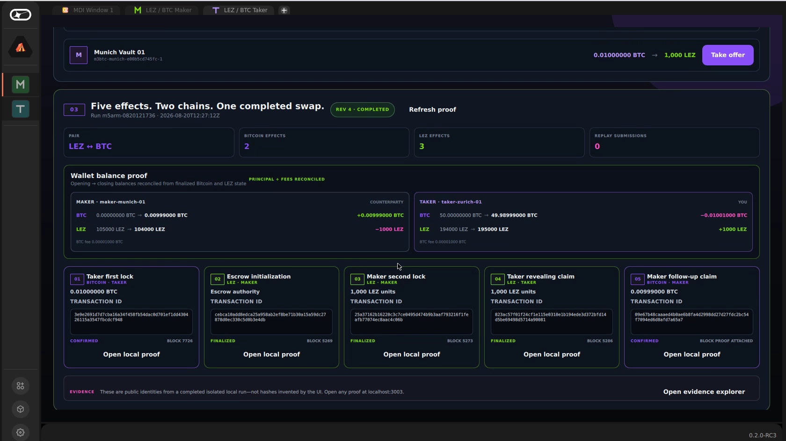
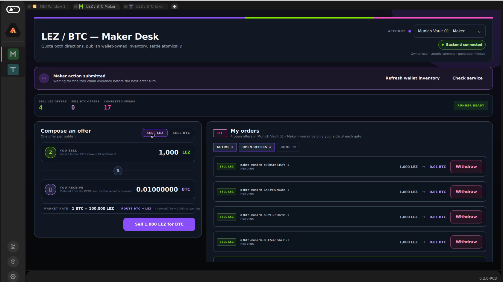
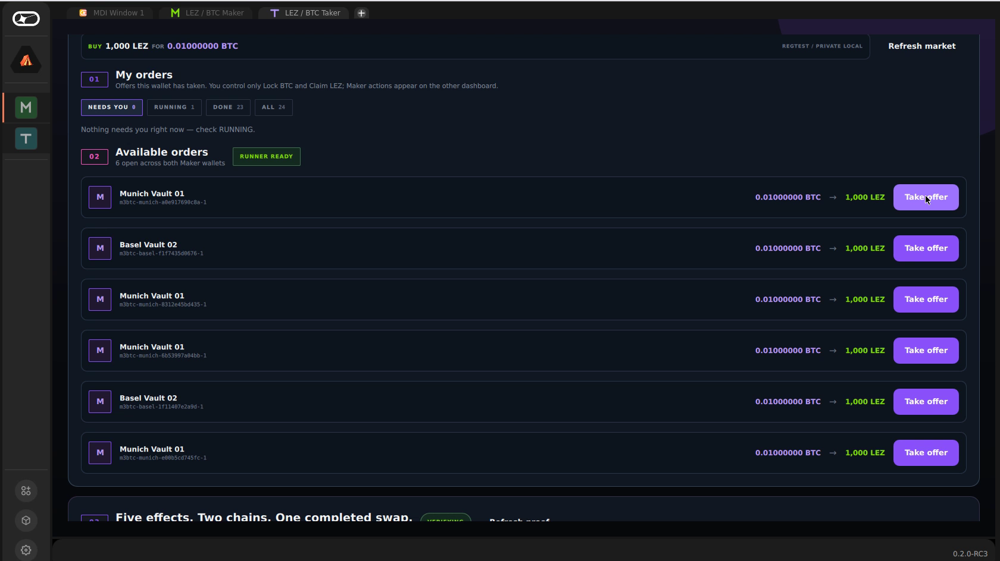
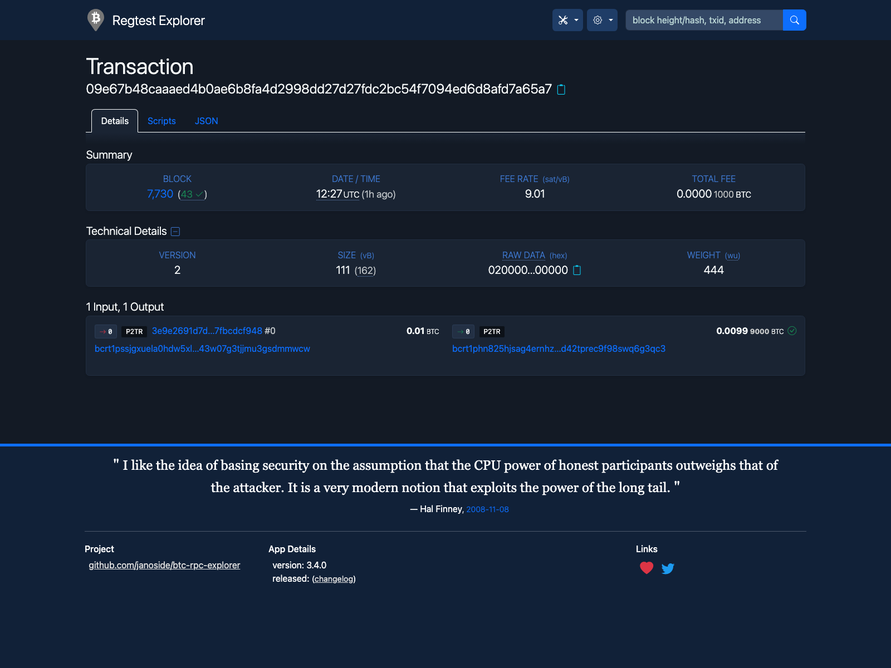
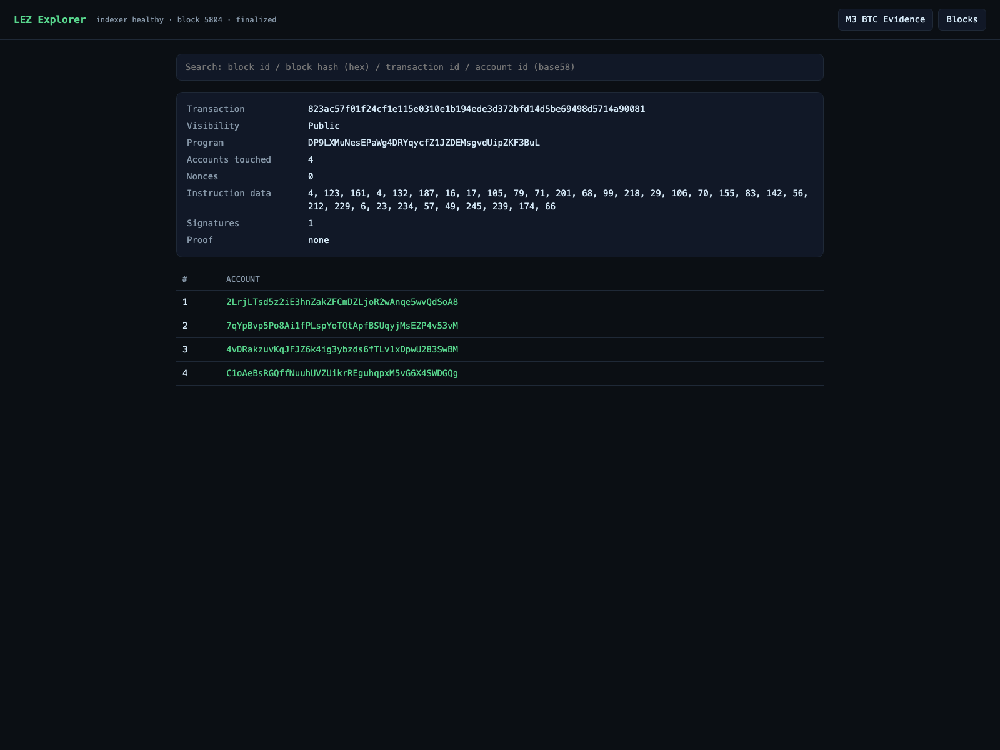
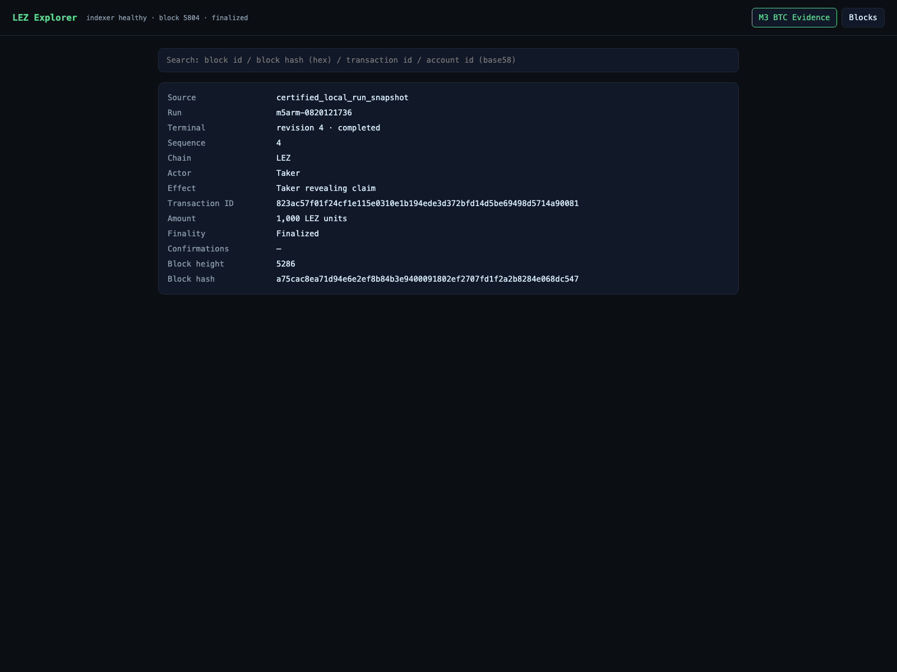

# LEZ ⇄ Bitcoin

**Bilateral atomic swaps with Taproot adaptor signatures, ordered refunds, and
an operator-facing Logos Basecamp flow.** No custodian, wrapped asset, or
cross-chain bridge controls settlement.

`M3+ submission` · `Bitcoin Core regtest` · `LEZ v0.2 private devnet` ·
`Basecamp Maker + Taker mini-apps`

[](media/lez-btc-rfp003-proposal-vertical.mp4)

*A real private-local run: two Bitcoin effects, three LEZ effects, reconciled
wallet balances, and zero replay submissions. [Watch the 1:42 proposal demo →](media/lez-btc-rfp003-proposal-vertical.mp4)*

## The product flow

| Maker publishes wallet-owned liquidity | Taker discovers and accepts an offer |
|---|---|
|  |  |

For the direction shown in the demo, the Taker pays **0.01 BTC** for **1,000
LEZ**:

1. The Taker locks Bitcoin into the agreed Taproot output.
2. After that lock is confirmed, the Maker funds the LEZ escrow.
3. The Taker claims LEZ with the final signature produced from the verified
   LEZ adaptor pre-signature.
4. The Maker combines that canonical final signature with its retained exact
   pre-signature, parity-aware extracts and point-checks `t`, and uses `t` to
   complete the Bitcoin claim without another Taker message.

The same construction supports the reverse economic direction. The party in
the Taker role always funds the first leg; the Maker funds the second leg and
receives the earlier refund deadline.

## Proof, not a simulated receipt

The completed screen is backed by public transaction identities from the two
local chains. The UI links directly to both explorers and to the exported
evidence record.

| Bitcoin P2TR claim | LEZ revealing claim | Evidence view |
|---|---|---|
|  |  |  |

The evidence exporter fails closed unless the source is a passed Bitcoin run
completed at revision 4, contains exactly two Bitcoin and three LEZ effects,
and discloses no private material. It carries the source replay count into the
exported record; the interactive controller separately validates and attaches
wallet-balance and fee reconciliation.

## Run the private-local stack

The runnable lane brings up Bitcoin Core 31.1 regtest, the LEZ v0.2 stack,
explorers, the real Maker daemon and Taker service, the M3 actor runner, and the
Basecamp UI:

```sh
cd deploy
./scripts/up.sh
./scripts/prepare-btc-m3-demo.sh
```

Then open:

- Basecamp: `vnc://127.0.0.1:5901` (default password `lezswap`)
- Bitcoin explorer: <http://127.0.0.1:3002>
- LEZ explorer and evidence: <http://127.0.0.1:3003/#/evidence>

Useful inspection commands:

```sh
docker compose --env-file runtime/runtime.env ps
docker compose --env-file runtime/runtime.env logs --tail=200 \
  maker-node taker-service btc-demo-controller
jq . full-swap/evidence-m5arm-08180005.json
./scripts/verify-all.sh
```

Stop the stack with `./scripts/down.sh`; pass `--wipe` only when you intend to
remove its generated local state.

## Refunds and atomicity

This is a conditional cross-chain protocol, not one ACID transaction spanning
two ledgers.

- Before the first lock, either party can stop with no funds exposed.
- If the Taker's first lock is the only lock, refund authority requires the
  signed Maker-lock cutoff, two matching fresh observations of canonical
  second-lock absence, and a fresh canonical, unspent, eligible first-lock
  check. Pending, ambiguous, moving-tip, or late-present second locks fail
  closed.
- If both locks exist and no claim reveals `t`, the Maker refunds the second
  leg first; the Taker may refund the first leg only after that exact earlier
  refund is canonical and the later bound is reached.
- Once the revealing claim is canonical, the Maker combines the canonical
  final signature with the retained pre-signature, point-checks `t`, and must
  obtain follow-up inclusion before the later refund boundary.

Safety depends on the documented confirmation, fee-inclusion, key-secrecy,
state-durability, chain-finality, and reaction-window assumptions. Near or
after a refund boundary, a Bitcoin key-path claim and refund can be competing
spends; the protocol's safety margin is designed to keep the normal flow out
of that race. See the [success and refund diagrams](docs/diagrams.md) and the
[M3 security mapping](docs/architecture/0050-map-btc-adaptor-construction-to-security-properties.md).

## Submission package

This branch presents three milestone areas as one reviewable vertical slice:

| Area | What is included |
|---|---|
| **M1 foundation** | [Accepted design packet](docs/milestone-1/README.md), threat model, primitive verification, SDK surface, parameter profiles, and ADRs 0001–0013 |
| **M3 Bitcoin** | [Milestone review](docs/milestone-3-review.md), operator guide, security ADRs, both-direction happy paths and ordered refunds, first-lock-only recovery, one post-reveal fresh-process Maker continuation, and one opposite-direction two-swap overlap run |
| **M6 experience** | Existing Basecamp Maker/Taker packages, clickable prototypes, [prototype review](docs/m6-prototype-review.md), and public evidence packets |

The live BTC demo also integrates M5-derived daemon, service, persistence, and
runner components. It is not presented here as proof that the complete M5
scope is delivered. See [submission scope and provenance](docs/submission.md)
for exact source checkpoints and nonclaims.

## Scope boundary

The video demonstrates the **M3 BTC happy path through the branch's current
Basecamp BTC UI** on Bitcoin regtest and a private LEZ devnet. The repository
evidence additionally covers both economic directions, two-lock refunds,
first-lock recovery, one fresh-process continuation after reveal, and one
opposite-direction two-swap overlap run. This package does **not** claim a
public-network deployment, production custody, independent audit, M2 Zcash,
M4 Monero, complete M5 operations, or M7 mainnet readiness.

## Repository map

| Path | Purpose |
|---|---|
| [`apps/basecamp/`](apps/basecamp/) | Maker and Taker QML packages over owner-local RPC |
| [`apps/m6-prototypes/`](apps/m6-prototypes/) | Clickable, no-effects journey prototypes |
| [`deploy/`](deploy/) | Dockerized chains, services, explorers, UI, evidence, and verification |
| [`docs/milestone-1/`](docs/milestone-1/) | M1 design and review packet |
| [`docs/evidence/`](docs/evidence/) | Public M3/M6 records plus the M2 prerequisite records referenced by M3 |
| [`docs/architecture/`](docs/architecture/) | Milestone ADRs and security arguments |
| [`media/`](media/) | Proposal video and secret-free screenshots from real local runs |

## License

MIT OR Apache-2.0.
