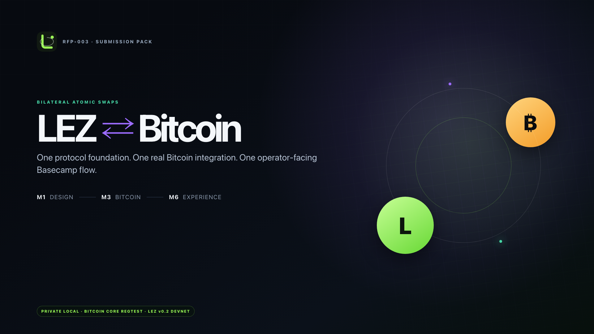
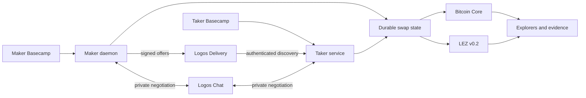

# LEZ Atomic Swaps

Swap native Bitcoin and LEZ without handing settlement to a custodian, wrapped
asset, or bridge operator.

This repository contains the protocol, Rust services, local chains, Maker and
Taker Basecamp apps, and reproducible evidence for a complete BTC → LEZ swap.
It uses Taproot/MuSig2 adaptor signatures on Bitcoin, witnessed escrow on LEZ,
signed offer discovery over Logos Delivery, and private negotiation over Logos
Chat.

[**Watch the 1:53 product walkthrough**](media/lez-btc-ui-swap-demo.mp4) ·
[**Open the interactive deck**](media/lez-btc-m1-m3-m6-submission.html) ·
[**Get the latest release**](https://github.com/gateway-fm/lez-atomic-swaps/releases/latest) ·
[**Read the protocol diagrams**](docs/diagrams.md)

[](media/lez-btc-ui-swap-demo.mp4)

> **Project status:** the private-local BTC/LEZ product path works end to end
> and is covered by real-chain, recovery, concurrency, UI, and offline tests.
> Public-network operation, production key management, and an independent
> cryptographic audit are still in progress.

## What works today

| Product capability | Current implementation |
|---|---|
| Native BTC ↔ LEZ settlement | Bitcoin Core regtest plus a private LEZ v0.2 devnet; no wrapped asset |
| Maker liquidity | Wallet-owned offers, inventory, withdrawal, active swaps, and history |
| Taker flow | Authenticated discovery, offer acceptance, progress, and role-owned actions |
| Network transport | Signed offer broadcasts over Logos Delivery and private per-Taker negotiation over Logos Chat |
| Atomic completion | Taproot/MuSig2 adaptor flow reveals the value needed to complete the Bitcoin leg |
| Recovery | Ordered two-lock refunds, first-lock-only recovery, durable replay, and fresh-process continuation |
| Evidence | Explorer-linked transaction identities, balance reconciliation, fees, and replay counters |

The recorded product run completes with **two Bitcoin effects, three LEZ
effects, reconciled wallet balances, and zero replay submissions**. Its
[secret-safe evidence record](docs/evidence/m3-btc-ui-run-m5arm-0825151914.json)
contains the public transaction and block identities shown in the walkthrough.

## Run the product locally

The packaged stack currently targets arm64, including Apple Silicon and arm64
Linux. It requires Docker with Compose; the first build downloads pinned
dependencies and images.

```sh
git clone https://github.com/gateway-fm/lez-atomic-swaps.git
cd lez-atomic-swaps/deploy
./scripts/up.sh
./scripts/prepare-btc-m3-demo.sh
```

Open the Basecamp desktop on macOS:

```sh
open vnc://127.0.0.1:5901
```

Or connect any VNC client to `127.0.0.1:5901`. The default password is
`lezswap`; override it with `VNC_PASSWORD` before starting the stack.

The local product also exposes:

| Surface | Address |
|---|---|
| Bitcoin explorer | <http://127.0.0.1:3002> |
| LEZ explorer and evidence | <http://127.0.0.1:3003/#/evidence> |
| Maker owner RPC | `/run/lez/maker.sock` inside the stack |
| Taker owner service | owner-only Unix socket inside the stack |

### Complete a swap

1. In **LEZ / BTC Maker**, select a wallet and publish an offer.
2. In **LEZ / BTC Taker**, select a wallet and take that authenticated offer.
3. Follow the four role-owned actions: **Lock BTC → Fund LEZ → Claim LEZ →
   Claim Bitcoin**.
4. Open the local proof and inspect the five chain effects, balances, and fees.

Each dashboard exposes only the action owned by that role. The standing local
chains persist between swaps, so balances and history accumulate like they do
on long-lived networks.

Verify the running product without starting another swap:

```sh
./scripts/verify-all.sh
docker compose --env-file runtime/runtime.env ps
docker compose --env-file runtime/runtime.env logs --tail=200 \
  maker-node taker-service btc-demo-controller
```

Stop it with `./scripts/down.sh`. Add `--wipe` only when you intentionally want
to remove generated local chain and wallet state.

## How the swap becomes atomic

For the direction shown in the walkthrough, the Taker buys **1,000 LEZ** for
**0.01 BTC**:

1. The Taker locks Bitcoin into the agreed Taproot output.
2. After the Bitcoin lock is canonical, the Maker funds the LEZ escrow.
3. The Taker claims LEZ using the verified adaptor pre-signature path.
4. The canonical LEZ claim reveals the value the Maker needs to complete the
   Bitcoin signature and claim BTC—without another Taker message.

The reverse economic direction uses the same role ordering. The Taker funds the
first leg; the Maker funds the second and receives the earlier refund deadline.
If the happy path stops, the protocol uses canonical chain observations and
ordered refund windows so the second leg resolves before the first.



Delivery and Chat move discovery and negotiation messages. Rust signatures,
role contributions, countersigned agreements, chain identities, durable
effects, and replay authority remain the protocol source of truth. Chat
sessions intentionally live only as long as their apps; accepted agreements
and settlement state survive restarts.

## Build and test

Inspect the complete Rust workspace directly from a fresh checkout:

```sh
cargo metadata --locked --no-deps
./scripts/run-public-offline-e2e.sh
```

After its pinned container image and dependency cache are available, the
offline suite runs in a one-off Linux container with Docker networking disabled.
That is the supported path for Linux-only process hardening on macOS and does
not touch the long-running demo stack.

Useful focused gates:

```sh
./scripts/verify-public-repository.sh
./scripts/test-v0-1-1-release-media-contract.sh
./scripts/check-bitcoin-core-isolation.sh
./scripts/check-lez-v02-docker-isolation.sh
npm run test:m6:basecamp:contract
```

See [CONTRIBUTING.md](CONTRIBUTING.md) for formatting, Clippy, dependency,
licence, architecture, DCO, and security-review requirements.

## Find your way around

| Path | What lives there |
|---|---|
| [`crates/`](crates/) | Protocol types, Bitcoin swap SDK, durable stores, Maker daemon, Taker service, and runners |
| [`compat/`](compat/) | Isolated compatibility packages for pinned LEZ interfaces |
| [`apps/basecamp/`](apps/basecamp/) | Buildable Maker and Taker Logos Basecamp packages |
| [`apps/m6-prototypes/`](apps/m6-prototypes/) | Fast, no-effects product journey prototypes |
| [`deploy/`](deploy/) | Dockerized chains, services, explorers, UI, evidence, and operator scripts |
| [`tests/`](tests/) | Local-chain, UI, transport, security, and integration tests |
| [`docs/architecture/`](docs/architecture/) | Protocol decisions, safety arguments, and operational design |
| [`docs/evidence/`](docs/evidence/) | Secret-safe records from real local runs |
| [`submission/`](submission/) | M1/M3/M6 reviewer map, evidence index, reproduction guide, and release checksums |
| [`media/`](media/) | Interactive deck, PDF, walkthrough, captions, and screenshots |

The current public release covers the M1 protocol foundation, the M3 BTC/LEZ
vertical slice, and the M6 Maker/Taker experience. Additional asset protocols
and public-network operations are being developed separately and will return in
their own reviewed releases.

## Contributing and security

Issues and focused pull requests are welcome. Behaviour changes should name the
affected Maker, Taker, operator, or recovery journey and include a regression
test. All commits require a [Developer Certificate of Origin](https://developercertificate.org/)
sign-off; see [CONTRIBUTING.md](CONTRIBUTING.md).

Please do not open a public issue for a suspected vulnerability. Follow the
private process in [SECURITY.md](SECURITY.md).

## License

Project-authored source and media are available under MIT OR Apache-2.0. See
[LICENSE](LICENSE), [LICENSE-MIT](LICENSE-MIT),
[LICENSE-APACHE](LICENSE-APACHE), and
[THIRD_PARTY_NOTICES](THIRD_PARTY_NOTICES).
