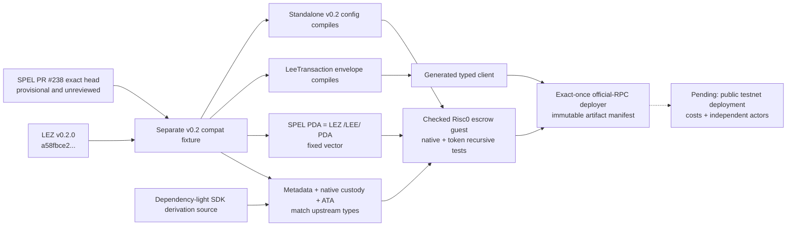

# Provisional LEZ v0.2 compatibility lane

Status: engineering evidence only; not an approved M2 release baseline.

This fixture preserves the proven `v0.1.2` lane while building the independent
LEZ v0.2 escrow guest, generated client, and fail-closed deployment client. It
is engineering and M2 testnet evidence; it is not production approval for the
unreviewed SPEL pin or the Logos-owned dependency exceptions below.

| Upstream | Immutable identity | Review status |
|---|---|---|
| SPEL PR [#238](https://github.com/logos-co/spel/pull/238) | head `df17acd98436be4f09c55877dae1fe2e73cbcdca` | Open, unmerged, and without a submitted maintainer review |
| LEZ | tag `v0.2.0`, commit `a58fbce2ff48c58b7bb5001b1a27e64b9596ee3a` | Official stable release |

PR #238 declares LEZ by tag. All direct LEZ dependencies use that same tag so
Cargo produces one `lee_core` type identity; the manifest metadata, lockfile,
and verifier bind the tag to the exact commit.



The test constructs but does not poll `sequencer_service::run`; it therefore
proves the standalone entry point and configuration API without binding a port,
starting tasks, or writing sequencer state. Its temporary home is unique to the
test. The fixed PDA vector proves that SPEL and LEZ resolve the same `/LEE/`
derivation and prevents silently mixing tag and revision package identities.
The second test compiles the exact SDK derivation source without importing the
full SDK dependency graph, then compares metadata, SPEL `custody`/swap
multi-seed, and official owner/definition ATA results with the pinned upstream
types. This is compatibility evidence for local derivation; a chain adapter
must still re-query deployed program and account identities.

## Full local-stack source contract

`local-stack.toml` is the immutable source, packaging, isolation, and service-readiness contract for the non-mock local lane. It selects exact LEZ v0.2.0, the digest-pinned Bedrock node, real non-standalone sequencer and indexer binaries, corrected event directions, conjunctive readiness, and the explicit pending full-runtime tuple. Docker Compose validates configuration; the runner directly creates exact run-scoped containers because this Compose/Engine pair cannot reliably realize ephemeral loopback publications. Each run owns `.e2e/${RUN_ID}/lez-v02`, one unique no-masquerade bridge, dynamic literal-loopback host ports, and captured container IDs. Fixed or global names, fixed host ports, and reused state remain forbidden.

Bedrock receives the exact hashed node, deployment, and KZG fixtures and invokes the Bedrock binary directly. The runner replaces exactly one audited stale embedded genesis timestamp with the current run epoch, then proves the generated fixture contains exactly one replacement and no old bytes. It never changes the source-required all-zero genesis channel. Minimal sequencer/indexer configs are generated from contracted
semantic fields; the unsupported stale example `backoff` field is omitted.

The upstream service Dockerfiles are retained only as hashed source
observations: they use mutable build/runtime inputs and are not the M2
packaging recipe. The contracted recipe builds both binaries from the locked
v0.2 graph with upstream Rust 1.94.0 and two jobs. It also binds the locked
`rust-rapidsnark` revision, native v0.0.8 release archive, and all four static
library hashes used by the offline build. The resulting services are packaged
with the verified r0vm 3.0.5 artifact on a digest-pinned distroless nonroot
runtime. One fresh-target clean-source locked offline build produced bound
sequencer/indexer SHA-256 values; a warm locked offline no-op rerun left those
outputs unchanged. This is not evidence of independent bit-reproducibility.
Both binaries plus r0vm returned their versions inside that runtime
as uid 65532 with no network, a read-only root, no capabilities, and
no-new-privileges. The CLI smoke remains separate evidence. Run `v02-stack-20260713n` then executed all three services as a numeric non-root UID/GID with read-only roots, dropped capabilities, `no-new-privileges`, and resource limits.

Verify a clean source checkout, the local artifacts, and the already-cached
Bedrock image without starting a container:

```sh
LEZ_V02_SOURCE_DIR=/path/to/exact-v0.2.0-checkout \
LEZ_V02_R0VM=/path/to/verified/r0vm-3.0.5 \
LEZ_V02_SEQUENCER_BINARY=/path/to/verified/sequencer_service \
LEZ_V02_INDEXER_BINARY=/path/to/verified/indexer_service \
LEZ_V02_RAPIDSNARK_ARCHIVE=/path/to/rapidsnark-linux-x86_64-pic-v0.0.8.zip \
RAPIDSNARK_LIB_DIR=/path/to/verified/rapidsnark-v0.0.8-libraries \
BINDGEN_EXTRA_CLANG_ARGS=-I/usr/lib/gcc/x86_64-linux-gnu/13/include \
RUN_ID=local-source-audit \
./scripts/verify-lez-v02-local-stack-contract.sh
```

The verifier requires a reachable Docker daemon and the exact Bedrock digest
already present locally. It runs `docker image inspect` and validates the
source, revision, version, and license labels; it never pulls or starts the image.

After provisioning those exact artifacts, run the isolated service stack:

```sh
export LEZ_V02_SOURCE_DIR=/absolute/path/to/clean/logos-execution-zone-v0.2.0
export LEZ_V02_SERVICES_DIR=/absolute/path/to/locked/release-binaries
export LEZ_V02_R0VM=/absolute/path/to/verified/r0vm
RUN_ID=local-v02-stack-001 ./scripts/run-lez-v02-stack.sh
```

The success line reports a finalized ID of at least 2. Evidence remains under
`.e2e/local-v02-stack-001/lez-v02`. Normal cleanup removes exact captured IDs,
the exact network, and the run image and then proves all are absent; removal or
assertion failure makes the run fail. `LEZ_V02_KEEP_RUNNING=1` retains resources
only after a GREEN run and prints the exact cleanup commands. Runtime uses no
public RPC, faucet, or public funds. A cold build may need the exact GHCR and
GCR image registries; clone and artifact provisioning may need GitHub, Rust,
and crates distribution.

The source checkout must have exact HEAD `a58fbce2...` and an empty
`git status --porcelain --untracked-files=all`. If local tag `v0.2.0` exists,
it must resolve to that commit; otherwise the verifier reports the tag as
absent. Cargo-managed Git checkouts containing `.cargo-ok` are deliberately
rejected as build source, even when HEAD is correct. The local dependency cache
may supply a byte-identical rapidsnark archive, but it is never trusted as the
LEZ source checkout.

The Bedrock digest's immutable OCI revision label is
`d8711bbc3d43d3ef9755ef9b73af32fd0f703160`, matching the Logos Blockchain
revision in the exact LEZ lock graph. Re-certification must inspect that local
digest and its source/version/license labels. This source mapping does not
establish public-runtime parity: the tagged LEZ README still describes its
bundled node as outdated, so that distinct upstream parity gap remains.

Readiness is functional rather than port-only. Before sequencer startup, the key-derived runtime channel must be absent with only HTTP 404 or 500 plus the exact 17-byte body `channel not found`. The real sequencer then signs its onboarding inscription, and Bedrock must report only that public key as accredited. The indexer must finalize an ID of at least 2; lookup by ID and hash must agree, and its decoded ID, previous hash, hash, and signature must match the sequencer canonical Borsh header. Bedrock channel slot or tip must advance after finality. Indexer `checkHealth` remains diagnostic only.

Run the complete lint/test/pin check with:

```sh
RUN_ID=local-unique ./scripts/verify-lez-v02-provisional.sh
```

The verifier uses at most two Cargo jobs and separate run-local root, guest,
artifact, tool, and Docker-source directories. The native dependency build
requires `unzip` plus a working libclang C-header search path. It builds the
deployment ELF once with the digest-pinned official Risc0 guest-builder image,
but starts no sequencer, listener, or fixed port. A cold run may pull that image,
Git sources, crates, and circuit assets; do not overlap it with another
Docker-heavy or native-build workload on the same host.

This lane now builds the v0.2 Risc0 escrow ELF, checks its SHA-256, ImageID, and
ProgramId, compiles the generated typed client, and executes native plus two
definition token claim/refund lifecycles through official recursive state
transitions. A rollback regression proves that a failed child transfer leaves
metadata and every account unchanged. The deployment client validates the
immutable endpoint, channel, built-ins, artifact identity, transaction bytes,
and canonical transaction/block observation before accepting evidence; an
ambiguous submission is attempted once and is never blindly retried.

Public-testnet deployment, deployed-runtime cost evidence, and the composed
independent-actor LEZ/Zcash corridor remain pending. This lane alone must not be
used to mark M2 complete. Retain fail-closed handling for upstream
[#242](https://github.com/logos-co/spel/issues/242) (non-zero private-PDA
identifiers are unsupported) and [#243](https://github.com/logos-co/spel/issues/243)
(program-ID parsing can accept a wrong 32-byte identifier). The current escrow
uses public PDAs, and its eventual deployment path must bind the program ID to
the checked ELF and immutable deployment manifest rather than free-form input.

The exact official LEZ graph also forces `hickory-proto 0.25.0-alpha.5`
(`RUSTSEC-2026-0118` and `RUSTSEC-2026-0119`) through Logos-owned common/libp2p
dependencies. Graph-local `cargo-deny` policy permits only those exact
advisories, while tests bind the upstream revisions, exclude the generated
wallet graph, and keep the sequencer future unpolled with DNSSEC features
absent. Under ADR 0018 this disclosed Logos-owned exception does not stop M2
testnet certification, but it remains a production-release blocker until
upstream removes the path or a separate security review explicitly accepts it.
