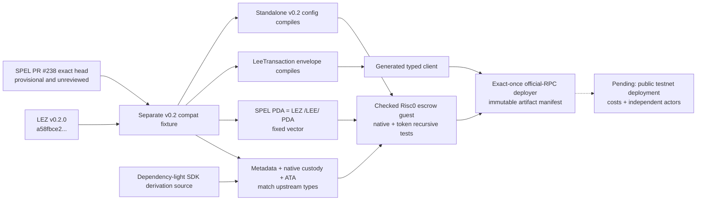

# Provisional LEZ v0.2 compatibility lane

Status: engineering evidence only; not an approved M2 release baseline.

This fixture preserves the proven `v0.1.2` lane while building the independent
LEZ v0.2 escrow guest, generated client, and fail-closed deployment client. It
is engineering and M2 testnet evidence; it is not production approval for the
unreviewed SPEL pin or the Logos-owned dependency exceptions below.

| Upstream | Immutable identity | Review status |
|---|---|---|
| SPEL PR [#238](https://github.com/logos-co/spel/pull/238) | head `df17acd98436be4f09c55877dae1fe2e73cbcdca` | Open, unmerged, and without a submitted maintainer review |
| LEZ | tag `v0.2.0`, commit `a58fbce2ff48c58b7bb5001b1a27e64b9596ee3a` | Official stable release |

PR #238 declares LEZ by tag. All direct LEZ dependencies use that same tag so
Cargo produces one `lee_core` type identity; the manifest metadata, lockfile,
and verifier bind the tag to the exact commit.



The test constructs but does not poll `sequencer_service::run`; it therefore
proves the standalone entry point and configuration API without binding a port,
starting tasks, or writing sequencer state. Its temporary home is unique to the
test. The fixed PDA vector proves that SPEL and LEZ resolve the same `/LEE/`
derivation and prevents silently mixing tag and revision package identities.
The second test compiles the exact SDK derivation source without importing the
full SDK dependency graph, then compares metadata, SPEL `custody`/swap
multi-seed, and official owner/definition ATA results with the pinned upstream
types. This is compatibility evidence for local derivation; a chain adapter
must still re-query deployed program and account identities.

Run the complete lint/test/pin check with:

```sh
RUN_ID=local-unique ./scripts/verify-lez-v02-provisional.sh
```

The verifier uses at most two Cargo jobs and separate run-local root, guest,
artifact, tool, and Docker-source directories. The native dependency build
requires `unzip` plus a working libclang C-header search path. It builds the
deployment ELF once with the digest-pinned official Risc0 guest-builder image,
but starts no sequencer, listener, or fixed port. A cold run may pull that image,
Git sources, crates, and circuit assets; do not overlap it with another
Docker-heavy or native-build workload on the same host.

This lane now builds the v0.2 Risc0 escrow ELF, checks its SHA-256, ImageID, and
ProgramId, compiles the generated typed client, and executes native plus two
definition token claim/refund lifecycles through official recursive state
transitions. A rollback regression proves that a failed child transfer leaves
metadata and every account unchanged. The deployment client validates the
immutable endpoint, channel, built-ins, artifact identity, transaction bytes,
and canonical transaction/block observation before accepting evidence; an
ambiguous submission is attempted once and is never blindly retried.

Public-testnet deployment, deployed-runtime cost evidence, and the composed
independent-actor LEZ/Zcash corridor remain pending. This lane alone must not be
used to mark M2 complete. Retain fail-closed handling for upstream
[#242](https://github.com/logos-co/spel/issues/242) (non-zero private-PDA
identifiers are unsupported) and [#243](https://github.com/logos-co/spel/issues/243)
(program-ID parsing can accept a wrong 32-byte identifier). The current escrow
uses public PDAs, and its eventual deployment path must bind the program ID to
the checked ELF and immutable deployment manifest rather than free-form input.

The exact official LEZ graph also forces `hickory-proto 0.25.0-alpha.5`
(`RUSTSEC-2026-0118` and `RUSTSEC-2026-0119`) through Logos-owned common/libp2p
dependencies. Graph-local `cargo-deny` policy permits only those exact
advisories, while tests bind the upstream revisions, exclude the generated
wallet graph, and keep the sequencer future unpolled with DNSSEC features
absent. Under ADR 0018 this disclosed Logos-owned exception does not stop M2
testnet certification, but it remains a production-release blocker until
upstream removes the path or a separate security review explicitly accepts it.
