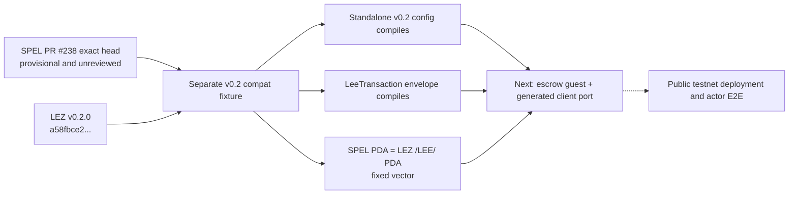

# Provisional LEZ v0.2 compatibility lane

Status: engineering evidence only; not an approved M2 release baseline.

This fixture preserves the proven `v0.1.2` lane and tests the smallest
independent compatibility seam needed before porting the escrow guest and
generated client.

| Upstream | Immutable identity | Review status |
|---|---|---|
| SPEL PR [#238](https://github.com/logos-co/spel/pull/238) | head `df17acd98436be4f09c55877dae1fe2e73cbcdca` | Open, unmerged, and without a submitted maintainer review |
| LEZ | tag `v0.2.0`, commit `a58fbce2ff48c58b7bb5001b1a27e64b9596ee3a` | Official stable release |

PR #238 declares LEZ by tag. All direct LEZ dependencies use that same tag so
Cargo produces one `lee_core` type identity; the manifest metadata, lockfile,
and verifier bind the tag to the exact commit.



The test constructs but does not poll `sequencer_service::run`; it therefore
proves the standalone entry point and configuration API without binding a port,
starting tasks, or writing sequencer state. Its temporary home is unique to the
test. The fixed PDA vector proves that SPEL and LEZ resolve the same `/LEE/`
derivation and prevents silently mixing tag and revision package identities.

Run the complete lint/test/pin check with:

```sh
RUN_ID=local-unique ./scripts/verify-lez-v02-provisional.sh
```

The verifier uses at most two Cargo jobs and an isolated target/tool directory.
The native dependency build requires `unzip` plus a working libclang C-header
search path. It never starts Docker, a network service, or a sequencer.

This lane does not yet rebuild the escrow ELF, IDL, generated client, actor
lifecycle, cost evidence, or public-testnet deployment. It must not be used to
mark M2 complete. Before expanding it, retain fail-closed handling for upstream
[#242](https://github.com/logos-co/spel/issues/242) (non-zero private-PDA
identifiers are unsupported) and [#243](https://github.com/logos-co/spel/issues/243)
(program-ID parsing can accept a wrong 32-byte identifier). The current escrow
uses public PDAs, and its eventual deployment path must bind the program ID to
the checked ELF and immutable deployment manifest rather than free-form input.

The exact standalone graph also forces vulnerable `hickory-proto
0.25.0-alpha.5` (`RUSTSEC-2026-0118` and `RUSTSEC-2026-0119`). This fixture's
policy permits those advisories only because the hash-locked test never polls
the standalone future or starts networking, and because DNSSEC features are
absent. The verifier fails if the test bytes or either condition changes. This
graph is prohibited for runtime and testnet use. These exceptions are not valid
for the next executable guest, sequencer, or deployment slice; that work needs
a safe upstream dependency or an explicit security review before it can pass.
