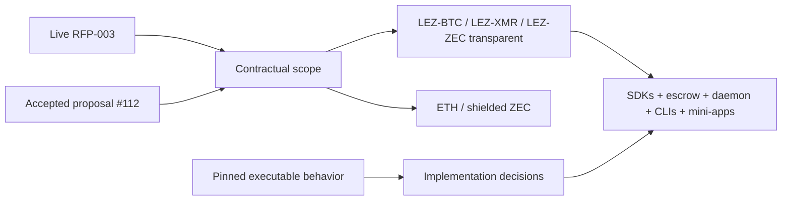

# ADR 0001: Authoritative scope

Status: Accepted — 2026-07-11

## Decision

Implement LEZ-BTC, LEZ-XMR, and LEZ-ZEC transparent swaps. Use the live RFP-003
and accepted Gateway proposal #112 as the contractual sources, with actual
pinned upstream behavior taking precedence over copied local notes. Issue #61
is superseded. ETH and shielded ZEC are excluded.

## Consequences

All pair enums, SDKs, demos, docs, and test matrices contain exactly BTC, XMR,
and transparent ZEC. The ETH reference may inform the chain-independent LEZ
HTLC path but cannot leak an ETH deliverable into plans or acceptance claims.
