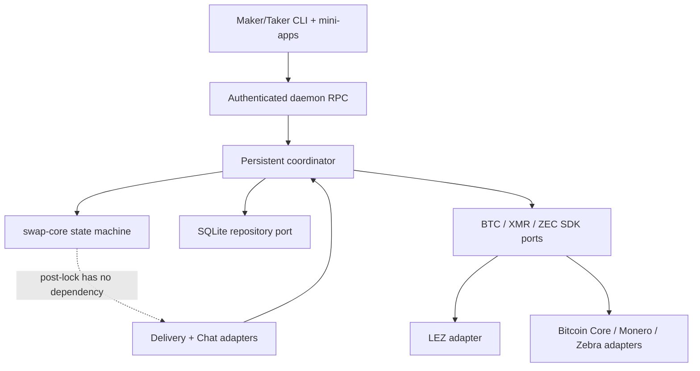

# ADR 0002: Protocol core with ports and adapters

Status: Accepted — 2026-07-11

## Decision

Keep a small serializable swap aggregate at the center. Pair SDKs validate
chain-specific observations and translate them into typed protocol evidence.
Persistence, clocks, chain nodes, Delivery, Chat, pricing, and RPC are ports
implemented by adapters.

Post-lock commands never accept Delivery, Chat, peer, GUI, or daemon handles.
This makes the RFP's on-chain-only invariant visible in the type/API boundary.

## Consequences

The explicit transition table remains project code because it embodies the
atomicity policy. Commodity behavior uses established crates. Chain-specific
cryptography stays out of the generic core and uses canonical ecosystem
libraries and published vectors.
