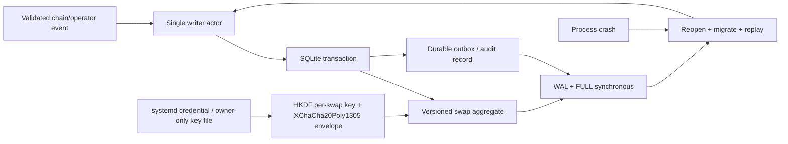

# ADR 0003: SQLite persistence through rusqlite

Status: Accepted; crash-test validation pending — 2026-07-11

## Context

The proposal requires choosing `sled` or an alternative. Swap transitions must
survive crashes, isolate concurrent swaps, support history queries, and permit
schema evolution and operational inspection.

## Decision

Use SQLite through the MIT-licensed `rusqlite` crate, with bundled SQLite for
reproducible deployment. A repository port hides it from `swap-core`. The daemon
uses a single persistence actor and explicit transactions; WAL, full synchronous
durability, foreign keys, and busy timeouts are configured deliberately.

Secret fields are versioned per-swap envelopes using maintained RustCrypto
XChaCha20Poly1305 and HKDF-SHA256 crates, `secrecy`, and `zeroize`. The random
master credential comes from `systemd-creds` or an owner-only file outside the
database. It is never accepted through process arguments or environment. Backup
and restore treat the encrypted database and credential as separate controlled
artefacts.

## Rationale

SQLite is mature, transactional, inspectable, and widely operated. It handles
atomic aggregate-plus-outbox updates without inventing a transaction protocol
over a key-value engine. A dedicated actor prevents blocking database work from
occupying async runtime workers.

## Validation before freeze

Crash after every durable transition, truncate/kill at commit boundaries, reopen
under concurrent reads, run migrations forward from every released schema, and
prove idempotent replay. Revisit only if measured write latency violates daemon
requirements.
