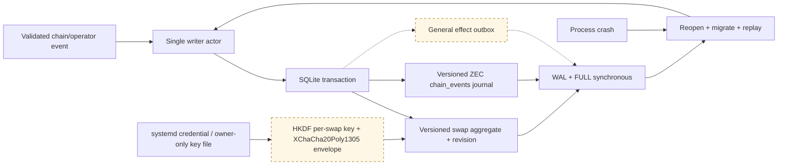

# ADR 0003: SQLite persistence through rusqlite

Status: Accepted; schema-v2 ZEC journal proven, full outbox/crash matrix pending — 2026-07-11

## Context

The proposal requires choosing `sled` or an alternative. Swap transitions must
survive crashes, isolate concurrent swaps, support history queries, and permit
schema evolution and operational inspection.

## Decision

Use SQLite through the MIT-licensed `rusqlite` crate, with bundled SQLite for
reproducible deployment. A repository port hides it from `swap-core`. The daemon
uses a single persistence actor and explicit transactions; WAL, full synchronous
durability, foreign keys, and busy timeouts are configured deliberately.

Schema v2 separates the database version from swap/event payload versions,
migrates the legacy v1 `swaps` table with revision zero, and rejects future
database or row payload versions explicitly. A `chain_events` row and its swap
aggregate revision commit in one immediate transaction. Exact replay is scoped
to the expected predecessor revision, so retry after an unknown successful
commit returns the existing revision while a later identical reappearance is a
new event.
Tests force the aggregate update to abort through a SQLite trigger and prove the
earlier event insert rolls back. Role-keyed event queries remain isolated across
maker and taker.

The runtime can probe an exact `(swap, funded role, predecessor revision,
payload)` slot before mutating core state. A removal retry after an unknown
successful commit therefore reloads the durable aggregate instead of reapplying
a removal that may already have cleared a pre-maker funding ID.

Secret fields are versioned per-swap envelopes using maintained RustCrypto
XChaCha20Poly1305 and HKDF-SHA256 crates, `secrecy`, and `zeroize`. The random
master credential comes from `systemd-creds` or an owner-only file outside the
database. It is never accepted through process arguments or environment. Backup
and restore treat the encrypted database and credential as separate controlled
artefacts.

## Rationale

SQLite is mature, transactional, inspectable, and widely operated. It handles
atomic aggregate-plus-outbox updates without inventing a transaction protocol
over a key-value engine. A dedicated actor prevents blocking database work from
occupying async runtime workers.

## Remaining validation before freeze

Crash after every durable effect transition, truncate/kill at commit boundaries,
reopen under concurrent reads, and add the general outbox and encrypted secret
envelopes. The ZEC journal already proves v1-to-v2 migration, future-version
rejection, atomic rollback, restart loading, role isolation, stale revision
rejection, and idempotent replay. Revisit only if measured write latency violates
daemon requirements.
