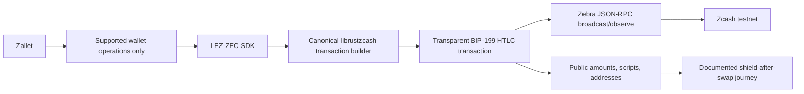

# ADR 0004: Zcash node and wallet stack

Status: Accepted; implementation pins refined by ADR 0014 — 2026-07-11

## Decision

Use `zebrad` as the supported full node. Construct and sign transparent HTLC
transactions locally with the canonical `librustzcash`/`zcash_transparent`
crates, then broadcast and observe them through Zebra RPC. Use Zallet only for
wallet functions it actually exposes; do not depend on omitted legacy raw
transaction builder/signing RPCs.

## Rationale

`zcashd` is deprecated, automatically halts before NU6.3, and is not a viable
delivery target. Zebra supports raw transaction submission and observation.
Local typed construction keeps BIP-199 scripts and sighash behavior under
version-pinned tests while avoiding an obsolete node wallet interface.

## Consequences

M2 must include a UTXO/key-management design, canonical transaction vectors,
Zebra testnet/regtest integration, and clear transparent-pool visibility plus
shield-after-swap guidance. Exact M2 compatibility and security pins are fixed
in [ADR 0014](0014-zec-m2-implementation-pins.md).
