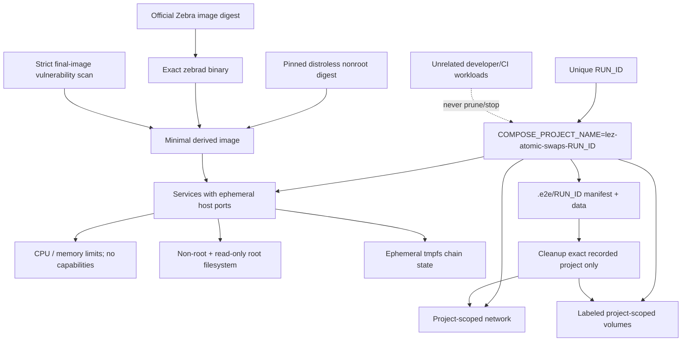

# ADR 0005: Docker E2E isolation

Status: Accepted — 2026-07-11

## Decision

Every run has a non-empty `lez-atomic-swaps-${RUN_ID}` Compose project. Compose
creates project-scoped networks/volumes; services do not declare fixed container
names; host ports are ephemeral. Cleanup takes the exact recorded project name
and never uses global Docker prune/stop/kill operations.

The M2 Zebra lane copies only the binary from the official immutable 5.2.0 image
into a pinned Google distroless nonroot runtime. This preserves upstream binary
provenance while removing the official image's unused vulnerable package set.
It uses an NU6.2 Regtest config, an ephemeral localhost RPC port, no external
Regtest peers, tmpfs state, a read-only root filesystem, UID/GID 65532, two CPU
and 2 GiB limits, no Linux capabilities, and a per-run manifest. CI validates
the Compose model without starting it, builds the derived image from the two
digests, hard-fails Trivy HIGH/CRITICAL findings on the final image, then runs
the actor-keyed consensus suite. The runner refuses to reuse an active project
and its trap removes only its exact project network/resources and owned image.

## Consequences

Suites may run beside unrelated developer and CI workloads. Failed runs leave a
run manifest that permits targeted cleanup without guessing resource ownership.
