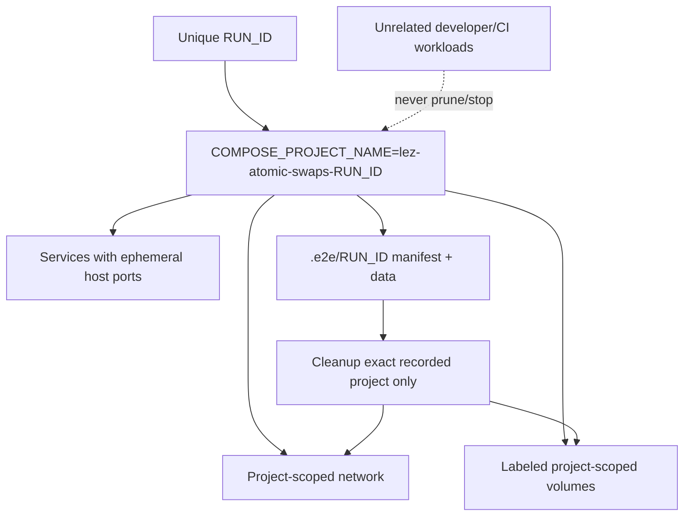

# ADR 0005: Docker E2E isolation

Status: Accepted — 2026-07-11

## Decision

Every run has a non-empty `lez-atomic-swaps-${RUN_ID}` Compose project. Compose
creates project-scoped networks/volumes; services do not declare fixed container
names; host ports are ephemeral. Cleanup takes the exact recorded project name
and never uses global Docker prune/stop/kill operations.

## Consequences

Suites may run beside unrelated developer and CI workloads. Failed runs leave a
run manifest that permits targeted cleanup without guessing resource ownership.
