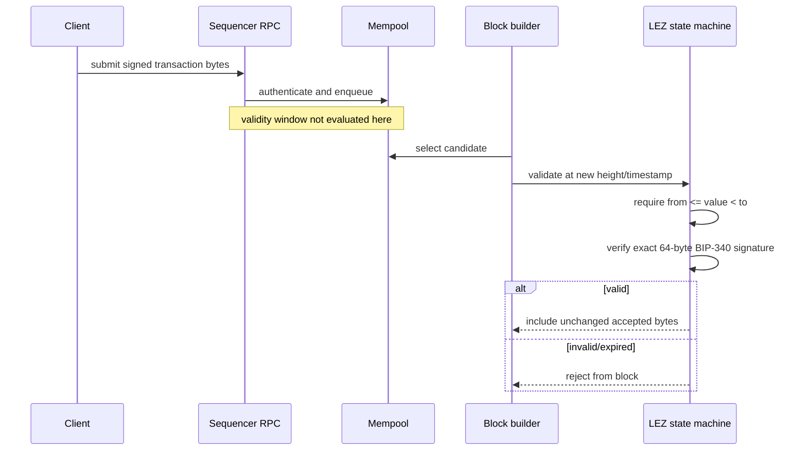

# ADR 0006: Verify LEZ upstream semantics from pinned source

Status: Accepted — 2026-07-11

## Evidence

Source trace used `logos-blockchain/logos-execution-zone` `dev` commit
`cac4921581b37e85ae25e940f3a62412cd22308e`.

- `lee/state_machine/core/src/program/mod.rs` defines validity as
  `[from, to)`: lower bound inclusive, upper bound exclusive.
- `lez/sequencer/service/src/service.rs` authenticates and pushes user
  transactions to the mempool without evaluating validity windows.
- `lez/sequencer/core/src/lib.rs` validates a transaction while building a block,
  using the new block's height and timestamp.
- `lee/state_machine/src/signature/mod.rs` stores the 64 signature bytes and
  passes them directly to `k256::schnorr::Signature::try_from` for verification.
  No signature normalization was found on the traced inclusion path.

## Decision

Timelocks include sequencer-inclusion slack and treat upper bounds as exclusive.
Adaptor extraction may rely on accepted signature bytes only after a pinned
sequencer-level reproducer proves submission-to-inclusion byte preservation.
Source inspection alone is insufficient for Milestone 1 exit.

Upstream tests run against a pinned commit and a scheduled current-`dev`
compatibility lane. File paths are diagnostic, not the contract: semantic tests
must fail clearly when upstream reorganizes code or behavior.
