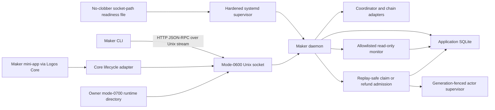

# ADR 0007: Maker local RPC and process ownership

Status: Accepted; owner-local Unix transport and versioned lifecycle controls implemented — 2026-07-29

## Context

The RFP requires a headless maker that can run standalone or under Logos Core.
The CLI and mini-app must not open the database or hold the daemon's chain keys.
Local process boundaries are still security boundaries: another local account or
compromised application must not change offers or trigger fund-moving actions.

## Decision

Use typed JSON-RPC methods implemented with `jsonrpsee`. The maker daemon is the
only database writer and the only component that owns maker execution keys. CLI,
mini-app, systemd, and Logos Core are clients or supervisors, never alternate
database writers.

The executable M5 slice runs `jsonrpsee`'s HTTP service over a Tokio Unix-domain
stream. The daemon accepts only an absolute socket below a real, effective-UID-
owned mode-0700 runtime directory, refuses any pre-existing socket path, sets and
rechecks mode 0600, disables batch/WebSocket requests, caps connections at 16,
and limits request and response bodies to 64 KiB. The CLI opens one fresh
connection per explicit command; transport failure never causes an automatic
mutation retry.

Authorization is the operating-system owner boundary. No bearer secret appears
in environment variables, arguments, readiness files, logs, or HTTP headers.
Socket and readiness cleanup capture device/inode identity and remove only the
exact path created by that daemon. The optional readiness file is create-new,
mode 0600, shares the runtime directory, and contains only the socket path.

The implemented surface separates read-only `maker_health` and
`maker_actor_monitor_v1` from idempotent configuration/offer mutations and the
fund-moving action admissions `maker_actor_claim_v1` and
`maker_actor_refund_v1`. Actor actions require a global request ID and explicit
observed generation. Their durable mutation result commits before the response,
so an exact retry returns the original admission without deriving a newer
generation. The hardened systemd package uses the same socket and RPC module.

A non-Unix deployment must still provide an equivalent owner-restricted local
transport; no TCP fallback is authorized.

Tests allocate distinct temporary runtime directories and kill only the child
process they created, so no host port or another developer's daemon can collide.

## Standalone and Logos Core lifecycle

The standalone systemd unit will use `RuntimeDirectory` and `StateDirectory` for
socket and database ownership. Its hardening baseline includes
`NoNewPrivileges`, `PrivateTmp`, `ProtectSystem=strict`, a private home, an
explicit writable state path, bounded restart policy, and no network address
families beyond those required by configured chain adapters.

The Logos Core daemon-mode adapter owns only lifecycle and presentation. Its
contract is `start(config)`, `endpoint()`, `health()`, and `stop(grace_period)`.
It must use the same daemon binary and RPC contract as the standalone mode,
receive the socket through the owner-local readiness contract, and never
deserialize wallet keys or bypass RPC by opening SQLite. Unexpected Core or UI
termination leaves the daemon governed by the configured ownership mode; it
cannot strand a post-lock recovery workflow.

## Evidence and consequences

`operator_journey` launches the actual daemon and CLI binaries, verifies the
runtime/socket modes, proves a wrong socket cannot reach the daemon, kills the
daemon, restarts it with a fresh owner runtime and the same database, and reads
the persisted swaps and alert history through the CLI. Fifteen passing tests plus one justified Docker-only ignored test in the
full maker-node package, strict Clippy, and warning-fatal Rustdoc pass. This covers the UJ-007 control seam. The lifecycle journey additionally proves
allowlisted monitoring, exact claim replay, request conflict, missing-actor
classification, and an identical queued-action view after daemon restart. ZEC
Maker actors admit claim/refund; BTC Maker actors admit refund only. ADR 0081
separately proves pricing. Fresh actual-node supervisor execution, Taker
lifecycle controls, and complete all-pair composition remain open.

The prototype serializes SQLite access with a mutex on `jsonrpsee` blocking
workers. Replace this with the dedicated persistence actor and atomic outbox
before chain watchers or concurrent mutations are added.
