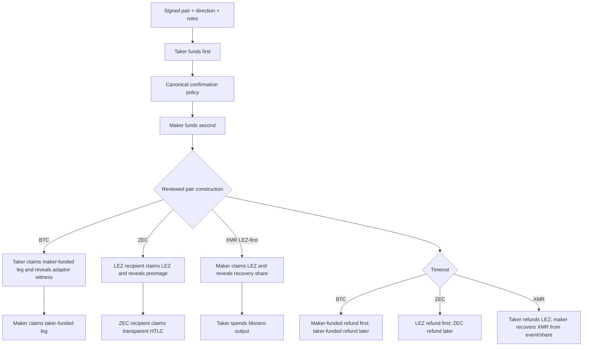

# ADR 0008: Product direction is constrained by reviewed pair capability

Status: Accepted; corrected from role-relative to construction-relative claim
ordering — 2026-07-11

## Context

The live RFP requires swaps “between LEZ and” BTC, XMR, and transparent ZEC and
requires the taker to act on-chain before the maker. Neither contractual source
states asset direction. The initial skeleton silently assumed the taker always
sold the foreign asset.

Source review then found an important protocol constraint: COMIT's pinned
`xmr-btc-swap` reference (`dc6ba84bbb1fe5ecc69581fec7dd8529567c4e32`) ships only
the scriptable-chain-first direction and states that XMR-first remains blocked.
Generic role symmetry is therefore not evidence of a safe pair construction.

## Decision

Represent both `TakerSellsForeign` and `TakerSellsLez`, but accept only directions
with a reviewed pair construction. Direction is immutable, signed negotiated
data and is durably stored before any lock. BTC and ZEC currently permit both.
XMR permits only `TakerSellsLez` (LEZ, the scriptable leg, funds first); XMR-first
is rejected in core term validation and at the actual CLI/daemon boundary.

Funding coordination remains role-relative:

1. the taker-funded leg is submitted and reaches its confirmation policy;
2. the maker-funded leg is submitted.

Claim and refund ordering is construction-relative, not generically tied to
maker/taker roles. BTC follows the standard first-funded-longer flow: the taker
claims the maker-funded leg first and the maker follows with the exposed adaptor
witness. XMR retains the reviewed COMIT flow in which the maker claims LEZ
first. For ZEC, the live RFP fixes chain order in both directions: the LEZ claim
publishes the preimage first and the ZEC claim follows; the LEZ refund is earlier
and the ZEC refund is later by the documented margin. Direction determines which
participant is the LEZ recipient and therefore the first claimant.

## Evidence and consequences

`bidirectional_lifecycle` exercises the LEZ-first direction for all three pairs
and verifies persisted direction. `zec_contract_ordering` proves both ZEC
directions use LEZ-first disclosure and rejects a role-valid but chain-reversed
schedule. `typed_refund_schedule` rejects XMR-first;
`operator_journey` proves the actual CLI/daemon rejects it while persisting a
supported reverse-direction swap across process kill/restart.

Final BTC/ZEC happy/refund/concurrency matrices run in both directions. XMR runs
LEZ-first unless a separately reviewed XMR-first construction supersedes this
ADR. Typed chain deadlines and construction-relative claimants are implemented;
calibrated pair margins remain open.
