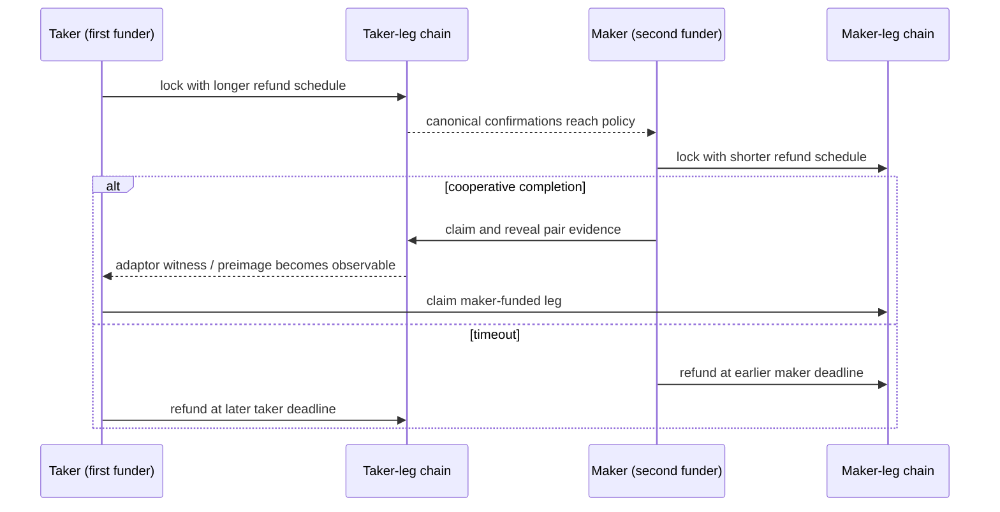

# ADR 0008: Bidirectional swaps use role-relative ordering

Status: Accepted — 2026-07-11

## Context

The live RFP requires swaps “between LEZ and” BTC, XMR, and transparent ZEC and
requires the taker to act on-chain before the maker. Neither the RFP nor accepted
proposal #112 limits which asset the taker sells. The initial skeleton silently
assumed the taker always sold the foreign asset, which would make half of the
ordinary user journeys unrepresentable.

## Decision

Support both `TakerSellsForeign` and `TakerSellsLez`. Direction is immutable,
signed negotiated data and is durably stored with the swap before any lock.
Generic coordination is role-relative:

1. the taker-funded leg is submitted and reaches its confirmation policy;
2. the maker-funded leg is submitted;
3. the maker claims the taker-funded leg and exposes pair-specific claim evidence;
4. the taker uses that evidence to claim the maker-funded leg.

The second-locking maker's refund matures first. The first-locking taker's refund
matures later by the pair-specific safety margin. Pair adapters map these roles
to LEZ or the foreign chain using direction; the core does not infer safety from
chain names.

## Evidence and consequences

`bidirectional_lifecycle` exercises reverse-direction claim and refund outcomes
for all three pairs and verifies old persisted state defaults to the original
direction. `operator_journey` creates a reverse-direction swap through the actual
CLI/daemon and reads the direction after process kill/restart.

All final happy/refund/concurrency matrices run in both directions. Typed chain
height/time deadlines and pair-specific margins remain a separate M1 gate; the
current normalized `u64` is only a transition prototype.
