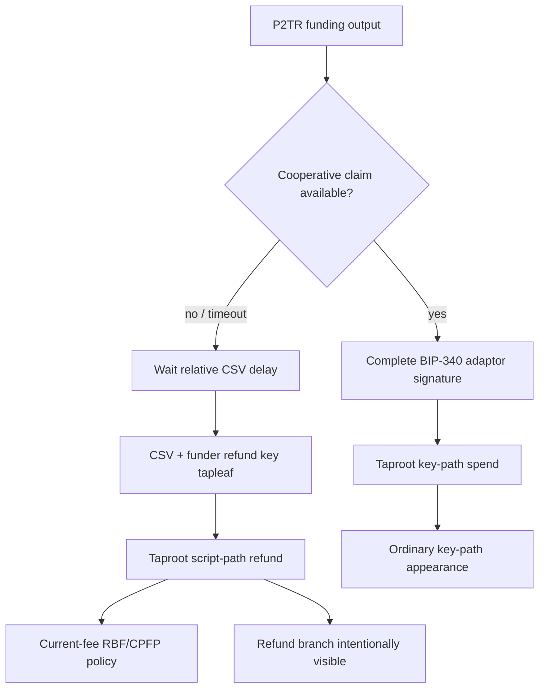

# ADR 0009: Bitcoin uses a Taproot script-path CSV refund

Status: Accepted; M3 entry audited, Bitcoin Core validation pending — 2026-07-14

## Context

RFP Reliability 7 requires choosing between a pre-signed timelocked key-path
refund and a Taproot script-path refund, then justifying the trade-off. The
cooperative claim must remain a BIP-340/BIP-341 key-path spend indistinguishable
from an ordinary Taproot payment.

A pre-signed refund hides the timeout path but makes recovery depend on a durable
transaction created during setup. It adds failure modes explicitly named by the
RFP: loss/corruption, malformed timelock, a setup-time fee becoming uneconomic or
unbroadcastable, and safety enforced by protocol ordering rather than the output
itself.

## Decision

Use a P2TR output whose internal/cooperative key supports the adaptor-signature
claim and whose committed refund tapleaf is equivalent to:

    <relative_delay> OP_CHECKSEQUENCEVERIFY OP_DROP
    <funder_refund_key> OP_CHECKSIG

The cooperative path is a key-path spend. The refund is a script-path spend and
is therefore identifiable when used, which the RFP explicitly permits. The
funder constructs and signs the refund spend when needed, with an `nSequence`
that satisfies the committed relative delay. Pair terms commit the exact output
key, tapleaf, amount, network, and refund authority before the taker locks.

This is the default because consensus protects the refund condition and recovery
does not depend on preserving one pre-signed transaction. A later privacy-driven
change requires measured evidence and a superseding ADR that addresses every
pre-signed failure mode.

## Fee, reorg, and operational consequences

- The relative delay starts from confirmation of the Bitcoin funding output;
  chain adapters never derive it from local wall-clock time.
- The refund transaction is created with current fee conditions. M3 must select
  and test a Bitcoin Core-compatible RBF/CPFP policy without changing the locked
  output, tapleaf, or refund authority.
- Confirmation/reorg monitoring can move an observation back below policy; the
  maker cannot treat mempool presence or a stale height as final.
- Wallet backup must preserve the refund key and immutable negotiated transcript,
  but not a one-off pre-signed refund transaction.
- The visible refund branch and timing leakage are documented as a known privacy
  limitation; the successful cooperative path retains key-path privacy.

## Required M3 evidence

Bitcoin Core tests cover the taproot commitment/control block, cooperative
key-path claim, correct refund key, exact CSV lower boundary, early/wrong-key
failure, reorged confirmation, realistic fee changes, replacement/child fee bump,
and both trade directions. ADR 0029 records the progressive local-node entry
boundary and the missing DLC Schnorr-vector reference. Official BIP-340/BIP-327
vectors, swap-specific adaptor vectors, an independent implementation
cross-check, and Core consensus validation are M3 gates. Formal third-party
cryptographic review remains an M7 production-release gate; the existing DLC
ECDSA corpus is not relabeled as Schnorr evidence.
