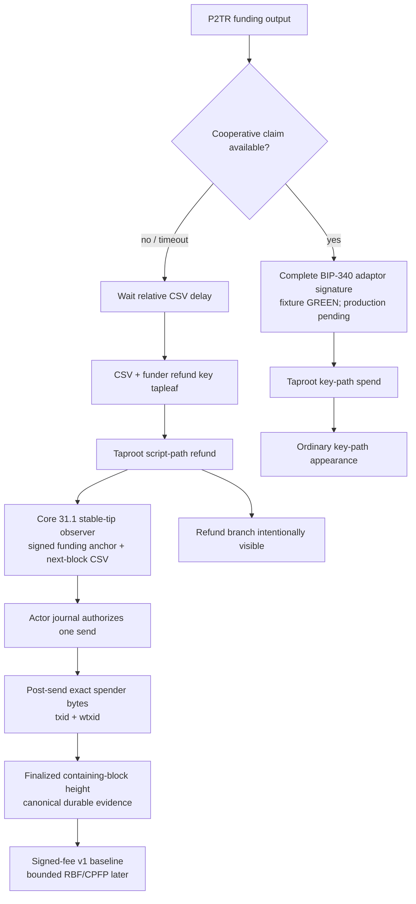

# ADR 0009: Bitcoin uses a Taproot script-path CSV refund

Status: Accepted; canonical BIP-342 construction plus typed Core maturity, exact observation, one-send submission, and finalized evidence are GREEN; actor key custody, actual-node refund matrix, and production fee policy remain — 2026-07-16

## Context

RFP Reliability 7 requires choosing between a pre-signed timelocked key-path
refund and a Taproot script-path refund, then justifying the trade-off. The
cooperative claim must remain a BIP-340/BIP-341 key-path spend indistinguishable
from an ordinary Taproot payment.

A pre-signed refund hides the timeout path but makes recovery depend on a durable
transaction created during setup. It adds failure modes explicitly named by the
RFP: loss/corruption, malformed timelock, a setup-time fee becoming uneconomic or
unbroadcastable, and safety enforced by protocol ordering rather than the output
itself.

## Decision

Use a P2TR output whose internal/cooperative key supports the adaptor-signature
claim and whose committed refund tapleaf is equivalent to:

    <relative_delay> OP_CHECKSEQUENCEVERIFY OP_DROP
    <funder_refund_key> OP_CHECKSIG

The cooperative path is a key-path spend. The refund is a script-path spend and
is therefore identifiable when used, which the RFP explicitly permits. The
funder constructs and signs the refund spend when needed, with an `nSequence`
that satisfies the committed relative delay. Pair terms commit the exact output
key, tapleaf, amount, network, refund authority, and both role-owned Bitcoin
destinations before the taker locks. Version one derives its initial refund fee
from the countersigned cooperative fee; the only output pays the
direction-derived funder's signed destination.

This is the default because consensus protects the refund condition and recovery
does not depend on preserving one pre-signed transaction. A later privacy-driven
change requires measured evidence and a superseding ADR that addresses every
pre-signed failure mode.

### Core maturity and exact-submission contract

The typed Core 31.1 adapter derives the actual funding containing height as
`stable_tip + 1 - funding_confirmations` and requires it to equal the
countersigned recovery anchor. For block-based BIP-68, a refund may enter block
`anchor + CSV`, so send eligibility begins when the next block can equal the
signed refund height; it does not wait one extra block. A confirmed refund
records its own containing-block height, derived as `stable_tip + 1 -
refund_confirmations`, never the observation tip height.

The actor-owned public-effect journal, not Core, owns the one-send CAS. The
adapter validates canonical consensus bytes and the exact three-item
SIGHASH_DEFAULT witness, preflights txid and wtxid, and calls
`sendrawtransaction` at most once. Because txid excludes witness, a successful
broadcast txid is insufficient: Core can already hold another witness with the
same txid. The adapter therefore accepts only an exact post-send
`gettxspendingprevout` byte readback with the expected txid and wtxid. Missing,
ambiguous, or different readback is terminal `Unknown` and never authorizes a
retry. The same shared submission primitive now closes that race for
cooperative claims.

## Fee, reorg, and operational consequences

- The relative delay starts from confirmation of the Bitcoin funding output;
  chain adapters never derive it from local wall-clock time.
- The deterministic version-one refund starts with the countersigned
  cooperative fee. M3 must select and test a Bitcoin Core-compatible bounded
  RBF/CPFP policy. Any replacement may only reduce the same signed
  funder-destination output, must be durably journaled as exact bytes before
  submission, and cannot change the locked output, tapleaf, or refund authority.
- Confirmation/reorg monitoring can move an observation back below policy; the
  maker cannot treat mempool presence or a stale height as final.
- Wallet backup must preserve the refund key and immutable negotiated transcript,
  but not a one-off pre-signed refund transaction.
- The visible refund branch and timing leakage are documented as a known privacy
  limitation; the successful cooperative path retains key-path privacy.

## Required M3 evidence

Bitcoin Core tests cover the taproot commitment/control block, cooperative
key-path claim, correct refund key, exact CSV lower boundary, early/wrong-key
failure, reorged confirmation, realistic fee changes, replacement/child fee bump,
and both trade directions. ADR 0029 records the progressive local-node entry
boundary and the missing DLC Schnorr-vector reference. Official BIP-340/BIP-327
vectors, swap-specific adaptor vectors, an independent implementation
cross-check, and Core consensus validation are M3 gates. Formal third-party
cryptographic review remains an M7 production-release gate; the existing DLC
ECDSA corpus is not relabeled as Schnorr evidence.

The first executable slice uses exact-pinned `bitcoin` 0.32.101 rather than
project-owned curve or Taproot arithmetic. It has hard-coded vectors for the
refund script, leaf/root, TapTweak hash, tweaked `Q`, parity, control block,
scriptPubKey, unsigned transaction, sighash, completed transaction, txid, and
wtxid. It verifies a completed default-sighash signature under `Q` before
creating a one-item key-path witness and rejects a valid signature on a changed
transaction. That library evidence alone does not prove the refund boundary
matrix; the composed one-process two-party Core fixture is recorded below.

The isolated Core fixture now uses public deterministic maker and taker key
shares with exact-pinned `musig2` 0.4.1. It performs BIP-327 aggregation and the
Taproot tweak to `Q`, computes role-tagged nonce commitments in process,
produces both partial signatures, verifies a 65-byte adaptor presignature,
adapts it with the public fixture scalar, and verifies the resulting 64-byte
signature under `Q`. Core accepts and mines the funding and one-item key-path
claim through policy and consensus at Regtest heights 102 and 103; extraction
recovers the public fixture scalar and matches its adaptor point.

The later role-fixed actor composition closes the former one-process claim
limitations: separate maker/taker processes, configs, keys, signer journals,
recovery stores, and public-effect journals complete both happy directions on
actual isolated Core and LEZ nodes. The first post-PoC hardening loop now also
constructs and verifies the exact BIP-342 refund transaction from the
countersigned agreement in both directions. It fixes the input sequence to the
committed CSV delay, signs the tapleaf digest under the funder's committed key,
and assembles the three-item witness. The typed Core component now proves the signed funding anchor, the exact next-block CSV boundary, mempool/confirming/finalized classification, conflicting spends, early inclusion rejection, exact post-send witness readback, and canonical finalized evidence at the refund containing height. Its complete tests, strict Clippy, and rustdoc are GREEN without new RPC methods or dependencies. Actor-owned refund-key custody, a fresh actual-node boundary run, restart/concurrency/reorg/fee cases, LEZ refund composition, and both-refund atomicity evidence remain pending.
