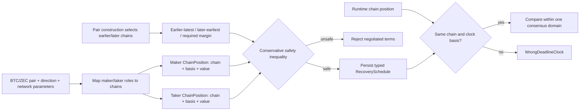

# ADR 0010: Typed consensus clocks and cross-chain safety bounds

Status: Accepted for deadline-bearing legs; XMR recovery superseded by ADR 0011
— 2026-07-11

## Context

The prototype compared two normalized `u64` values even though LEZ may use block
height or timestamp while BTC, XMR, and ZEC use their own consensus clocks. A
Bitcoin height and LEZ timestamp have no meaningful numeric ordering. RFP R6
also requires variance, congestion, reorgs, and drift to be explicit.

## Decision

Every consensus-deadline refund point is a
`ChainPosition { chain, basis, value }`, where basis is block height or
consensus timestamp. Deadline checks reject a different chain or basis instead
of comparing raw values. `RecoverySchedule` maps maker/taker-funded legs to
LEZ/foreign chains using immutable `SwapDirection`, while `TimelockSafety`
separately names the construction's earlier and later chains.

This does not apply to a maker-funded Monero output: Monero has no native refund
timelock. ADR 0011 replaces that prototype representation with a canonical LEZ
refund event plus key-share recovery trigger.

Cross-chain ordering is validated separately with conservative Unix-time bounds:

    later_refund_earliest >= earlier_refund_latest + required_reaction_margin

`earlier_refund_latest` includes the slowest plausible earlier-chain clock
advance, congestion, inclusion, configured reorg recovery, and sequencer
admission-to-validation slack. `later_refund_earliest` uses the fastest
plausible later-chain clock including permitted clock drift. Bitcoin maps these
chains from its reviewed first-funded-longer role flow. ZEC always uses LEZ as
earlier and Zcash as later, exactly matching RFP F4 even when trade direction
swaps participant roles. These values validate negotiated terms; runtime expiry
still uses only the relevant chain's typed consensus position.

## Consequences

Pair adapters own conversion from current tips/timestamps and reviewed network
parameters into deadlines and conservative bounds. The coordinator never invents
block-time conversions. Parameters name their network/release and are covered by
boundary tests; unsafe arithmetic, zero margin, wrong role chain, wrong
construction order, or wrong clock domain is rejected.

The prototype coordinator, persisted aggregate, RPC requests, CLI clock-basis inputs, and
refund transitions use the typed schedule. Four focused schedule tests, two ZEC
contract-order regressions, and the scenario/property/restart/operator suites
cover the integration. Named network parameters for public testnets are fixed in
the M1 profile; mainnet remains disabled pending telemetry and formal review.
