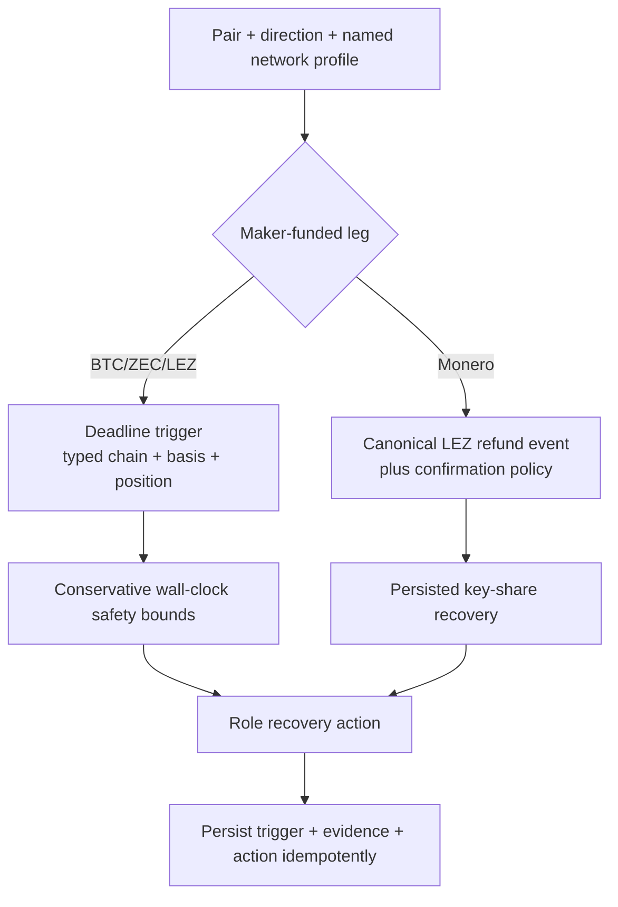

# ADR 0011: Deadline and event-gated recovery profiles

Status: Accepted; core representation refactor pending — 2026-07-11

## Context

ADR 0010 correctly prevents numeric comparison of unrelated chain clocks, but
the prototype generalized every recovery as a deadline. The reviewed LEZ-first
COMIT construction has no Monero script or refund timelock. Treating a Monero
height as a maker refund deadline would invent a security property the chain
does not provide.

## Decision

Recovery terms use a tagged trigger:

- `Deadline(ChainPosition)` for LEZ, Bitcoin CSV, and Zcash CLTV paths; or
- `CanonicalEvent { chain, event, confirmations }` for the XMR maker recovery
  unlocked by the taker's canonical LEZ refund and persisted recovery share.

`public-testnet-v1` fixes named confirmation depths and direction-specific
horizons in the M1 parameter profile. Mainnet has no enabled profile until
telemetry, fee/reorg stress tests, value policy, and formal review are complete.

## Consequences

The current generic `RefundSchedule` remains useful for BTC/ZEC tests but must be
refactored to `RecoverySchedule` before XMR implementation. RED tests first
assert that XMR has no Monero deadline, cannot recover before canonical LEZ
refund evidence, can recover after restart, and rejects XMR-first terms. No API,
CLI, or serialized state may expose a fake Monero deadline after that migration.
