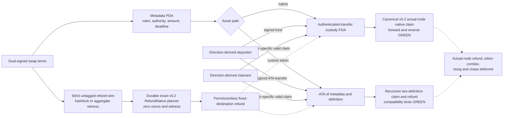

# ADR 0012: Split LEZ escrow metadata from asset custody

Status: Accepted; source-correct custody, canonical v0.2 native claims, strict hashlock/witnessed refund wire, and durable exact v0.2 refund preparation GREEN; finalized observation, actor execution, actual-node refund, and token corridor hardening remain -- reconciled 2026-07-16

## Context

The RFP requires native LEZ and custom tokens through ATAs. Pinned LEZ source
allows only an account's owning program to debit native balance. Exact v0.1.2
already ships `authenticated_transfer`: a user initializes an account under that
program, and an escrow custody address can remain a PDA of the swap program while
`authenticated_transfer` owns its balance. Custom token holdings and ATAs have
their own program-owned data formats. An ATA address is derived by the ATA
program from owner plus definition, but the resulting holding is owned by the
token program.

## Decision

Use a swap-program-owned public metadata PDA plus exactly one custody path:

- native vault PDA owned by `authenticated_transfer`; or
- ATA derived from the metadata PDA and immutable token definition.

Initialization, claim, and refund verify derivation, owner, asset definition,
exact balance, and fixed destinations. Refund is permissionless after the LEZ
timestamp deadline. ADR 0029 supersedes the BTC authority detail: both BTC
directions use distinct two-party aggregate witnessed authorities bound to exact
claim messages and adaptor sessions, with no actor-owned or direct-secret bypass.
XMR retains its separately reviewed pair-specific witnessed authority; hash
claims use reviewed library verification.

The native-refund bridge uses one strict untagged authority envelope. Existing
hashlock JSON remains byte-shape compatible, while the BTC corridor carries
aggregate authority account/key facts. Strict inner decoders reject mixed
authority fields; the v0.1.2 sidecar accepts only hashlock terms and the v0.2 lane
durably prepares both shapes; finalized observation and actor authorization
remain separate.

The first ZEC compatibility fixture was narrower than this target: it directly
mutated swap-program-owned native accounts and stored custom tokens at an escrow
custody PDA. Direct v0.1.2 source review invalidated both as final evidence. The
replacement uses authenticated-transfer chained calls for native custody and
official ATA create/transfer semantics for custom custody, with no local account
codec or derivation.

## Consequences

One-account escrow sketches are rejected. Generated IDL/client, replay,
preimage, version, validity-boundary, authenticated-transfer, and exact ATA
tests are GREEN. The canonical v0.2 native path was deployed as ProgramId
`5cf8c5...29c1` and exercised by independent actors in both actual-node happy
directions, reaching terminal `Claimed` state with zero custody. The custom
token path remains lower recursive compatibility evidence rather than a
composed v0.2 corridor claim. The durable v0.2 planner now produces and
restart-restores exact unsigned `RefundNative` bytes without a nonce RPC, as specified by ADR 0038. Finalized
refund observation, actor submission, actual-node refund, token-corridor, reorg,
chaos, and public execution remain deferred. Private custody, NFTs, partial
withdrawal, and mutable destinations are outside v1.
