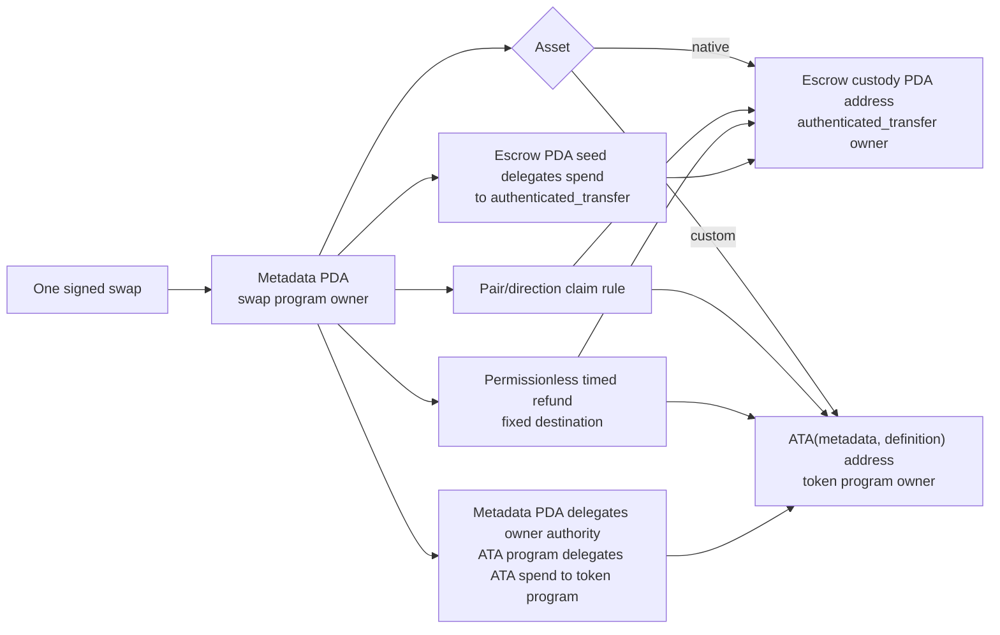

# ADR 0012: Split LEZ escrow metadata from asset custody

Status: Accepted target; source-correct authenticated-transfer/ATA TDD in progress — 2026-07-11

## Context

The RFP requires native LEZ and custom tokens through ATAs. Pinned LEZ source
allows only an account's owning program to debit native balance. Exact v0.1.2
already ships `authenticated_transfer`: a user initializes an account under that
program, and an escrow custody address can remain a PDA of the swap program while
`authenticated_transfer` owns its balance. Custom token holdings and ATAs have
their own program-owned data formats. An ATA address is derived by the ATA
program from owner plus definition, but the resulting holding is owned by the
token program.

## Decision

Use a swap-program-owned public metadata PDA plus exactly one custody path:

- native vault PDA owned by `authenticated_transfer`; or
- ATA derived from the metadata PDA and immutable token definition.

Initialization, claim, and refund verify derivation, owner, asset definition,
exact balance, and fixed destinations. Refund is permissionless after the LEZ
timestamp deadline. BTC/XMR witnessed claims use isolated per-swap claim
authorities; secret/hash claims use reviewed library verification.

The first ZEC compatibility fixture was narrower than this target: it directly
mutated swap-program-owned native accounts and stored custom tokens at an escrow
custody PDA. Direct v0.1.2 source review invalidated both as final evidence. The
replacement uses authenticated-transfer chained calls for native custody and
official ATA create/transfer semantics for custom custody, with no local account
codec or derivation.

## Consequences

One-account escrow sketches are rejected. Generated IDL/client, replay,
preimage, version, and validity-boundary tests remain. The native/asset custody
tests are being replaced with actual-user authenticated-transfer and exact ATA
execution before standalone-sequencer deployment evidence. Private custody,
NFTs, partial withdrawal, and mutable destinations are outside v1.
