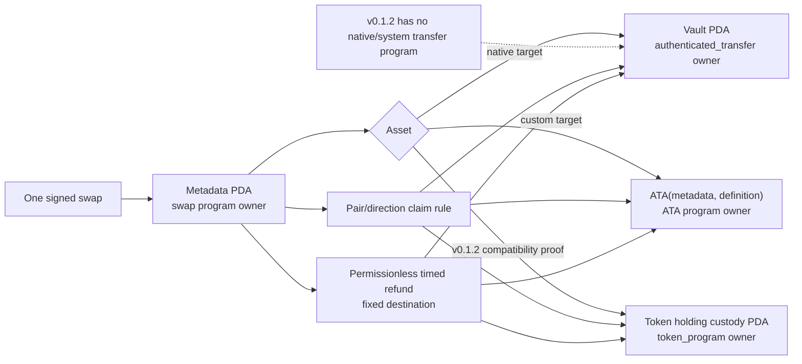

# ADR 0012: Split LEZ escrow metadata from asset custody

Status: Accepted; custom-token instruction semantics validated, native-user/ATA/sequencer evidence pending — 2026-07-11

## Context

The RFP requires native LEZ and custom tokens through ATAs. Pinned LEZ source
allows only an account's owning program to debit native balance. Its `vault`
program therefore derives a PDA under the caller but lets
`authenticated_transfer` own the spendable account. Custom token holdings and
ATAs likewise have their own program-owned data formats. The exact v0.1.2
surface required by SPEL v0.5.0 does not expose that native/system transfer
program, so compatibility code cannot honestly onboard a user-owned native
account.

## Decision

Use a swap-program-owned public metadata PDA plus exactly one custody path:

- native vault PDA owned by `authenticated_transfer`; or
- ATA derived from the metadata PDA and immutable token definition.

Initialization, claim, and refund verify derivation, owner, asset definition,
exact balance, and fixed destinations. Refund is permissionless after the LEZ
timestamp deadline. BTC/XMR witnessed claims use isolated per-swap claim
authorities; secret/hash claims use reviewed library verification.

The current ZEC compatibility fixture is narrower than this target. It proves
metadata and custody-PDA binding plus two independent custom-token definitions
by executing chained transfers through pinned `token_program` v0.1.2 and LEZ
`validate_execution`. Its native path is deliberately limited to accounts
already owned by the swap program. It does not claim actual-user native custody
or final ATA integration.

## Consequences

One-account escrow sketches are rejected. RED/GREEN substitution,
balance-conservation, generated IDL/client, custom-token chained execution,
replay, and validity-boundary tests now pass. Actual-user native transfer, final
ATA derivation, and standalone-sequencer execution remain required before
deployment. Private custody, NFTs, partial withdrawal, and mutable destinations
are outside v1.
