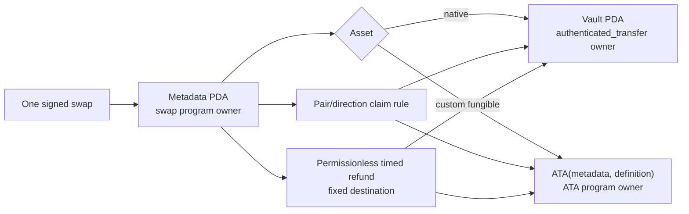

# ADR 0012: Split LEZ escrow metadata from asset custody

Status: Accepted; SPEL/standalone-sequencer validation pending — 2026-07-11

## Context

The RFP requires native LEZ and custom tokens through ATAs. Pinned LEZ source
allows only an account's owning program to debit native balance. Its `vault`
program therefore derives a PDA under the caller but lets
`authenticated_transfer` own the spendable account. Custom token holdings and
ATAs likewise have their own program-owned data formats.

## Decision

Use a swap-program-owned public metadata PDA plus exactly one custody path:

- native vault PDA owned by `authenticated_transfer`; or
- ATA derived from the metadata PDA and immutable token definition.

Initialization, claim, and refund verify derivation, owner, asset definition,
exact balance, and fixed destinations. Refund is permissionless after the LEZ
timestamp deadline. BTC/XMR witnessed claims use isolated per-swap claim
authorities; secret/hash claims use reviewed library verification.

## Consequences

One-account escrow sketches are rejected. M2 starts with RED substitution and
balance-conservation tests against native and custom paths, a generated SPEL
IDL/client golden test, and standalone-sequencer execution before deployment.
Private custody, NFTs, partial withdrawal, and mutable destinations are outside
v1.
