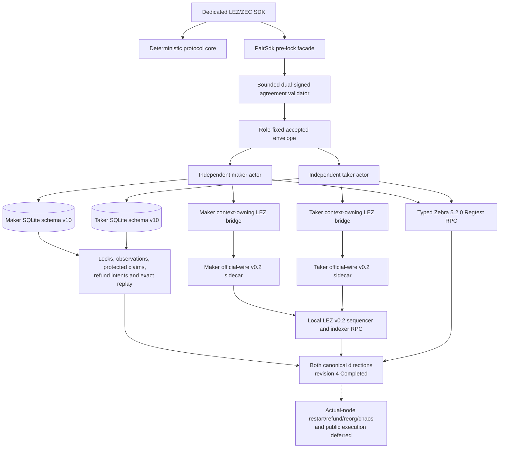

# ADR 0013: Deterministic SDK core with optional async orchestration

Status: canonical ZEC negotiation, schema-v3 actor activation, schema-v10 replay, both lock and claim effects, role-isolated LEZ sidecars, and Zebra adapters completed in both actual-node happy directions; actual-node recovery/chaos and public execution deferred -- reconciled 2026-07-14

## Context

The RFP requires one complete SDK per pair, while the accepted proposal commits
to a common trait surface. Hiding all network I/O inside one async trait would
couple protocol correctness to a runtime and make deterministic replay harder.
Excluding discovery/negotiation entirely would fail the complete-lifecycle SDK
requirement.

## Decision

Ship a shared deterministic lifecycle/evidence/error crate and three dedicated
pair crates. Each pair crate also exposes a `PairSdk` facade composing Delivery,
Chat, chain, and recovery-store ports, plus a reference async coordinator.
`ZecPairSdk::negotiate_at` treats all transport bytes as untrusted and validates
the bounded concrete agreement at a trusted local time. Activation persists the
accepted envelope, fixed local role, accepted time, commitment, and revision
before returning `ActiveZecSwap`. Resume revalidates those durable parts before
exposing an active value. The active type has no discovery, negotiation, raw
chain-adapter, or recovery-store accessors. Pair-specific evidence and errors
remain concrete; only lifecycle vocabulary is common.

## Initial executable evidence

The integrated ZEC slice defines async discovery, untrusted-byte negotiation,
and role-local recovery contracts without inventing Delivery or Chat wire
protocols. Independent maker and taker SDK instances validate the same concrete
dual-signed agreement, reject wrong role, revision, profile, wire, and swap ID,
persist to separate stores before activation, and resume the original accepted
wire even after transcript expiry. Exact replay is idempotent and a changed
same-key record conflicts. The claim preimage wrapper and active diagnostics are
redacted; secret storage zeroizes on drop. At that initial checkpoint, the discovery, negotiation, and chain adapters
proved only the API/type boundary; they were not Logos Delivery/Chat, production
chain actions, or actor E2E. The canonical status addendum below records the
later composed actor evidence.

The implemented first-lock slice adds a bounded action/observation contract without
exposing raw adapters: exact Zcash funding bytes, or separate exact LEZ
initialize and fund bytes, are staged before any node call. Restart revalidates
the intent and observes before byte-identical submission. Confirmed final-step
evidence is projected only after the store atomically commits the exact
transition, next revision, and intent closure; an unknown result is probed before
in-memory apply, and resume replays the committed transition. The executable
store adapter is now cloneable role-fixed SQLite: it retains the closed intent,
atomically commits transition/revision/closure, isolates maker and taker rows,
revalidates primitive payloads, survives close/reopen, and rejects injected
rollback and mirrored torn-state corruption. Encryption and the general
later-effect outbox remain M5 work.

The maker now has a separate observation-only route. Signed direction chooses
LEZ or Zcash, the other port is not queried, and absence, unstable state, or an
RPC error cannot advance or persist protocol state. Forward Zcash accepts only
the complete canonical output observation and revalidates its transaction,
block, tip, outpoint, value, scripts, depth, and agreement HTLC-output binding after
restart; the primitive transaction-ID/depth assertion is rejected. Validated evidence commits
to the maker-role predecessor slot before memory changes and replays
from the maker's own SQLite store without taker intent or negotiation state.
The ordered journal folds canonical evidence, same-inclusion depth changes,
atomic same-tip replacement, and affirmative exact-head removal through
`ZcashObservationTracker` before every append/load. Duplicate polls write
nothing and changed inclusion without replacement fails; exact row-range
validation, poison-append rejection, rollback, restart, and stale-instance
catch-up are tested. The SDK returns Wait afterward, including on
restart. Reverse LEZ likewise rejects primitive ID/depth assertions. Its stable
snapshot validator binds signed channel/genesis, public fund program, signer,
generated account order, canonical inclusion/tip, complete funded metadata,
exact custody amount/asset, depth, and public finality policy. The primitive
snapshot is persisted and revalidated after restart. The production Zcash port
must still assemble fresh canonical snapshots. The dependency-free LEZ
two-phase tracker now proves duplicate suppression, monotonic finality,
affirmative removal/replacement, and finalized-history rejection. Complete
primitive removal/replacement records are integrated with the ordered
SDK/SQLite journal. The official-wire LEZ v0.2 sidecar and context-owning port
are now composed in the canonical local happy paths. The distinct
fresh eligibility call replays and re-queries, but deliberately caches no
authority. It now applies to both deterministic-local directions and checks
signed depth explicitly. The public-policy unit seam distinguishes LEZ
Pending/Safe from Finalized, but public activation remains fail-closed. It leaves
`next_action` at `Wait` because permission is never cached. The implemented
maker method consumes the fresh result internally, persists the exact
opposite-chain plan, and atomically projects confirmed funding. Both directions replay from schema-v10 SQLite at `BothLegsLocked`. The canonical
local actor runs then crossed production-shaped LEZ and Zebra ports through
claim completion. Actual-node transport/reorg repetition remains deferred.

## 2026-07-14 canonical actual-node reconciliation

Independent schema-v3 maker and taker processes used separate configs, stores,
claim keys, signers, sidecars, and request journals in
`m2cert-canonical-forward-bb53daf-20260714a` and
`m2cert-canonical-reverse-bb53daf-20260714a`. Both crossed the exact deployed
ProgramId `5cf8c5...29c1`, the three-service LEZ v0.2 stack, and Zebra Regtest;
both role-local stores reached revision 4 `Completed`. The same signed ordering
held in both directions: confirmed Zcash funding, then LEZ revealing claim,
then exact Zcash follow-up spend. This proves the M2 PoC happy-path adapter and
actor composition, not actual-node restart/refund/reorg, chaos, public service
behavior, or production transport hardening.

## 2026-07-18 BTC public lifecycle closure

The BTC facade now exposes a bounded canonical secret-free durable record,
exact create/compare-exchange store port, role-fixed stored SDK, and typed
Bitcoin/LEZ runtime ports. It drives both claim orders and both ordered refund
directions through revision four, resumes after every transition, converges on
byte-identical replay without another write, and rejects chain, role,
agreement, revision, and public-effect substitution. Full-range LEZ `u128`
amounts use canonical decimal strings rather than lossy JSON numbers.

The SDK deliberately does not pretend an in-memory reference store is process
durable or that a lifecycle CAS is a chain transaction. Applications implement
the store and chain ports; mutating ports persist exact public bytes before a
possible node call, observe before another send decision, and keep unknown
outcomes non-authorizing. The existing schema-4 reference actor supplies that
concrete local SQLite/effect-journal evidence. Strict rustdoc, public doctests,
the dedicated `durable-lifecycle.rs` wiring example, and both-direction
restart/replay tests are GREEN at pushed commit `0c78f3d`.

## Consequences

Logos modules may use the complete facade or embed the deterministic engine with
their own adapters. Every pair crate must document and compile the same real-role journeys used by
black-box E2E tests. For M2, both actual-node happy directions are GREEN;
refund, restart, concurrency fault injection, post-lock transport loss, reorg,
and chaos remain explicit later phases. The workspace versions together until the first audited
protocol version.
