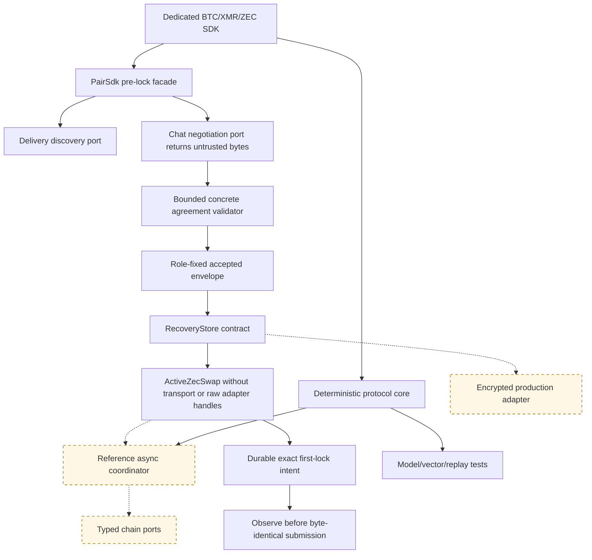

# ADR 0013: Deterministic SDK core with optional async orchestration

Status: concrete ZEC negotiation, activation, resume, and first-lock intent
boundary implemented; durable evidence projection in progress — 2026-07-12

## Context

The RFP requires one complete SDK per pair, while the accepted proposal commits
to a common trait surface. Hiding all network I/O inside one async trait would
couple protocol correctness to a runtime and make deterministic replay harder.
Excluding discovery/negotiation entirely would fail the complete-lifecycle SDK
requirement.

## Decision

Ship a shared deterministic lifecycle/evidence/error crate and three dedicated
pair crates. Each pair crate also exposes a `PairSdk` facade composing Delivery,
Chat, chain, and recovery-store ports, plus a reference async coordinator.
`ZecPairSdk::negotiate_at` treats all transport bytes as untrusted and validates
the bounded concrete agreement at a trusted local time. Activation persists the
accepted envelope, fixed local role, accepted time, commitment, and revision
before returning `ActiveZecSwap`. Resume revalidates those durable parts before
exposing an active value. The active type has no discovery, negotiation, raw
chain-adapter, or recovery-store accessors. Pair-specific evidence and errors
remain concrete; only lifecycle vocabulary is common.

## Initial executable evidence

The integrated ZEC slice defines async discovery, untrusted-byte negotiation,
and role-local recovery contracts without inventing Delivery or Chat wire
protocols. Independent maker and taker SDK instances validate the same concrete
dual-signed agreement, reject wrong role, revision, profile, wire, and swap ID,
persist to separate stores before activation, and resume the original accepted
wire even after transcript expiry. Exact replay is idempotent and a changed
same-key record conflicts. The claim preimage wrapper and active diagnostics are
redacted; secret storage zeroizes on drop. These in-memory adapters prove the
API/type boundary only; they are not Logos Delivery/Chat, encrypted production
storage, typed chain actions, or actor E2E.

The next slice adds a bounded first-lock action/observation contract without
exposing raw adapters: exact Zcash funding bytes, or separate exact LEZ
initialize and fund bytes, are staged before any node call. Restart revalidates
the intent and observes before byte-identical submission. This does not yet
atomically persist confirmed evidence or advance the coordinator.

## Consequences

Logos modules may use the complete facade or embed the deterministic engine with
their own adapters. Every pair crate must document and compile the same real-role
happy, refund, restart, concurrency, and post-lock transport-loss journeys used
by black-box E2E tests. The workspace versions together until the first audited
protocol version.
