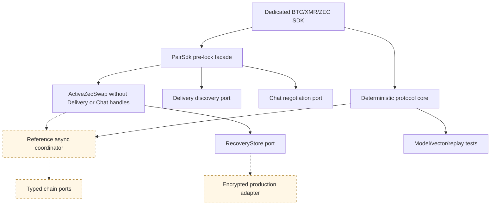

# ADR 0013: Deterministic SDK core with optional async orchestration

Status: ZEC pre-lock boundary implemented; active chain lifecycle in progress — 2026-07-12

## Context

The RFP requires one complete SDK per pair, while the accepted proposal commits
to a common trait surface. Hiding all network I/O inside one async trait would
couple protocol correctness to a runtime and make deterministic replay harder.
Excluding discovery/negotiation entirely would fail the complete-lifecycle SDK
requirement.

## Decision

Ship a shared deterministic lifecycle/evidence/error crate and three dedicated
pair crates. Each pair crate also exposes a `PairSdk` facade composing Delivery,
Chat, chain, and recovery-store ports, plus a reference async coordinator.
`ZecPairSdk::activate` persists immutable terms and returns an `ActiveZecSwap`
whose type has no discovery or negotiation generic parameters. Pair-specific
evidence and errors remain concrete; only lifecycle vocabulary is common.

## Initial executable evidence

The first ZEC slice defines async discovery, negotiation, and role-local recovery
ports without inventing Delivery or Chat wire protocols. Independent maker and
taker SDK instances receive the same versioned agreement, reject wrong pair or
profile confirmation policy, persist to separate stores, activate, and resume.
The claim preimage wrapper is redacted, non-serializable, and zeroized on drop.
These in-memory adapters prove the API/type boundary only; they are not Logos
Delivery/Chat, encrypted production storage, typed chain actions, or actor E2E.

## Consequences

Logos modules may use the complete facade or embed the deterministic engine with
their own adapters. Every pair crate must document and compile the same real-role
happy, refund, restart, concurrency, and post-lock transport-loss journeys used
by black-box E2E tests. The workspace versions together until the first audited
protocol version.
