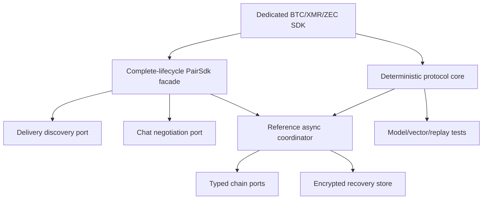

# ADR 0013: Deterministic SDK core with optional async orchestration

Status: Accepted for Logos review — 2026-07-11

## Context

The RFP requires one complete SDK per pair, while the accepted proposal commits
to a common trait surface. Hiding all network I/O inside one async trait would
couple protocol correctness to a runtime and make deterministic replay harder.
Excluding discovery/negotiation entirely would fail the complete-lifecycle SDK
requirement.

## Decision

Ship a shared deterministic lifecycle/evidence/error crate and three dedicated
pair crates. Each pair crate also exposes a `PairSdk` facade composing Delivery,
Chat, chain, and recovery-store ports, plus a reference async coordinator.
Discovery and negotiation handles are dropped after first lock. Pair-specific
evidence and errors remain concrete; only lifecycle vocabulary is common.

## Consequences

Logos modules may use the complete facade or embed the deterministic engine with
their own adapters. Every pair crate must document and compile the same real-role
happy, refund, restart, concurrency, and post-lock transport-loss journeys used
by black-box E2E tests. The workspace versions together until the first audited
protocol version.
