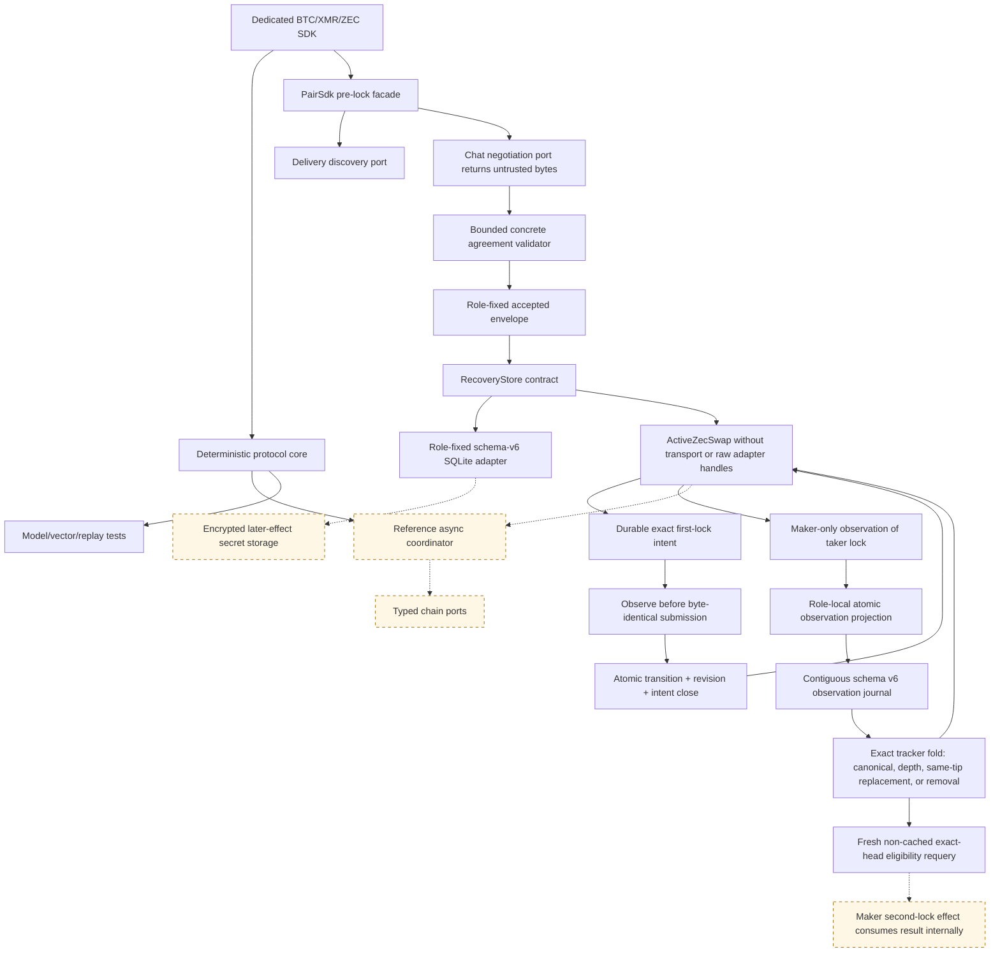

# ADR 0013: Deterministic SDK core with optional async orchestration

Status: concrete ZEC negotiation, activation, resume, first-lock intent, taker
projection, and maker-independent SQLite observation/replay implemented; chain
and transport adapters in progress — 2026-07-12

## Context

The RFP requires one complete SDK per pair, while the accepted proposal commits
to a common trait surface. Hiding all network I/O inside one async trait would
couple protocol correctness to a runtime and make deterministic replay harder.
Excluding discovery/negotiation entirely would fail the complete-lifecycle SDK
requirement.

## Decision

Ship a shared deterministic lifecycle/evidence/error crate and three dedicated
pair crates. Each pair crate also exposes a `PairSdk` facade composing Delivery,
Chat, chain, and recovery-store ports, plus a reference async coordinator.
`ZecPairSdk::negotiate_at` treats all transport bytes as untrusted and validates
the bounded concrete agreement at a trusted local time. Activation persists the
accepted envelope, fixed local role, accepted time, commitment, and revision
before returning `ActiveZecSwap`. Resume revalidates those durable parts before
exposing an active value. The active type has no discovery, negotiation, raw
chain-adapter, or recovery-store accessors. Pair-specific evidence and errors
remain concrete; only lifecycle vocabulary is common.

## Initial executable evidence

The integrated ZEC slice defines async discovery, untrusted-byte negotiation,
and role-local recovery contracts without inventing Delivery or Chat wire
protocols. Independent maker and taker SDK instances validate the same concrete
dual-signed agreement, reject wrong role, revision, profile, wire, and swap ID,
persist to separate stores before activation, and resume the original accepted
wire even after transcript expiry. Exact replay is idempotent and a changed
same-key record conflicts. The claim preimage wrapper and active diagnostics are
redacted; secret storage zeroizes on drop. The discovery, negotiation, and chain
adapters prove the API/type boundary only; they are not Logos Delivery/Chat,
production chain actions, or actor E2E.

The implemented first-lock slice adds a bounded action/observation contract without
exposing raw adapters: exact Zcash funding bytes, or separate exact LEZ
initialize and fund bytes, are staged before any node call. Restart revalidates
the intent and observes before byte-identical submission. Confirmed final-step
evidence is projected only after the store atomically commits the exact
transition, next revision, and intent closure; an unknown result is probed before
in-memory apply, and resume replays the committed transition. The executable
store adapter is now cloneable role-fixed SQLite: it retains the closed intent,
atomically commits transition/revision/closure, isolates maker and taker rows,
revalidates primitive payloads, survives close/reopen, and rejects injected
rollback and mirrored torn-state corruption. Encryption and the general
later-effect outbox remain M5 work.

The maker now has a separate observation-only route. Signed direction chooses
LEZ or Zcash, the other port is not queried, and absence, unstable state, or an
RPC error cannot advance or persist protocol state. Forward Zcash accepts only
the complete canonical output observation and revalidates its transaction,
block, tip, outpoint, value, scripts, depth, and agreement HTLC-output binding after
restart; the primitive transaction-ID/depth assertion is rejected. Validated evidence commits
to the maker-role predecessor slot before memory changes and replays
from the maker's own SQLite store without taker intent or negotiation state.
The ordered journal folds canonical evidence, same-inclusion depth changes,
atomic same-tip replacement, and affirmative exact-head removal through
`ZcashObservationTracker` before every append/load. Duplicate polls write
nothing and changed inclusion without replacement fails; exact row-range
validation, poison-append rejection, rollback, restart, and stale-instance
catch-up are tested. The SDK returns Wait afterward, including on
restart. Reverse LEZ likewise rejects primitive ID/depth assertions. Its stable
snapshot validator binds signed channel/genesis, public fund program, signer,
generated account order, canonical inclusion/tip, complete funded metadata,
exact custody amount/asset, depth, and public finality policy. The primitive
snapshot is persisted and revalidated after restart. The production Zcash port
must still assemble fresh canonical snapshots. The dependency-free LEZ
two-phase tracker now proves duplicate suppression, monotonic finality,
affirmative removal/replacement, and finalized-history rejection; integration
with the ordered SDK/SQLite journal and the official-wire LEZ port remain open. The distinct
fresh eligibility call replays and re-queries, but deliberately caches no
authority and leaves `next_action` at `Wait`; the future maker second-lock
method must consume the result internally in the same operation.

## Consequences

Logos modules may use the complete facade or embed the deterministic engine with
their own adapters. Every pair crate must document and compile the same real-role
happy, refund, restart, concurrency, and post-lock transport-loss journeys used
by black-box E2E tests. The workspace versions together until the first audited
protocol version.
