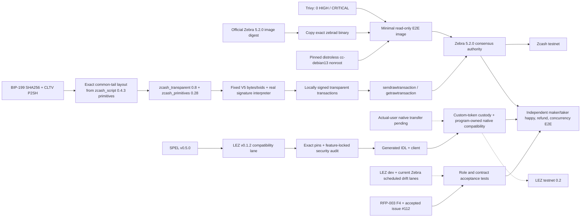

# ADR 0014: M2 ZEC implementation and compatibility pins

Status: Accepted for M2 implementation — 2026-07-11

## Context

The contractual sources require transparent ZEC through a BIP-199-style
SHA-256/CLTV HTLC, a SPEL-generated LEZ escrow, Zcash testnet use, and real
maker/taker lifecycle demonstrations. Upstream prose is insufficient by itself:
the implementation must select versions whose APIs and consensus behavior are
executable together.

An initial review selected Zebra 4.5.1. A fresh release/security reconciliation
rejected that pin: 4.5.3 mitigated an Orchard vulnerability and 5.0.0 activated
the fixed NU6.2 rules. A second review rejected the stale 5.1.1 runtime and moved
the consensus authority to the signed 5.2.0 stable release, which increases the
local rollback window from 99 to 1,000 blocks. M2 must not freeze a node version
merely because an older review called it “latest.”

## Decision

Use the following compatibility baseline. Every mutable name is paired with an
immutable source or image identity.

| Layer | M2 pin | License/policy reason |
|---|---|---|
| SPEL | stable `v0.5.0`, commit `73fc462eb8f0a4d00f1a846437c627ec2e523f83` | Repository carries MIT and Apache-2.0 files but omits Cargo license fields; fixture policy hash-locks both texts for all three used crates; use its macros, IDL, and client generator instead of recreating them |
| LEZ compatibility | tag `v0.1.2`, commit `cf3639d8252040d13b3d4e933feb19b42c76e14a` | This is the exact LEZ dependency locked by SPEL v0.5.0; SPEL records it as equivalent to the earlier v0.2.0-rc3 compatibility point |
| LEZ semantic drift | `dev` evidence pin `cac4921581b37e85ae25e940f3a62412cd22308e`, plus scheduled current `dev` | Keeps M1 validity/signature assumptions checked without pretending the newer development tree is SPEL-compatible |
| BIP-199 script | `zcash_script = 0.4.3`, Apache-2.0 | Reuse its typed opcodes, push encodings, CLTV, branch, parser, and P2SH helpers; compose BIP-199's exact common `OP_EQUALVERIFY OP_CHECKSIG` tail |
| Script bound type | transitive `bounded-vec = 0.9.0`, CC0-1.0 | Permissive public-domain dedication, scoped to this exact crate/version in `deny.toml`; CC0 is not added to the global license allowlist |
| Script signature validation | `zcash_script`'s `signature-validation` feature with `secp256k1 = 0.29.1` and `secp256k1-sys = 0.10.1`, both CC0-1.0 | Use the maintained Rust Bitcoin/libsecp256k1 DER/pubkey/signature path; both licenses are exact-package exceptions; real signatures and sighashes remain canonical transaction-adapter work |
| Zcash transaction stack | `zcash_transparent = 0.8.0`, `zcash_primitives = 0.28.0`, `zcash_protocol = 0.9.0`; audited together at librustzcash commit `8766e0532a793516c27ad2f838bccfbb24d47285` | Canonical MIT/Apache Rust types and consensus encodings; no custom signature, sighash, address, or transaction codec |
| Consensus node | Zebra `v5.2.0`, commit `62e4a43879c9c86d23ecfcf5a02335eec8a1517d` | Signed stable Zcash Foundation node; MIT/Apache; supports raw transaction submission and lookup and increases the local rollback window to 1,000 blocks |
| Official binary source image | `docker.io/zfnd/zebra:5.2.0@sha256:477e65add4dacf52074ba04da8d763c89c26cc57f911dba2127401f8e1da597d` | Pins the official multi-platform index; Linux/amd64 resolves to `sha256:883cc4c341524edab34eec4a282679ce8b3603e3f337980f719b2728fd960616` |
| Minimal runtime base | `gcr.io/distroless/cc-debian13:nonroot@sha256:aded2458d026e046cb68199db0e5793e1028ffa143f7258f3c4278253e20add7` | Google distroless, Apache-2.0; supplies only the dynamic C/C++ runtime needed by the official binary and runs as UID/GID 65532 |
| Isolated node image | Repository Dockerfile copies only `/usr/local/bin/zebrad` from the official source image into the pinned distroless base | The official 5.1.1 and 5.2.0 Debian runtimes each failed the 2026-07-11 strict scan with 40 HIGH and 2 CRITICAL findings; the final derived image passed with zero HIGH/CRITICAL findings without suppressions |

The crate's ready-made `sha256_htlc_p2pkh` helper is not byte-identical to
BIP-199: it repeats `OP_EQUALVERIFY OP_CHECKSIG` inside each branch. The BIP puts
that tail once after `OP_ENDIF`. M2 therefore composes the exact template from
the crate's lower-level canonical primitives rather than copying a raw hex blob
or accepting merely equivalent bytes.

The BIP-199 claim stack is signature, claimant public key, preimage, and true;
the refund stack is signature, funder public key, and false. The redeem script
uses `OP_SHA256` in the true branch and absolute `OP_CHECKLOCKTIMEVERIFY` in the
false branch. Tests must pin exact redeem-script and P2SH bytes, branch stack
shape, wrong-preimage rejection, signature ownership, transaction lock time and
non-final input sequence, and the height/time threshold boundary.

Refund transaction construction takes its `nLockTime` directly from the
contract and uses input sequence `0xfffffffe`. A final `0xffffffff` input is
never exposed by the refund API because it disables CLTV enforcement.

The signed-spend foundation accepts the fetched funding `TxOut`, validates its
scriptPubKey against the exact contract, derives the input value from it, and
rejects consensus branches in which V5 is invalid. Claim and refund tests pin
the complete serialized bytes and txids. Both generated signatures execute via
the upstream `zcash_script` callback checker, which independently recomputes
ZIP-244 from the real prevout context; signature-bit mutations fail.

The current SPEL fixture proves macro expansion, generated IDL, the official
generated-client golden, and custody state transitions. Client tests require
claimant and depositor signatures on claim and refund. Eleven custody tests bind
version, swap, actors, custody PDA, asset program/definition, amount, refund
time, and terminal status; reject substitution, wrong preimage, and replay; and
keep claim/refund windows disjoint. Calls for two custom-token definitions
execute through the exact pinned `token_program` and their post-states pass LEZ
`validate_execution`.

The v0.1.2 compatibility surface exposes no native/system transfer program, and
its validator permits a native balance decrease only from an account owned by
the executing program. Native tests therefore prove program-owned-account
compatibility only, not actual-user native onboarding or custody. That boundary
remains an explicit M2 blocker rather than being simulated in adapter code. The
accepted LEZ pin forces `rsa 0.9.10` and `tracing-subscriber 0.2.25`; no safe
compatible pin exists today. The fixture-local policy is permitted only because
CI proves rzup `publish`/`install` and tracing `fmt`/`ansi` features are absent,
so the advisory capabilities are not compiled. Stale ignores are errors. The
root workspace has no such advisory exceptions, and the deployed guest graph
must be re-audited before testnet evidence or an M2 tag.

The deterministic Zebra lane mines NU6.2 Regtest coinbases to a key held by the
funding actor, fetches the actual outputs through RPC, and submits locally signed
funding, claim, and refund transactions. Zebra rejects bit-mutated funding and
claim signatures and a refund before its CLTV height; valid transactions are
mined and re-read with confirmations. This is consensus-adapter evidence, not
the still-pending composed maker/taker cross-chain E2E.

Use Zebra as the acceptance authority. Local parsing or interpreter success is
useful unit evidence but never proves a transaction is consensus-valid or
standard enough for the node mempool. M2 E2E therefore constructs/signs locally,
submits with `sendrawtransaction`, observes with `getrawtransaction`, and checks
confirmed state through the selected Zebra RPC.

## Isolation and upgrade policy

The derived image is built only from its two immutable inputs and used inside a unique Compose project named
`lez-atomic-swaps-${RUN_ID}` with project-scoped data and ephemeral host ports.
No fixed container name, shared network, shared volume, or global Docker cleanup
is permitted. The container is non-root, read-only, capability-free, and
shell-free; readiness is checked from the host so the runtime does not carry
`curl` merely for a healthcheck.

The 5.x release line has a shortened support horizon ahead of NU7. Before any
public-testnet evidence run or M2 tag, rerun the upstream security/release and
final-image vulnerability audits.
An update receives the same script-vector, RPC, consensus, refund, and role-E2E
suite; a moving `latest` tag is never used. Scheduled drift checks are diagnostic
until a reviewed pin update makes them required.

## Consequences

- The ETH/LEZ repository is behavioral prior art only; its old raw guest stack is
  not an implementation dependency.
- Zallet may supply supported wallet operations, but it is not assumed to expose
  legacy raw transaction construction/signing RPCs.
- Arbitrary P2SH HTLC signing is an explicit adapter responsibility built from
  canonical librustzcash sighash/signature types; the transparent builder's
  P2SH multisig helper is not misrepresented as a generic HTLC signer.
- Source inspection proves both `TransparentBuilder::apply_signatures` and the
  PCZT signer/spend finalizer support only standard P2PKH/P2PK/multisig shapes,
  not BIP-199. The adapter validates a canonical fetched `TxOut`, constructs
  canonical transparent bundles, uses the upstream authorization context and
  ZIP-244 implementation, signs with upstream secp256k1, and freezes through
  canonical `Bundle<Authorized>`/`TransactionData`; only the already-vector-tested
  HTLC scriptSig assembly is adapter-owned.
- `TransparentBuilder` initially assigns final sequence `0xffffffff`. Refund
  construction must replace that input with `0xfffffffe` before computing the
  transaction digest and signature; mutation after signing is forbidden.
- The generic `sha256_htlc_p2pkh` helper is not used as a byte-level substitute
  for BIP-199; exact-vector tests protect the contractual common-tail layout.
- The LEZ compatibility lane and newer semantic drift lane stay separate until
  a minimal generated SPEL program proves a newer common version.
- Advisory, license, ban, and source checks remain hard CI gates for every added
  crate and explicitly allowed immutable Git dependency. Compatibility-only
  advisory exceptions are isolated from the root policy, exact-ID reasoned,
  feature-asserted, and fail when stale.
- Non-default licenses require narrow package exceptions: CC0-1.0 is accepted
  only for reviewed exact packages (`bounded-vec 0.9.0`, `secp256k1 0.29.1`,
  and `secp256k1-sys 0.10.1`), not globally.

## Primary sources checked

- [RFP-003](https://github.com/logos-co/rfp/blob/master/RFPs/RFP-003-atomic-swaps.md)
  and Gateway's accepted replacement [issue
  #112](https://github.com/logos-co/rfp/issues/112), not superseded issue #61.
- Bitcoin's exact [BIP-199
  text](https://github.com/bitcoin/bips/blob/master/bip-0199.mediawiki); its
  document status is closed, but its script template remains the contractual
  construction named by the RFP.
- SPEL [`v0.5.0` source](https://github.com/logos-co/spel/tree/73fc462eb8f0a4d00f1a846437c627ec2e523f83)
  and lockfile, including its exact LEZ dependency.
- The audited [librustzcash compatibility
  commit](https://github.com/zcash/librustzcash/tree/8766e0532a793516c27ad2f838bccfbb24d47285)
  and published `zcash_script` 0.4.3 source.
- Zebra [5.2.0 release](https://github.com/ZcashFoundation/zebra/releases/tag/v5.2.0),
  exact [RPC source](https://github.com/ZcashFoundation/zebra/blob/62e4a43879c9c86d23ecfcf5a02335eec8a1517d/zebra-rpc/src/methods.rs),
  and official container manifest; the pinned source contains both
  `sendrawtransaction` and `getrawtransaction`.
