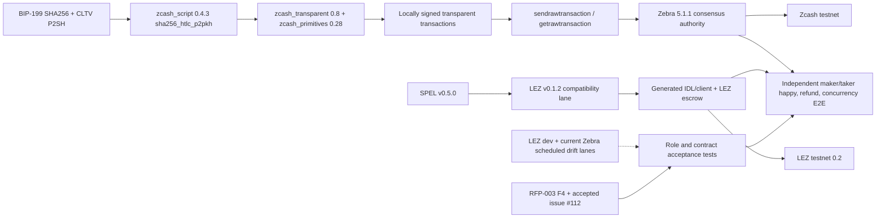

# ADR 0014: M2 ZEC implementation and compatibility pins

Status: Accepted for M2 implementation — 2026-07-11

## Context

The contractual sources require transparent ZEC through a BIP-199-style
SHA-256/CLTV HTLC, a SPEL-generated LEZ escrow, Zcash testnet use, and real
maker/taker lifecycle demonstrations. Upstream prose is insufficient by itself:
the implementation must select versions whose APIs and consensus behavior are
executable together.

An initial review selected Zebra 4.5.1. A fresh release/security reconciliation
rejected that pin: 4.5.3 mitigated an Orchard vulnerability, 5.0.0 activated the
fixed NU6.2 rules, and 5.1.1 is the current non-RC stable release. M2 must not
freeze a node version merely because an older review called it “latest.”

## Decision

Use the following compatibility baseline. Every mutable name is paired with an
immutable source or image identity.

| Layer | M2 pin | License/policy reason |
|---|---|---|
| SPEL | stable `v0.5.0`, commit `73fc462eb8f0a4d00f1a846437c627ec2e523f83` | Repository carries MIT and Apache-2.0; use its macros, IDL, and client generator instead of recreating them |
| LEZ compatibility | tag `v0.1.2`, commit `cf3639d8252040d13b3d4e933feb19b42c76e14a` | This is the exact LEZ dependency locked by SPEL v0.5.0; SPEL records it as equivalent to the earlier v0.2.0-rc3 compatibility point |
| LEZ semantic drift | `dev` evidence pin `cac4921581b37e85ae25e940f3a62412cd22308e`, plus scheduled current `dev` | Keeps M1 validity/signature assumptions checked without pretending the newer development tree is SPEL-compatible |
| BIP-199 script | `zcash_script = 0.4.3`, Apache-2.0 | Use `pattern::sha256_htlc_p2pkh`; the similarly named `sha256_htlc` uses direct pubkeys and is not the BIP-199 P2PKH template |
| Zcash transaction stack | `zcash_transparent = 0.8.0`, `zcash_primitives = 0.28.0`, `zcash_protocol = 0.9.0`; audited together at librustzcash commit `8766e0532a793516c27ad2f838bccfbb24d47285` | Canonical MIT/Apache Rust types and consensus encodings; no custom signature, sighash, address, or transaction codec |
| Consensus node | Zebra `v5.1.1`, commit `5126cfae4f57c799dbf0811d207d4f931a00c6b1` | Current stable Zcash Foundation node; MIT/Apache; supports raw transaction submission and lookup |
| Isolated node image | `docker.io/zfnd/zebra:5.1.1@sha256:5870614fdb7c089f281ca33ef8f1ff7998f59fa60fecae19462a4c8e9a37fc6e` | Pins the official multi-platform index; Linux/amd64 resolves to `sha256:f9bdbe407bb0216132ee2b969516c59fda296645062629eb139e53979be149cc` |

The BIP-199 claim stack is signature, claimant public key, preimage, and true;
the refund stack is signature, funder public key, and false. The redeem script
uses `OP_SHA256` in the true branch and absolute `OP_CHECKLOCKTIMEVERIFY` in the
false branch. Tests must pin exact redeem-script and P2SH bytes, branch stack
shape, wrong-preimage rejection, signature ownership, transaction lock time and
non-final input sequence, and the height/time threshold boundary.

Use Zebra as the acceptance authority. Local parsing or interpreter success is
useful unit evidence but never proves a transaction is consensus-valid or
standard enough for the node mempool. M2 E2E therefore constructs/signs locally,
submits with `sendrawtransaction`, observes with `getrawtransaction`, and checks
confirmed state through the selected Zebra RPC.

## Isolation and upgrade policy

The pinned image is used only inside a unique Compose project named
`lez-atomic-swaps-${RUN_ID}` with project-scoped data and ephemeral host ports.
No fixed container name, shared network, shared volume, or global Docker cleanup
is permitted.

Zebra 5.1.1 deliberately shortened its support horizon ahead of NU7. Before any
public-testnet evidence run or M2 tag, rerun the upstream security/release audit.
An update receives the same script-vector, RPC, consensus, refund, and role-E2E
suite; a moving `latest` tag is never used. Scheduled drift checks are diagnostic
until a reviewed pin update makes them required.

## Consequences

- The ETH/LEZ repository is behavioral prior art only; its old raw guest stack is
  not an implementation dependency.
- Zallet may supply supported wallet operations, but it is not assumed to expose
  legacy raw transaction construction/signing RPCs.
- Arbitrary P2SH HTLC signing is an explicit adapter responsibility built from
  canonical librustzcash sighash/signature types; the transparent builder's
  P2SH multisig helper is not misrepresented as a generic HTLC signer.
- The LEZ compatibility lane and newer semantic drift lane stay separate until
  a minimal generated SPEL program proves a newer common version.
- Advisory, license, ban, and source checks remain hard CI gates for every added
  crate and explicitly allowed immutable Git dependency.

## Primary sources checked

- [RFP-003](https://github.com/logos-co/rfp/blob/master/RFPs/RFP-003-atomic-swaps.md)
  and Gateway's accepted replacement [issue
  #112](https://github.com/logos-co/rfp/issues/112), not superseded issue #61.
- Bitcoin's exact [BIP-199
  text](https://github.com/bitcoin/bips/blob/master/bip-0199.mediawiki); its
  document status is closed, but its script template remains the contractual
  construction named by the RFP.
- SPEL [`v0.5.0` source](https://github.com/logos-co/spel/tree/73fc462eb8f0a4d00f1a846437c627ec2e523f83)
  and lockfile, including its exact LEZ dependency.
- The audited [librustzcash compatibility
  commit](https://github.com/zcash/librustzcash/tree/8766e0532a793516c27ad2f838bccfbb24d47285)
  and published `zcash_script` 0.4.3 source.
- Zebra [5.1.1 release](https://github.com/ZcashFoundation/zebra/releases/tag/v5.1.1),
  exact [RPC source](https://github.com/ZcashFoundation/zebra/blob/5126cfae4f57c799dbf0811d207d4f931a00c6b1/zebra-rpc/src/methods.rs),
  and official container manifest; the pinned source contains both
  `sendrawtransaction` and `getrawtransaction`.
