# ADR 0014: M2 ZEC implementation and compatibility pins

Status: Accepted for M2 implementation -- 2026-07-11; canonical target reconciled 2026-07-14

```mermaid
flowchart LR
    Contract["RFP-003 F4 + accepted issue #112"] --> Tests["Role and contract acceptance tests"]
    BIP["BIP-199 SHA256 + CLTV P2SH"] --> Script["Exact common-tail layout from zcash_script 0.4.3 primitives"]
    Script --> Tx["zcash_transparent 0.8 + zcash_primitives 0.28"]
    Tx --> TxVectors["Fixed V5 bytes/txids + real signature interpreter"]
    TxVectors --> Raw["Locally signed transparent transactions"]
    Profile["Named ZEC profile<br/>network + NU6.2 + depths + horizons"] --> Raw
    Calibration["Measured or harness safety bounds"] --> Profile
    Raw --> RPC["sendrawtransaction / getrawtransaction"]
    RPC --> Zebra["Zebra 5.2.0 consensus authority"]
    Zebra --> Snapshot["Stable network/branch/block/raw-tx snapshot"]
    Snapshot --> Observe["Re-decode + bind outpoint/value/BIP-199/depth"]
    Observe --> CoreProof["Lossy ChainProof projection<br/>full source evidence retained"]
    Zebra --> OldBranch["Actor claim + refund<br/>3-block branch"]
    RPC --> ForkZebra["Disconnected Zebra 5.2.0 fork authority"]
    ForkZebra --> NewBranch["Conflicting actor refund<br/>4-block branch"]
    NewBranch -->|"raw getblock / submitblock"| Zebra
    Zebra --> ForkEvidence["Canonical hash replacement at 3 detached heights"]
    Official["Official Zebra 5.2.0 image digest"] --> Binary["Copy exact zebrad binary"]
    Distroless["Pinned distroless cc-debian13 nonroot"] --> Runtime["Minimal read-only E2E image"]
    Binary --> Runtime
    Scan["Trivy: 0 HIGH / CRITICAL"] --> Runtime
    Runtime --> Zebra
    Zebra --> ZTest["Zcash testnet"]
    SPEL["SPEL v0.5.0"] --> Compat["LEZ v0.1.2 compatibility lane"]
    Compat --> CompatAudit["Exact pins + feature-locked security audit"]
    CompatAudit --> IDL["Generated IDL + client"]
    IDL --> Escrow["SPEL escrow metadata + owner-role client"]
    Escrow --> NativeCustody["Native custody PDA via authenticated transfer"]
    Escrow --> TokenCustody["ATA(metadata, definition) via ATA -> token nested call"]
    NativeCustody --> LocalProof["GREEN composed upstream-program tests"]
    TokenCustody --> LocalProof
    LocalProof --> Guest["Checked Risc0 3.0.5 guest ELF + ImageID"]
    Guest --> LocalSeq["RPC deployment in ephemeral v0.1.2 standalone block"]
    Actors["Funded genesis depositor + claimant"] --> NativeFlow["Native initialize / fund / claim / refund"]
    LocalSeq --> NativeFlow
    NativeFlow --> NativeEvidence["Canonical state, balances, role/deadline negatives"]
    NativeEvidence --> CostReplay["Production V03State replay without Clock noise"]
    CostReplay --> CostJson["Attributed sessions + budgets + checked JSON"]
    LocalSeq --> TokenFlow["Two-definition standalone ATA lifecycle"]
    TokenFlow --> TokenEvidence["Owner roles + holding/supply conservation + negatives"]
    TokenEvidence --> TokenCostReplay["Production token replay without setup/Clock noise"]
    TokenCostReplay --> TokenCostJson["Escrow + ATA + Token sessions + checked JSON"]
    Provisional["SPEL PR #238 exact head<br/>open + unreviewed"] --> V02Compat["Separate provisional v0.2<br/>compile/config/PDA lane"]
    V02Compat --> Port["Rebuild SPEL guest for LEZ v0.2 PDA + ABI"]
    DockerBuilder["Pinned Risc0 guest-builder<br/>Rust 1.94.1 + immutable digest"] --> CanonicalV02["Canonical Docker-built v0.2 guest<br/>ELF c85055...9d2e<br/>ProgramId 5cf8c5...29c1"]
    Port --> CanonicalV02
    CanonicalV02 --> StateProof["Advisory-free V03State lifecycle + cost proof"]
    HostBuilt["Historical host-built v0.2 guest<br/>ELF 40c9d3...8021<br/>ProgramId f83850...0fbe"] -.-> Superseded["Superseded for deployment<br/>retained only as historical evidence"]
    OfficialTypes["Official LEZ v0.2 transaction and RPC types"] -.-> ThinClient["Thin deployment/query client"]
    Exclude["Exclude Logos node auth + libp2p + Hickory"] -.-> ThinClient
    ThinClient -.-> LezTest["LEZ testnet 0.2"]
    StateProof --> LezLocal["Private actual-node LEZ v0.2 devnet"]
    CanonicalV02 --> LezLocal
    LezLocal --> Manifest["Channel + canonical artifact + ProgramId<br/>deployment tx bd1680...733f<br/>finalized block 2582"]
    LezTest -.-> Manifest
    Native["Reviewed SPEL/LEZ v0.2 compatibility pin"] -.-> Port
    Drift["LEZ dev + current Zebra scheduled drift lanes"] -.-> Tests
    Tests --> Roles["Independent maker/taker happy, refund, concurrency E2E"]
    LocalSeq -.-> Roles
    Zebra --> Roles
```

## Context

The contractual sources require transparent ZEC through a BIP-199-style
SHA-256/CLTV HTLC, a SPEL-generated LEZ escrow, Zcash testnet use, and real
maker/taker lifecycle demonstrations. Upstream prose is insufficient by itself:
the implementation must select versions whose APIs and consensus behavior are
executable together.

An initial review selected Zebra 4.5.1. A fresh release/security reconciliation
rejected that pin: 4.5.3 mitigated an Orchard vulnerability and 5.0.0 activated
the fixed NU6.2 rules. A second review rejected the stale 5.1.1 runtime and moved
the consensus authority to the signed 5.2.0 stable release, which increases the
local rollback window from 99 to 1,000 blocks. M2 must not freeze a node version
merely because an older review called it “latest.”

## Decision

Use the following compatibility baseline. Every mutable name is paired with an
immutable source or image identity.

| Layer | M2 pin | License/policy reason |
|---|---|---|
| SPEL | stable `v0.5.0`, commit `73fc462eb8f0a4d00f1a846437c627ec2e523f83` | Repository carries MIT and Apache-2.0 files but omits Cargo license fields; fixture policy hash-locks both texts for all three used crates; use its macros, IDL, and client generator instead of recreating them |
| LEZ compatibility | tag `v0.1.2`, commit `cf3639d8252040d13b3d4e933feb19b42c76e14a` | This is the exact LEZ dependency locked by SPEL v0.5.0; SPEL records it as equivalent to the earlier v0.2.0-rc3 compatibility point |
| LEZ semantic drift | `dev` evidence pin `cac4921581b37e85ae25e940f3a62412cd22308e`, plus scheduled current `dev` | Keeps M1 validity/signature assumptions checked without pretending the newer development tree is SPEL-compatible |
| Risc0 v0.2 guest/runtime | `cargo-risczero` and `r0vm` 3.0.5; guest Rust 1.94.1; builder `r0.1.94.1@sha256:c2f63fdd720337c0727e05c5e1733083baba04c00a864a89b0e3f4f8d92617be` | Exact tool/runtime identity aligned with Rust 1.94 MSRV; `RISC0_DEV_MODE=1` is not treated as an executor substitute; the methods build uses the supported Risc0 Docker embedding API and executes with the exact isolated `r0vm` |
| v0.1.2 compatibility guest artifact | ELF SHA-256 `a324355c6417f6ac7265ab8ba880287d0976e8c27a672917d293bddd80be7006`; ImageID `c14c978abbaedeffb54c71aa6a96275d1fdb66fcf79f7343bf6bf7aee04f4483` | This identity belongs only to the lower v0.1.2 standalone compatibility lane; its tracked manifest and runner fail on byte or program-identity drift |
| Canonical v0.2 guest artifact | ELF SHA-256 `c85055f6fe85b71535a322ba84ffc612f5d093954a721ba3b529428814dc9d2e`; ImageID and ProgramId `5cf8c5a4eedb3c2873956cb7898eb33a495407c9746fb1a065c99638159329c1`; words `[2764437596, 675077102, 3077346675, 984845961, 3372700745, 2695982964, 949406053, 3240727317]` | This Docker-built identity is the only trusted v0.2 deployment target. Artifact bytes are generated, not committed; manifest, verifier, deployer, actor configuration, and runner fail on drift |
| Superseded v0.2 host artifact | ELF SHA-256 `40c9d37c5dc3c8544bcb7c26916a5be1039b76cc862b2c9dcd34e0cf61468021`; ImageID and ProgramId `f8385049e93a319b44d868e0d0cf805b058eddcf92141a186ffd69e4596c0fbe` | Retained only to interpret immutable earlier evidence. It is not accepted for new deployment or actor admission because host and container Cargo source paths changed crate disambiguators and therefore the ELF and ImageID |
| BIP-199 script | `zcash_script = 0.4.3`, Apache-2.0 | Reuse its typed opcodes, push encodings, CLTV, branch, parser, and P2SH helpers; compose BIP-199's exact common `OP_EQUALVERIFY OP_CHECKSIG` tail |
| Script bound type | transitive `bounded-vec = 0.9.0`, CC0-1.0 | Permissive public-domain dedication, scoped to this exact crate/version in `deny.toml`; CC0 is not added to the global license allowlist |
| Script signature validation | `zcash_script`'s `signature-validation` feature with `secp256k1 = 0.29.1` and `secp256k1-sys = 0.10.1`, both CC0-1.0 | Use the maintained Rust Bitcoin/libsecp256k1 DER/pubkey/signature path; both licenses are exact-package exceptions; real signatures and sighashes remain canonical transaction-adapter work |
| Zcash transaction stack | `zcash_transparent = 0.8.0`, `zcash_primitives = 0.28.0`, `zcash_protocol = 0.9.0`; audited together at librustzcash commit `8766e0532a793516c27ad2f838bccfbb24d47285` | Canonical MIT/Apache Rust types and consensus encodings; no custom signature, sighash, address, or transaction codec |
| Consensus node | Zebra `v5.2.0`, commit `62e4a43879c9c86d23ecfcf5a02335eec8a1517d` | Signed stable Zcash Foundation node; MIT/Apache; supports raw transaction submission and lookup and increases the local rollback window to 1,000 blocks |
| Official binary source image | `docker.io/zfnd/zebra:5.2.0@sha256:477e65add4dacf52074ba04da8d763c89c26cc57f911dba2127401f8e1da597d` | Pins the official multi-platform index; Linux/amd64 resolves to `sha256:883cc4c341524edab34eec4a282679ce8b3603e3f337980f719b2728fd960616` |
| Minimal runtime base | `gcr.io/distroless/cc-debian13:nonroot@sha256:aded2458d026e046cb68199db0e5793e1028ffa143f7258f3c4278253e20add7` | Google distroless, Apache-2.0; supplies only the dynamic C/C++ runtime needed by the official binary and runs as UID/GID 65532 |
| Isolated node image | Repository Dockerfile copies only `/usr/local/bin/zebrad` from the official source image into the pinned distroless base | The official 5.1.1 and 5.2.0 Debian runtimes each failed the 2026-07-11 strict scan with 40 HIGH and 2 CRITICAL findings; the final derived image passed with zero HIGH/CRITICAL findings without suppressions |

The crate's ready-made `sha256_htlc_p2pkh` helper is not byte-identical to
BIP-199: it repeats `OP_EQUALVERIFY OP_CHECKSIG` inside each branch. The BIP puts
that tail once after `OP_ENDIF`. M2 therefore composes the exact template from
the crate's lower-level canonical primitives rather than copying a raw hex blob
or accepting merely equivalent bytes.

The BIP-199 claim stack is signature, claimant public key, preimage, and true;
the refund stack is signature, funder public key, and false. The redeem script
uses `OP_SHA256` in the true branch and absolute `OP_CHECKLOCKTIMEVERIFY` in the
false branch. Tests must pin exact redeem-script and P2SH bytes, branch stack
shape, wrong-preimage rejection, signature ownership, transaction lock time and
non-final input sequence, and the height/time threshold boundary.

Refund transaction construction takes its `nLockTime` directly from the
contract and uses input sequence `0xfffffffe`. A final `0xffffffff` input is
never exposed by the refund API because it disables CLTV enforcement.

The signed-spend foundation accepts the fetched funding `TxOut`, validates its
scriptPubKey against the exact contract, derives the input value from it, and
rejects consensus branches in which V5 is invalid. Claim and refund tests pin
the complete serialized bytes and txids. Both generated signatures execute via
the upstream `zcash_script` callback checker, which independently recomputes
ZIP-244 from the real prevout context; signature-bit mutations fail.

The current SPEL fixture proves macro expansion, generated IDL/client signer
roles, metadata binding, replay/preimage/version rejection, and disjoint
validity windows. A direct v0.1.2 source audit invalidated its first custody
implementation: native user accounts were incorrectly swap-program-owned and
custom custody was a direct token holding rather than an ATA. Exact v0.1.2 does
ship canonical `authenticated_transfer`, PDA delegation, `ata_core`, the ATA
program, wallet flows, and standalone tests. A replacement RED-GREEN cycle uses
those upstream primitives rather than preserving the false green. The
replacement is now green locally: native funding/release composes canonical
authenticated transfer; custom custody is the exact `ATA(metadata, definition)`;
tests execute the official ATA outer call and its nested token call for two
independent definitions; generated clients sign with actor owner accounts and
never attempt to sign with an ATA. Fixed-destination refunds are permissionless.

Local v0.1.2 compatibility is sufficient for source-correct custody semantics,
but it is not sufficient for live-testnet completion: upstream SPEL issues #234
and #237 record v0.5.0 public-signature rejection against the newer testnet. The
official LEZ v0.2.0 release and `https://testnet.lez.logos.co` are live, but
the compatibility upgrade remains provisional: SPEL PR #238 head
`df17acd98436be4f09c55877dae1fe2e73cbcdca` is open, unmerged, and has no
submitted maintainer review despite green checks. Final production readiness
requires a merged/tagged SPEL release or an explicit reviewed exception. Under
ADR 0018, M2 may certify repository-controlled evidence against the immutable
provisional head while retaining this exact Logos-owned release item in the
production-blocker register. This is not a runtime-only pin change:
v0.1.2 derives public PDAs under `/NSSA/v0.2/AccountId/PDA/`, while v0.2.0
validates `/LEE/v0.2/AccountId/PDA/`. The guest, generated client, account
derivations, and actor tests must be rebuilt together.

The separate provisional compile/config/PDA fixture also exposes a new runtime
security boundary: exact LEZ v0.2.0 forces `hickory-proto 0.25.0-alpha.5`, which
is affected by `RUSTSEC-2026-0118` and `RUSTSEC-2026-0119`. Fixture-local
exceptions are allowed only while the hash-locked test constructs and drops the
standalone future without polling and DNSSEC features remain absent; CI checks
both conditions and fails on any test-byte change. This graph is prohibited for
runtime and testnet use. Expanding the port therefore requires a safe upstream
graph or a separate explicit security review as well as the SPEL review/release
decision.

A fresh 2026-07-12 runtime audit narrows the safe implementation route. Official
LEZ v0.2.0 is pinned at commit
`a58fbce2ff48c58b7bb5001b1a27e64b9596ee3a`; its live endpoint answered
non-mutating health, last-block, and built-in-program queries. The release's
wallet deployment command uses official `ProgramDeploymentTransaction` and
`sendTransaction` types but discards the returned transaction hash. The project
client must retain that hash and prove exact `getTransaction` plus canonical
`getBlock` inclusion.

Neither released LEZ nor current Logos Blockchain provides a vulnerability-clean
full runtime graph: both retain the Hickory 0.25 line and explicitly ignore
`RUSTSEC-2026-0118` and `RUSTSEC-2026-0119`; the compatible Hickory 0.26.1
migration exists only on unreleased rust-libp2p master. M2 will therefore not
run or deploy through the full standalone/node graph. The smallest reviewed
route is to port the guest with package aliases, prove lifecycle and costs
through the advisory-free `V03State` layer, and feature-gate the sole LEZ
`common::config` conversion that pulls Logos node authentication into the graph.
A thin `jsonrpsee` client then uses official LEZ transaction/RPC types while CI
proves libp2p, Hickory, and pending LGPL exceptions are absent. This is an
implementation constraint, not permission to hand-roll LEZ wire formats.

Public evidence must bind the LEZ/SPEL/Risc0 commits, ELF SHA-256, ImageID and
derived ProgramId, endpoint, `getChannelId`, pre/post block IDs, returned
transaction hash, exact deployment bytes, and containing canonical block. The
network has announced another upgrade/reset, so evidence is invalid across a
channel change and must be regenerated. Public-profile enablement and production
readiness remain fail-closed until SPEL PR #238 receives maintainer review/merge
or an explicit project security/governance acceptance records its immutable
head and the narrow client fork. M2 tagging follows ADR 0018: the upstream item
does not waive repository-controlled behavior or evidence, but it is disclosed
rather than treated as a milestone stop.

Primary audit inputs are the official [LEZ v0.2.0
release](https://github.com/logos-blockchain/logos-execution-zone/releases/tag/v0.2.0),
[deployment tutorial](https://github.com/logos-blockchain/logos-execution-zone/blob/v0.2.0/examples/program_deployment/README.md),
[SPEL PR #238](https://github.com/logos-co/spel/pull/238), and
[RUSTSEC-2026-0118](https://rustsec.org/advisories/RUSTSEC-2026-0118.html) plus
[RUSTSEC-2026-0119](https://rustsec.org/advisories/RUSTSEC-2026-0119.html).

## Canonical v0.2 build and local deployment reconciliation -- 2026-07-14

The v0.2 methods crate now invokes the supported Risc0 Docker embedding API with
the exact guest-builder image and an isolated target directory. The resulting
ELF SHA-256 is
`c85055f6fe85b71535a322ba84ffc612f5d093954a721ba3b529428814dc9d2e`;
its Risc0 ImageID and LEZ ProgramId are
`5cf8c5a4eedb3c2873956cb7898eb33a495407c9746fb1a065c99638159329c1`,
represented by words `[2764437596, 675077102, 3077346675, 984845961,
3372700745, 2695982964, 949406053, 3240727317]`. The manifest, build
verifier, deployer, and both actor configurations bind that one identity. An
environment variable cannot select a different builder or program.

An earlier host build produced ELF `40c9d37c...8021` and ProgramId
`f8385049...0fbe`. The source and compiler identity matched, but host and
container Cargo source paths produced different crate disambiguators, which
changed the ELF and consequently the ImageID. Earlier evidence remains
immutable and interpretable under that historical identity; it is not current
deployment authority and cannot be admitted by a canonical actor run.

The canonical Docker artifact was submitted to the retained private LEZ v0.2
devnet as transaction
`bd16808ee91c9860e860830e7437148b3f4f81c632fc1b6d40350e20cc47733f`.
The indexer proved Finalized inclusion in LEZ block `2582`, hash
`d2c4944a936347207be7030bb39f6b8f21dfc3dc75e95afedb58e22ed1f96860`.
Both role-real local corridor directions then completed with only the canonical
ProgramId. This private deployment proves local on-chain execution; it does not
claim a public LEZ deployment, public propagation, or public service behavior.

The local compatibility lane now uses the exact v0.1.2 `sequencer_service`
standalone path in-process with port `0`, temporary state, and deterministic
genesis keys. Exact Risc0 3.0.5 builds a canonical guest whose ELF SHA-256 and
ImageID are checked before every run. The harness first waits for an empty
mandatory-clock block, then submits `ProgramDeployment` through public RPC and
proves the exact transaction is stored in the following canonical block. The
initial RED established that `RISC0_DEV_MODE=1` does not supply an executor:
without exact `r0vm` the deployment is admitted to the mempool but clock
execution aborts block creation at genesis.

The native lifecycle is now executable evidence, not a source-only claim. The
two v0.1.2 genesis accounts are already authenticated-transfer-owned and funded;
the initial plan to re-register them was rejected after inspecting actual state
construction. Their real keys sign initialize/fund and claimant claim, while
refund remains unsigned and fixed-destination. Canonical blocks reject wrong
preimage, a valid depositor attempting the claimant role, and early refund
without consuming the signer nonce or moving custody. After canonical block
time reaches the deadline, any relayer can return the exact amount only to the
stored depositor. Native cost evidence now records deterministic Risc0
user cycles/segments and
recursively includes the authenticated-transfer child because v0.1.2 does not
expose compute units through RPC or blocks. It replays the production
`V03State` transition with Clock excluded, requires two ordered one-segment
sessions per operation, verifies `total = user + paging + reserved`, enforces
versioned user-cycle budgets, and reproduces
`docs/evidence/lez-v0.1.2-escrow-costs.json`.

The standalone token lifecycle now uses two independently key-created fungible
definitions and supply accounts, plus actor ATAs created by their real owner
keys. Definition A reaches claim and definition B reaches permissionless refund.
Canonical negatives reject wrong preimage, a valid depositor in the claimant
role, claimant ATA substitution across definitions, early refund, and
cross-definition refund destination without nonce/holding mutation. Final
holdings retain the exact definition IDs and conserve each independent total
supply. The deterministic cost replay excludes unmeasured Token/ATA setup and
Clock sessions, then attributes initialization to the escrow root and every
custody/fund/claim/refund to the ordered escrow, ATA, and nested Token sessions.
The same segment/classification/allocated-cycle/user-budget gates reproduce the
complete escrow evidence JSON. The
accepted LEZ pin forces `rsa 0.9.10` and `tracing-subscriber 0.2.25`; no safe
compatible pin exists today. The fixture-local policy is permitted only because
CI proves rzup `publish`/`install` and tracing `fmt`/`ansi` features are absent,
so the advisory capabilities are not compiled. Stale ignores are errors. The
root workspace has no such advisory exceptions. The deployable guest audit also
found `RUSTSEC-2025-0137` in directly pinned `ruint 1.17.0`; it was upgraded to
fixed `1.17.1` rather than ignored, and the rebuilt ELF/ImageID were re-recorded.
Guest, methods-wrapper, and standalone lock graphs now have explicit CI
advisory/license/ban/source checks and must be re-audited before testnet evidence
or an M2 tag.

The deterministic Zebra lane mines NU6.2 Regtest coinbases to a key held by the
funding actor, fetches actual outputs through RPC, and submits locally signed
funding, claim, and refund transactions. Its first regression scenario runs two
independent swaps concurrently, invalidates their terminal block, has each
actor rebroadcast the exact transaction, rejects a conflicting same-output
replacement, and reconsiders the exact block. Its accepted-fork scenario runs
two disconnected pinned nodes from an identical RPC-relayed prefix. The
primary confirms the claimant claim on a three-block branch; the fork confirms
the conflicting funder refund on a four-block branch. Raw fork blocks submitted
to the primary replace all three old canonical hashes, and the primary reports
the conflicting refund as active with four confirmations. Zebra 5.2.0 evicts
the detached non-finalized headers, so the proof asserts canonical replacement
rather than assuming side-chain RPC retention. That evidence is a consensus-node fault lane and was not by itself a composed
cross-chain E2E. The canonical private actual-node corridor now composes the
happy path in both directions; actual-node restart, refund, and reorg remain
later hardening.

Use Zebra as the acceptance authority. Local parsing or interpreter success is
useful unit evidence but never proves a transaction is consensus-valid or
standard enough for the node mempool. M2 E2E therefore constructs/signs locally,
submits with `sendrawtransaction`, observes with `getrawtransaction`, and checks
confirmed state through the selected Zebra RPC.

The adapter owns immutable `deterministic-local-v1` and `public-testnet-v1`
profiles. Each binds the exact Zcash network and NU6.2 signing branch plus LEZ
and Zcash confirmation depths, LEZ delay, Zcash CLTV delta, required margin,
and ZIP-203 expiry delta. Deadline arithmetic is checked. The public profile
refuses to build a recovery schedule without calibrated conservative wall-clock
bounds; it never treats the nominal 75-second block target as a fastest-chain
guarantee. The deterministic profile accepts bounds only from the controlled
harness and is invalid on public network IDs.

The actual Regtest lane now constructs the complete typed funding observation
from stable Zebra RPC queries. It re-decodes and retains raw bytes, uses upstream
`ReverseHex`, compares the transaction block with `getblockhash(height)`, holds
the best tip stable across the query, derives confirmation depth, and validates
the exact 100,000,000-zatoshi output/redeem/P2SH commitment. Zebra reports the
Regtest BIP70 family name as `test`, so the lane binds Regtest with its exact
genesis hash plus NU6.2 rather than misclassifying the chain-name string. The
two-phase watcher retains the stable tip and can propose confirmation, validated
detach, or atomic replacement events without advancing its head before commit.
Absence and RPC errors are never removals. Its version-1 primitive record
round-trips historical evidence without deserializing a trusted canonical type
and revalidates raw transaction bindings. The SQLite event journal and
direction-aware core projection remain M2 work; see ADR 0015.

## Isolation and upgrade policy

The derived image is built only from its two immutable inputs and used twice
inside a unique Compose project named `lez-atomic-swaps-${RUN_ID}` with
project-scoped data and separate ephemeral host ports.
No fixed container name, shared network, shared volume, or global Docker cleanup
is permitted. The container is non-root, read-only, capability-free, and
shell-free; readiness is checked from the host so the runtime does not carry
`curl` merely for a healthcheck.

The 5.x release line has a shortened support horizon ahead of NU7. Before the
M2 tag, rerun the final-image vulnerability audit against the private Regtest
image. Before the deferred public-testnet evidence, also rerun the upstream
security/release audit and select a currently supported public-compatible pin.
An update receives the same script-vector, RPC, consensus, refund, and role-E2E
suite; a moving `latest` tag is never used. Scheduled drift checks are diagnostic
until a reviewed pin update makes them required.

## Consequences

- The ETH/LEZ repository is behavioral prior art only; its old raw guest stack is
  not an implementation dependency.
- Zallet may supply supported wallet operations, but it is not assumed to expose
  legacy raw transaction construction/signing RPCs.
- Arbitrary P2SH HTLC signing is an explicit adapter responsibility built from
  canonical librustzcash sighash/signature types; the transparent builder's
  P2SH multisig helper is not misrepresented as a generic HTLC signer.
- Source inspection proves both `TransparentBuilder::apply_signatures` and the
  PCZT signer/spend finalizer support only standard P2PKH/P2PK/multisig shapes,
  not BIP-199. The adapter validates a canonical fetched `TxOut`, constructs
  canonical transparent bundles, uses the upstream authorization context and
  ZIP-244 implementation, signs with upstream secp256k1, and freezes through
  canonical `Bundle<Authorized>`/`TransactionData`; only the already-vector-tested
  HTLC scriptSig assembly is adapter-owned.
- `TransparentBuilder` initially assigns final sequence `0xffffffff`. Refund
  construction must replace that input with `0xfffffffe` before computing the
  transaction digest and signature; mutation after signing is forbidden.
- The generic `sha256_htlc_p2pkh` helper is not used as a byte-level substitute
  for BIP-199; exact-vector tests protect the contractual common-tail layout.
- The LEZ compatibility lane and newer semantic drift lane stay separate until
  a minimal generated SPEL program proves a newer common version.
- Advisory, license, ban, and source checks remain hard CI gates for every added
  crate and explicitly allowed immutable Git dependency. Compatibility-only
  advisory exceptions are isolated from the root policy, exact-ID reasoned,
  feature-asserted, and fail when stale.
- Non-default licenses require narrow package exceptions: CC0-1.0 is accepted
  only for reviewed exact packages (`bounded-vec 0.9.0`, `secp256k1 0.29.1`,
  and `secp256k1-sys 0.10.1`), not globally.

## Primary sources checked

- [RFP-003](https://github.com/logos-co/rfp/blob/master/RFPs/RFP-003-atomic-swaps.md)
  and Gateway's accepted replacement [issue
  #112](https://github.com/logos-co/rfp/issues/112), not superseded issue #61.
- Bitcoin's exact [BIP-199
  text](https://github.com/bitcoin/bips/blob/master/bip-0199.mediawiki); its
  document status is closed, but its script template remains the contractual
  construction named by the RFP.
- SPEL [`v0.5.0` source](https://github.com/logos-co/spel/tree/73fc462eb8f0a4d00f1a846437c627ec2e523f83)
  and lockfile, including its exact LEZ dependency.
- The audited [librustzcash compatibility
  commit](https://github.com/zcash/librustzcash/tree/8766e0532a793516c27ad2f838bccfbb24d47285)
  and published `zcash_script` 0.4.3 source.
- Zebra [5.2.0 release](https://github.com/ZcashFoundation/zebra/releases/tag/v5.2.0),
  exact [RPC source](https://github.com/ZcashFoundation/zebra/blob/62e4a43879c9c86d23ecfcf5a02335eec8a1517d/zebra-rpc/src/methods.rs),
  and official container manifest; the pinned source contains both
  `sendrawtransaction` and `getrawtransaction`.
