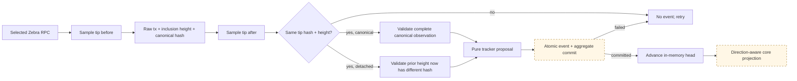
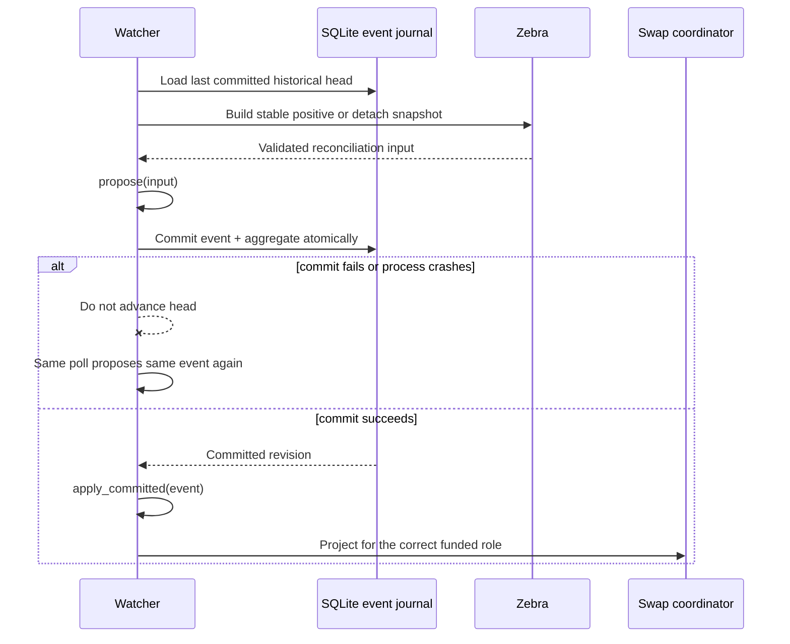

# ADR 0015: Durable Zcash observation reconciliation

## Status

Accepted in part. Stable canonical/removal validation, the two-phase tracker,
the version-1 primitive event record, and the atomic SQLite event journal are
implemented. Participant-aware core reorg semantics are also implemented;
runtime journal-to-core projection remains M2 work.

Taker- and maker-funded legs have independent immutable confirmation policies.
This is required for reverse public-testnet ZEC, where maker-funded ZEC uses a
deeper threshold than taker-funded LEZ. A maker observation below threshold
remains awaiting confirmations; regression after acceptance enters
`MakerLockReorged`, suspends claims, and exact depth recovery restores them.

## Context

A successful RPC call is not durable chain truth. In particular, transaction
absence can also mean an unavailable node, a partial multi-query snapshot, or a
tip that changed during observation. Treating any of those as a reorg could
revoke a valid funding leg. Likewise, advancing an in-memory watcher before its
event commits to SQLite could permanently suppress that event after a database
failure.

The generic core `ChainProof` deliberately omits Zcash network, consensus
branch, inclusion block, outpoint, value, scripts, raw bytes, and observed tip.
It therefore cannot be the source record for watcher recovery.

## Decision

Only a stable positive snapshot may produce canonical evidence. The node tip
hash and height are sampled before and after the raw-transaction and canonical
height queries; any difference rejects the entire attempt. The validated
observation retains both the exact raw transaction and the stable tip used to
derive depth.

Removal also requires affirmative evidence. It binds the exact prior validated
observation, network and branch, a stable replacement tip, and a different
canonical block hash at the prior inclusion height. RPC errors, not-found
responses, and incomplete snapshots produce no reconciliation input.

The tracker is two phase: `propose` is pure and repeatable, an adapter atomically
commits the complete event and aggregate transition, and only then does
`apply_committed` advance the in-memory head. Replacement is one event carrying
both the validated detach proof and new canonical observation.

On restart, stored records are historical evidence rather than fresh
canonicality. The watcher must re-query Zebra before causing a chain effect.
Trusted canonical types are not publicly deserializable from database JSON.
The implemented version-1 primitive DTO retains all observation/removal fields,
re-decodes the raw transaction, and rechecks branch, depth, txid, outpoint,
value, and scripts before comparison with fresh node evidence.

## Consequences

- A transient RPC failure cannot manufacture a removal.
- Confirmation-only changes are durable events; identical polls are suppressed.
- Journal replay identity includes the predecessor revision; identical evidence
  after an intervening removal/update is retained as a new transition.
- Stale removal evidence and unproved replacements fail closed.
- Reverse-direction ZEC maps ZEC to the maker-funded leg. The core now exposes
  participant-relative funding/removal APIs and a separate maker-lock reorg
  phase; claims suspend, exact reappearance restores, conflicts fail, and
  refunds remain available for either funded leg.
- Confirmation-only canonical updates can suspend and restore maker funding
  without falsely claiming the transaction was removed.
- Runtime journal-to-core wiring and actual two-Zebra store/restart evidence
  remain required before this ADR is fully proven.

An initial concrete maker-runtime composition now derives the ZEC funder from
immutable direction, probes unknown-outcome replay before core mutation, maps
canonical/removal evidence, commits event plus aggregate atomically, and reloads
across restart in both directions. It is not yet the production watcher: journal
history is now revalidated and replayed into the exact tracker head, and an
identical fresh requery is suppressed. Durable profile/expected-output binding,
atomic conflicting-replacement outcomes, terminal-reorg alerts, and actual
two-Zebra store/restart evidence remain required.
