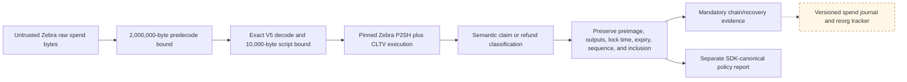
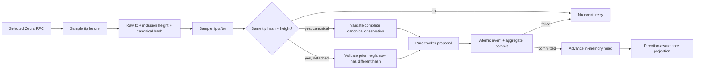
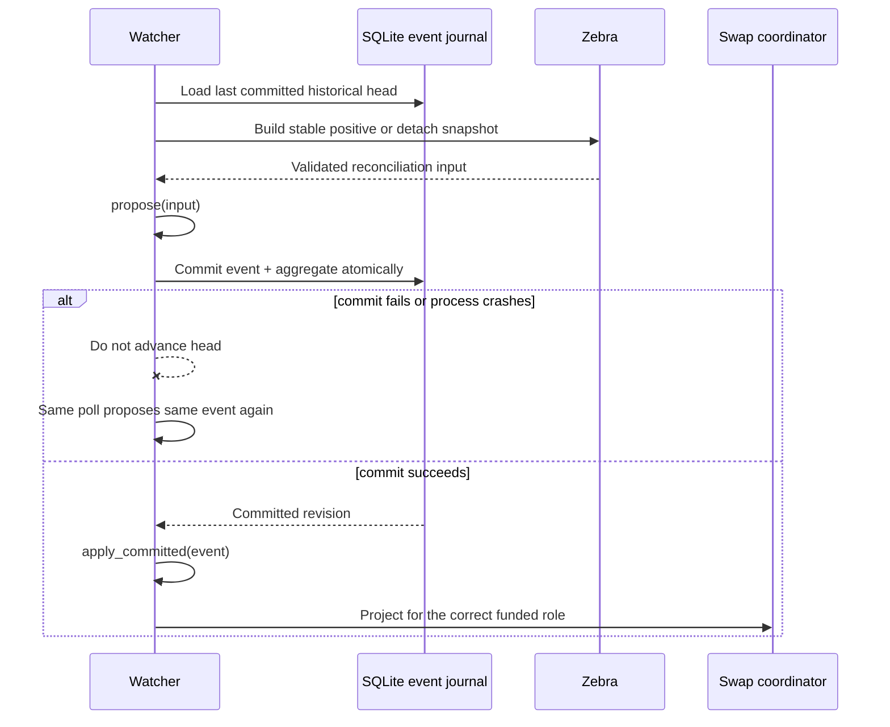

# ADR 0015: Durable Zcash observation reconciliation

## Status

Accepted at the tested runtime boundary. Stable canonical/removal validation,
the two-phase tracker, the version-1 primitive event/binding records, atomic
SQLite journal/alert commit, participant-aware projection, authenticated alert
operations, and actual two-Zebra close/reopen/requery/removal/replay are
implemented. A daemon-integrated production polling loop and the composed
LEZ/ZEC actor corridor remain M2 work. Bounded transparent spend recognition is
implemented separately; durable claim/refund spend journaling remains open.

Taker- and maker-funded legs have independent immutable confirmation policies.
This is required for reverse public-testnet ZEC, where maker-funded ZEC uses a
deeper threshold than taker-funded LEZ. A maker observation below threshold
remains awaiting confirmations; regression after acceptance enters
`MakerLockReorged`, suspends claims, and exact depth recovery restores them.

## Context

A successful RPC call is not durable chain truth. In particular, transaction
absence can also mean an unavailable node, a partial multi-query snapshot, or a
tip that changed during observation. Treating any of those as a reorg could
revoke a valid funding leg. Likewise, advancing an in-memory watcher before its
event commits to SQLite could permanently suppress that event after a database
failure.

The generic core `ChainProof` deliberately omits Zcash network, consensus
branch, inclusion block, outpoint, value, scripts, raw bytes, and observed tip.
It therefore cannot be the source record for watcher recovery.

## Decision

Only a stable positive snapshot may produce canonical evidence. The node tip
hash and height are sampled before and after the raw-transaction and canonical
height queries; any difference rejects the entire attempt. The validated
observation retains both the exact raw transaction and the stable tip used to
derive depth.

Removal also requires affirmative evidence. It binds the exact prior validated
observation, network and branch, a stable replacement tip, and a different
canonical block hash at the prior inclusion height. RPC errors, not-found
responses, and incomplete snapshots produce no reconciliation input.

The tracker is two phase: `propose` is pure and repeatable, an adapter atomically
commits the complete event and aggregate transition, and only then does
`apply_committed` advance the in-memory head. Replacement is one event carrying
both the validated detach proof and new canonical observation.

A BIP-199 spend has two distinct validity questions. Mandatory recognition uses
the exact pinned Zebra 5.2.0 flags (`P2SH | CHECKLOCKTIMEVERIFY`) and accepts all
six defined ZIP-244 sighash modes plus consensus-valid high-S, nonminimal-push,
and semantically equivalent stack forms. This prevents a valid claim from hiding
its revealed preimage merely because another wallet did not use this SDK's
preferred encoding. A separate SDK-canonical policy report records deviations
from the exact one-input, low-S, minimal-push, `SIGHASH_ALL`, destination, fee,
expiry, sequence, and output construction; policy deviation never erases chain
truth.

On restart, stored records are historical evidence rather than fresh
canonicality. The watcher must re-query Zebra before causing a chain effect.
Trusted canonical types are not publicly deserializable from database JSON.
The implemented version-1 primitive DTO retains all observation/removal fields,
re-decodes the raw transaction, and rechecks branch, depth, txid, outpoint,
value, and scripts before comparison with fresh node evidence.

## Consequences

- A transient RPC failure cannot manufacture a removal.
- Consensus-valid alternate spend encodings cannot hide a claim preimage; the
  SDK's stricter construction policy is reported independently.
- Raw spend bytes are rejected above Zebra's pinned 2,000,000-byte block bound
  before transaction decoding, and script bytes are capped at 10,000.
- Confirmation-only changes are durable events; identical polls are suppressed.
- Journal replay identity includes the predecessor revision; identical evidence
  after an intervening removal/update is retained as a new transition.
- Stale removal evidence and unproved replacements fail closed.
- Reverse-direction ZEC maps ZEC to the maker-funded leg. The core now exposes
  participant-relative funding/removal APIs and a separate maker-lock reorg
  phase; claims suspend, exact reappearance restores, conflicts fail, and
  refunds remain available for either funded leg.
- Confirmation-only canonical updates can suspend and restore maker funding
  without falsely claiming the transaction was removed.
- Removal or replacement after `Completed` or `Refunded` is journaled while the
  absorbing lifecycle result is retained and classified as
  `TerminalReorgDetected`; it is never reported as a normal applied event, even
  when the exact durable event is retried after an unknown commit outcome.
- A post-dependent replacement with a different transaction ID commits one
  atomic `Replaced` journal revision, retains the original participant funding
  ID in its role-specific reorg phase, and returns `ReplacementConflict`.
  Pre-dependent replacement adopts the new ID; exact-transaction re-mining
  restores the dependent swap normally.
- Before any new event reaches the core, runtime replays the role journal and
  requires the event to advance that exact durable tracker head. A structurally
  valid replacement for a stale inclusion therefore changes neither aggregate,
  revision, nor journal.
- `ReplacementConflict` and `TerminalReorgDetected` create versioned warning and
  critical operator alerts in the same transaction as event and aggregate.
  Exact replay preserves one alert cursor and acknowledgment; Applied creates no
  alert, and alert insertion failure rolls the entire transition back.
- The actual two-Zebra fixture proves canonical funding, immutable binding, atomic
  projection, close/reopen, unchanged fresh-query suppression, affirmative
  deeper-fork removal, second close/reopen, and exact retry without duplication.
  The production daemon polling loop remains separate work.

The spend recognizer is not yet durable protocol truth. It still needs expected
terms derived from the concrete agreement plus canonical funding provenance,
all prevout contexts before supporting multi-input non-`ANYONECANPAY` spends,
and versioned claim/refund removal/replacement persistence before it can drive
terminal projection.

The concrete maker-runtime composition derives the ZEC funder from
immutable direction, probes unknown-outcome replay before core mutation, maps
canonical/removal evidence, commits event plus aggregate atomically, and reloads
across restart in both directions. It is not yet the production watcher: journal
history is now revalidated and replayed into the exact tracker head, and an
identical fresh requery is suppressed. Authenticated owner status/list/ack alert
surfaces pass across daemon restart. The isolated actual-node fixture now proves
the same runtime boundary against two Zebra consensus processes and schema-v4
SQLite. The remaining gap is daemon-integrated polling and the composed actor
corridor, not store/reconciliation semantics.

The SDK now defines a version-1 primitive binding record for the reviewed
profile, network, branch, value, BIP-199 source terms, and both derived scripts.
Loading rebuilds the contract and validates profile consensus before returning
a trusted binding. Schema v3 now stores that record with the swap atomically,
makes exact rebinding idempotent, rejects changed terms without overwrite, and
migrates legacy swaps without inventing a binding. Runtime and store boundaries
now reject missing bindings, require both coordinator leg policies to match the
named profile, and match canonical, removal-previous, and both replacement sides
before replay detection or projection.
