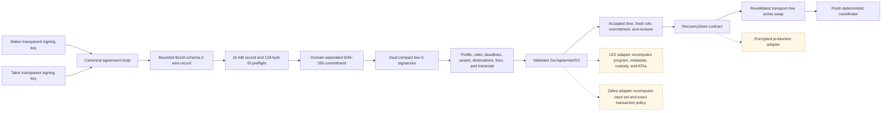

# ADR 0016: Canonical dual-signed LEZ/ZEC agreement

Status: validator, wire contract, and active lifecycle integration implemented;
effect adapters pending — 2026-07-12

## Context

The initial SDK seam accepted a generic agreement containing opaque LEZ terms.
That was sufficient to test discovery, negotiation, persistence-before-activation,
and removal of transport handles, but it could not prove that both actors had
signed the same executable chain identities, custody destinations, deadlines,
fees, and transaction policy. Passing raw effect adapters to an active swap on
top of that generic record would make the agreement non-authoritative.

## Decision

Use one canonical record family for the LEZ/ZEC corridor. Its body binds the
application swap ID and direction; named profile; maker/taker LEZ accounts and
compressed transparent keys; common SHA-256 digest; exact LEZ environment,
genesis, programs, asset, amount, metadata and custody accounts; validated
BIP-199 output; canonical funding-input-set commitment; funding, claim, and
refund destinations and fees; transaction expiry; refund anchors and
conservative bounds; and authenticated negotiation transcript.

The current record is canonical Borsh encoded under schema 2. Schema 1 lacked
the signed LEZ v0.2 execution channel and is deliberately unsupported. The
bounded decoder still recognizes its shorter layout and returns a typed
`UnsupportedSchema(1)` error; neither SQLite nor network entry attempts to
inject an unsigned channel into an already signed agreement. Actors must
renegotiate and re-sign under schema 2. Network entry is only
through an exact-consumption decoder capped at 16 KiB. The variable-length
application ID is preflighted at 128 bytes before allocation. The body is hashed
under `logos.gateway.lez-zec.agreement.v1\0`, and maker and taker must supply
valid compact low-S secp256k1 signatures over that commitment. Commitment
comparison is constant-time.

Validation reconstructs the named Zcash binding and recovery profile, requires
the actual derived LEZ deadline to fit the signed earlier-refund bound, derives
the exact Zcash CLTV height, and creates a fresh coordinator. It also verifies
role-controlled P2PKH destinations, nonzero safe fees, profile expiry, distinct
LEZ programs/accounts, and collision-free native or fungible custody terms.

Adapters must treat the signed record as policy, not as evidence that a chain
matches it. The LEZ adapter must independently derive and compare the program,
metadata PDA, custody PDA or ATA, and participant ATAs. The Zcash adapter must
re-fetch and canonically commit the selected funding inputs and construct or
validate the exact fee, destination, expiry, output, and deadline policy.

## Executable evidence

`agreement_v1_cross_binding` covers 17 focused cases: deterministic commitment,
bounded exact wire decoding, dual signature failures, both directions,
deterministic-local positives and fail-closed public deployment, actual LEZ
deadline bounds, digest/role/CLTV cross-binding, agreement-derived canonical
funding/claim/refund requests, bounded order-independent funding inputs, exact
native/token PDA and ATA derivations, accepted-at resume, redacted diagnostics,
and mutation of signed body fields. The full ZEC SDK suite, strict all-target
Clippy, rustdoc, and formatting also pass.

## Consequences and remaining boundary

The record contains public protocol terms, public keys, signatures, and a secret
digest; it never contains a preimage or private key. Borsh 1.7 is MIT or
Apache-2.0, and `subtle` 2.6.1 is BSD-3-Clause.

The generic activation seam has been replaced. Negotiation returns untrusted
wire bytes; the SDK validates them at a trusted local time, fixes the local role,
and persists the accepted time, exact wire, commitment, and revision before an
active value exists. Resume checks the requested swap ID, role, signed body,
signatures, commitment, wire, and supported revision before rebuilding the
coordinator. Exact retry is idempotent while a changed same-key record conflicts.
The active API exposes no raw chain or storage handles. Production encrypted
storage, typed effect adapters, and real actor orchestration remain pending.
Public-testnet agreement validation deliberately fails until a reviewed escrow
deployment fixes its genesis and program identities. The lightweight `/LEE/`
PDA implementation has pinned golden vectors, and the provisional compatibility
fixture compiles the exact same dependency-light source against upstream v0.2
`lee_core`, SPEL multi-seed, and ATA-core types. This avoids pulling the full
Risc0/LEZ runtime into the production SDK; adapters must still recompute the
identities selected by an actual deployment.
