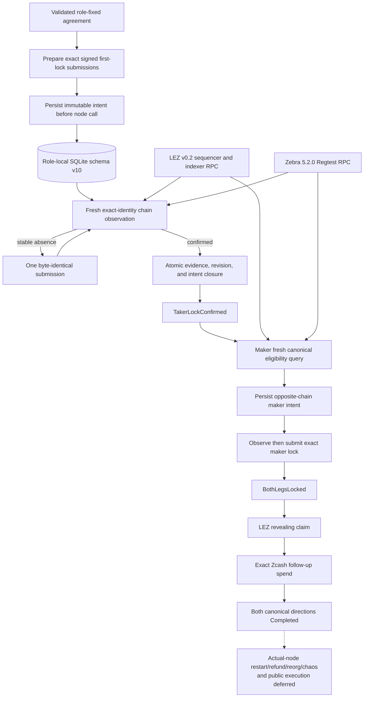

# ADR 0017: Durable intent before first-lock effects

Status: taker and maker lock intents/projections, schema-v10 replay, typed LEZ/Zebra chain adapters, and later claim effects crossed both canonical actual-node happy directions; actual-node restart/refund/reorg/chaos and public execution deferred -- reconciled 2026-07-14

## Context

The first active SDK seam retained chain and recovery capabilities but did not
use them. Treating a successful RPC return as a protocol transition would be
unsafe: the process can crash after node acceptance but before receiving the
response, or after observation but before persistence. LEZ also has separate
initialize and fund transactions, so one opaque `CreateAndFundLez` effect would
lose the exact crash boundary between them.

## Decision

Before any first-lock node call, the role-fixed taker atomically stages a
versioned immutable intent containing the accepted agreement commitment,
application swap ID, predecessor revision, fixed role, expected chain identity,
and exact signed bytes. A Zcash plan has one funding submission. A LEZ plan
contains separate initialize and fund submissions, both durable before either
node call. Each submission is nonempty and capped at 2,000,000 bytes; expected
identities must be nonzero and the two LEZ identities must differ.

The signed direction selects the plan shape; callers cannot choose a different
first-lock chain. Exact retry is idempotent and changed bytes under the same
role-local swap key conflict. Stable effect IDs are domain-separated by the
agreement commitment, fixed role, and step, not by mutable submission bytes.

Durable JSON never deserializes directly into trusted intent, evidence, or
transition domain types. Version-1 primitive records use explicit stable
snake-case role, step, and plan spellings, reject unknown fields, and retain
schema, swap, commitment, predecessor revision, exact submission bytes, and
confirmed evidence. Reconstruction independently resumes the accepted
agreement and revalidates every bound. A committed transition additionally
requires the exact separately retained closed intent; transition JSON alone is
insufficient recovery evidence.

Driving a staged plan always loads and revalidates the durable intent, then asks
the typed chain adapter to observe the expected identity before any submission.
An unstable observation waits without an effect. Stable absence permits only a
byte-identical submission. Confirmed LEZ initialization permits observation and
possible submission of the already-durable fund step. The adapter receives the
validated agreement as well as the exact submission and must independently
decode and recompute chain policy.

## Executable evidence

The SDK RED–GREEN lifecycle cases prove maker rejection, signed-direction plan
selection, durable-before-effect staging, exact replay, changed-byte conflict,
unstable-query non-submission, observe-before-rebroadcast restart, and ordered
LEZ initialize/fund behavior. They also prove that invalid evidence and a failed
commit leave the coordinator in `Offered`, an unknown successful commit advances
only after an exact predecessor-slot probe, and restart replays the committed
transition to `TakerLockConfirmed`. Adversarial primitive-record tests reject
future schemas, unknown fields, substituted swap/role/commitment/revision/plan,
oversized exact bytes, wrong final step/identity, zero-confirmation evidence,
and a corrupt retained closed intent. Additional cases prove that a maker
queries only its agreement-derived node route, writes no taker intent, does not
advance on absence, instability, RPC failure, wrong-chain evidence, or a failed
commit, adopts an unknown successful commit only by exact probe, and replays its
own role-local observation after restart. Forward Zcash rejects the primitive
transaction-ID/depth assertion: it retains the complete canonical transaction,
block, tip, outpoint, output, script, and depth record, revalidates it against
the signed agreement's HTLC output binding after SQLite restart, and only then
projects. Input candidates, change, fee target, and expiry remain the funder's
role-local construction policy rather than a disclosure requirement imposed on
the remote wallet. The public next-action projection remains Wait, including
after restart, so observation history cannot authorize the maker lock. The
forward maker actor now commits and replays canonical evidence, an atomic
different-transaction replacement, a same-inclusion depth change, and
affirmative removal across revisions 1 through 4. The package currently passes
117 ordinary tests plus one doctest, with the real-Zebra Docker case
intentionally delegated to its isolated runner.

Fifteen production-store cases instantiate the SDK with a cloneable role-fixed
`SqliteZecRecoveryStore`. They prove exact agreement replay and changed same-key
conflict; maker/taker isolation for the same application ID; an open intent
durable before effects; one immediate transaction that inserts the transition,
advances active revision, and closes but retains the intent; exact replay; and
close/reopen resume to `TakerLockConfirmed`. An external SQLite trigger forces
the middle update to fail and proves all three writes roll back. Future payloads,
malformed primitive JSON, an active revision missing its transition, a closed
intent missing its transition, and an orphan taker row fail closed rather than
reconstructing trusted state. Maker cases prove exact and historical replay,
no taker intent, rollback of row plus revision after a trigger failure,
stale-instance catch-up, four-event close/reopen recovery, rejection of a
same-cardinality journal hole, and rejection of an individually valid
different transaction that lacks atomic replacement evidence.

## 2026-07-14 canonical actual-node reconciliation

The canonical forward and reverse runs used separate schema-v3 actors and
schema-v10 stores. Each direction persisted the direction-selected first lock,
required fresh canonical evidence before the maker second lock, reached
`BothLegsLocked`, then preserved the LEZ-reveal-before-Zcash-follow-up order
through revision 4 `Completed`. LEZ effects crossed role-isolated v0.2 sidecars
and Zebra effects crossed the typed Regtest adapter. No public route was called.

The deterministic restart and unknown-outcome matrices remain valid lower
hardening evidence. Their equivalent process-kill, refund, removal/replacement,
and chaos injections have not yet been repeated inside the composed actual-node
corridor.

## Consequences and remaining boundary

The first-lock recovery boundary is production SQLite durability and its
positive path now composes into both completed canonical corridor directions.
That completion does not by itself prove process-kill or unknown-outcome
recovery against actual nodes. The adapter uses WAL, `FULL` synchronous mode,
foreign keys, immediate transactions, role-composite keys, primitive payloads,
and full revalidation on every load. Forward Zcash now requires the existing
complete canonical output type and persists its primitive event record; a
production Zebra port must still assemble it from fresh stable RPC snapshots.
The ordered SDK removal/replacement journal is implemented for maker-observed
forward Zcash. Before every append/load, the journal invariant introduced in
schema v8 and retained in current schema v10 proves the exact contiguous row
range and folds all prior records through the agreement-selected exact
tracker and the coordinator. Zcash replacement halves must share the same stable tip;
duplicate canonical polls write nothing; changed inclusion requires explicit
replacement; and stale removal must match the exact tracker head. Replacement
applies remove plus observe to a clone, and the store rejects history poison
before mutation. Reverse LEZ canonical and same-inclusion finality/depth updates
now fold through `LezObservationTrackerV1` in both the active SDK and SQLite;
exact duplicates write no row, and a historical payload-v1 `swap_id` record
is upgraded according to the signed native/token asset before revalidation.
Complete primitive LEZ removal/replacement records now survive restart, consume
one predecessor slot, suppress exact duplicate replacement, and reject stale
old-head removal without mutation. The official-wire v0.2 sidecar and typed Zebra node adapter are composed for
the canonical positive path. The
maker second-lock method now replays and re-queries the exact tracker head
internally, persists a separate maker intent introduced in schema v8 and
retained in current schema v10 whose staging revision may
precede its transition predecessor, and reaches `BothLegsLocked` in both
directions after atomic commit. Union journal replay reconstructs that phase
after close/reopen without caching authority in `next_action`. Maker retry/reorg fault hardening, actual-node refund/restart recovery, chaos,
public execution, and production operations remain deferred. Independent maker
and taker actors, claim effects, and production-shaped local adapters are GREEN
in both canonical happy directions. Logos-owned live-release dependencies are
tracked separately under ADR 0018.
