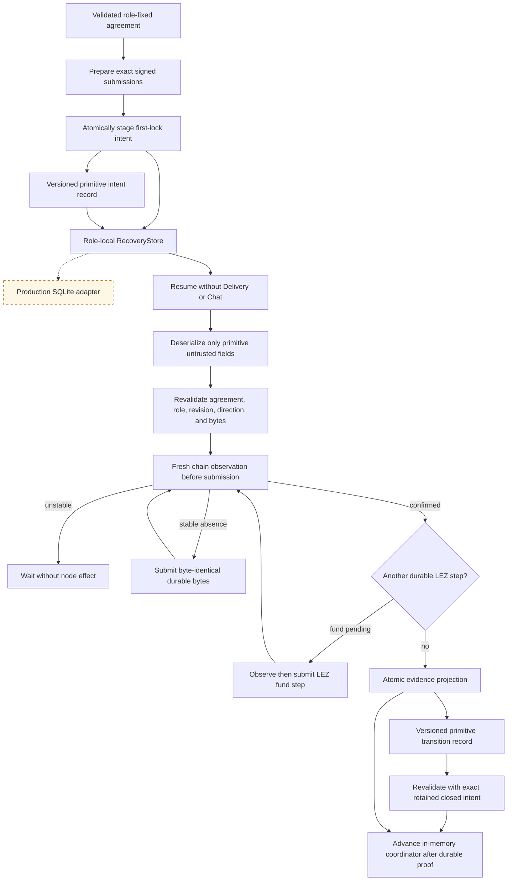

# ADR 0017: Durable intent before first-lock effects

Status: in-memory SDK intent, primitive recovery records, atomic projection,
and replay contract proven; production SQLite and chain adapters pending —
2026-07-12

## Context

The first active SDK seam retained chain and recovery capabilities but did not
use them. Treating a successful RPC return as a protocol transition would be
unsafe: the process can crash after node acceptance but before receiving the
response, or after observation but before persistence. LEZ also has separate
initialize and fund transactions, so one opaque `CreateAndFundLez` effect would
lose the exact crash boundary between them.

## Decision

Before any first-lock node call, the role-fixed taker atomically stages a
versioned immutable intent containing the accepted agreement commitment,
application swap ID, predecessor revision, fixed role, expected chain identity,
and exact signed bytes. A Zcash plan has one funding submission. A LEZ plan
contains separate initialize and fund submissions, both durable before either
node call. Each submission is nonempty and capped at 2,000,000 bytes; expected
identities must be nonzero and the two LEZ identities must differ.

The signed direction selects the plan shape; callers cannot choose a different
first-lock chain. Exact retry is idempotent and changed bytes under the same
role-local swap key conflict. Stable effect IDs are domain-separated by the
agreement commitment, fixed role, and step, not by mutable submission bytes.

Durable JSON never deserializes directly into trusted intent, evidence, or
transition domain types. Version-1 primitive records use explicit stable
snake-case role, step, and plan spellings, reject unknown fields, and retain
schema, swap, commitment, predecessor revision, exact submission bytes, and
confirmed evidence. Reconstruction independently resumes the accepted
agreement and revalidates every bound. A committed transition additionally
requires the exact separately retained closed intent; transition JSON alone is
insufficient recovery evidence.

Driving a staged plan always loads and revalidates the durable intent, then asks
the typed chain adapter to observe the expected identity before any submission.
An unstable observation waits without an effect. Stable absence permits only a
byte-identical submission. Confirmed LEZ initialization permits observation and
possible submission of the already-durable fund step. The adapter receives the
validated agreement as well as the exact submission and must independently
decode and recompute chain policy.

## Executable evidence

Six RED–GREEN lifecycle cases prove maker rejection, signed-direction plan
selection, durable-before-effect staging, exact replay, changed-byte conflict,
unstable-query non-submission, observe-before-rebroadcast restart, and ordered
LEZ initialize/fund behavior. They also prove that invalid evidence and a failed
commit leave the coordinator in `Offered`, an unknown successful commit advances
only after an exact predecessor-slot probe, and restart replays the committed
transition to `TakerLockConfirmed`. Adversarial primitive-record tests reject
future schemas, unknown fields, substituted swap/role/commitment/revision/plan,
oversized exact bytes, wrong final step/identity, zero-confirmation evidence,
and a corrupt retained closed intent. The full package currently passes 79
tests, with the real-Zebra Docker case intentionally delegated to its isolated
runner.

## Consequences and remaining boundary

This is an SDK contract, primitive persistence boundary, and in-memory test
adapter, not production durability or a completed corridor swap. `RecoveryStore`
now requires atomic transition, aggregate-revision, and intent-close semantics
plus exact predecessor-slot probing, but no SQLite implementation exists yet.
Confirmed evidence is a typed
adapter assertion; actual LEZ and Zebra adapters must produce it from fresh
stable canonical evidence at the signed threshold. The maker still needs to
persist its own independent observation of the taker lock before staging the
second lock. Claim/refund effects, production adapters, real independent actors,
and public-testnet evidence remain M2 blockers.
