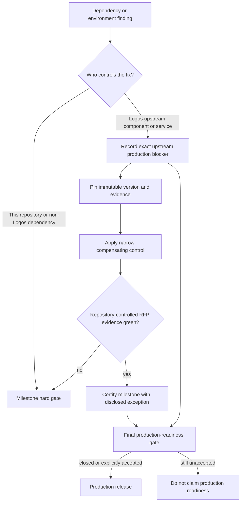

# ADR 0018: Separate Logos upstream production blockers from milestone evidence

Status: Accepted — 2026-07-12

## Context

The project is an RFP implementation delivered in milestones. Logos owns LEZ,
SPEL, and the public LEZ service, so this repository cannot merge their pull
requests, replace their release graph, or guarantee their service behavior.
Treating every Logos-owned release issue as a milestone stop would prevent
certification of repository work that is complete and reproducible. Hiding those
issues would make the final production-readiness claim unreliable.

## Decision

Milestone certification is based on the RFP deliverables controlled by this
repository and reproducible evidence against immutable external inputs. A
Logos-owned dependency or service issue does not block a milestone when all of
the following are true:

1. the exact version, commit, dependency path, impact, and upstream owner are
   recorded in the upstream production-blocker register;
2. the repository uses an immutable pin and the narrowest practical
   compensating control;
3. the exception does not waive missing behavior or safety code that this
   repository controls;
4. automated tests prove the supported provisional boundary; and
5. the milestone tag and evidence packet link the still-open production item.

Repository defects, missing actor behavior, missing recovery semantics,
floating dependencies, unexplained vulnerability suppressions, and non-Logos
dependency failures remain milestone hard gates. The final production-readiness
milestone must close each upstream item or record an explicit release-risk
acceptance by the appropriate owner.

## Consequences

M2 may advance on the exact LEZ v0.2.0 and SPEL PR-head pins while upstream
review, the full Logos runtime dependency graph, and public-service operational
questions remain open. This does not make a provisional contract double
canonical: the repository must still implement agreement-bound LEZ evidence,
durable reorg-safe authorization, complete effects, and real actor flows.

The living register is
[Upstream Logos blockers to production](../upstream-production-blockers.md).
Every milestone review rechecks its immutable references and updates status.
