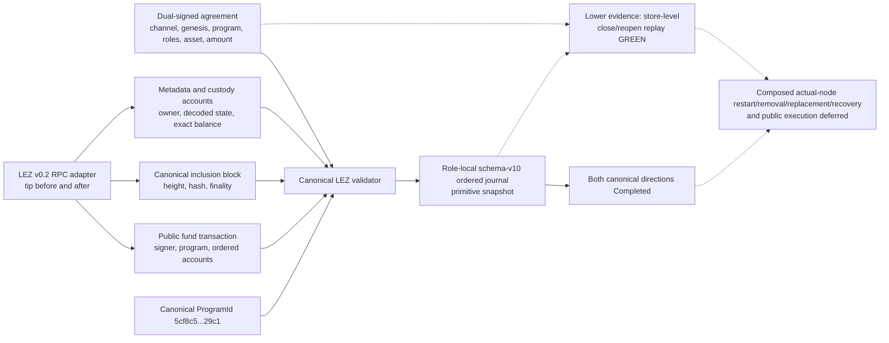

# ADR 0019: Canonical LEZ funded-escrow observation

Status: Accepted; SDK/schema-v10 exact-head validation, official-wire v0.2 RPC observation, and terminal funded/claimed escrow semantics crossed both canonical actual-node happy directions; actual-node removal/replacement/recovery and public execution deferred -- reconciled 2026-07-14

## Context

A transaction ID and confirmation count cannot prove a LEZ escrow is the
agreement-selected taker lock. The maker must distinguish a real funded SPEL
escrow from the wrong execution channel, program, actor, instruction accounts,
metadata, asset, custody, amount, or fork. A trusted in-memory verdict is also
insufficient because every restart must reconstruct trust from primitive data.

LEZ v0.2 exposes channel, block, transaction, account, and block-status RPCs.
Its RPC does not expose a sequencer verification key or a separately
verifiable Bedrock finality proof. The resulting evidence is therefore
consistency evidence against the selected authoritative node, not a trustless
light-client proof.

## Decision

The dual-signed agreement binds the execution environment, nonzero v0.2 channel
ID, nonzero genesis block hash, escrow ProgramId, role accounts, derived
metadata/custody accounts, asset programs and definition, amount, terms hash,
secret digest, and refund deadline.

The observation adapter brackets all reads with the same tip and returns
primitive transaction, block, decoded metadata, and custody facts. The SDK
accepts only the reverse direction and checks:

- exact channel/genesis and a stable bracketing tip;
- a public, validly signed fund transaction under the escrow program, signed by
  the taker/depositor, using the exact generated FundNative or FundToken kind,
  on-chain swap ID, and generated-client account order;
- canonical inclusion at or below the stable tip and recomputed nonzero depth;
- metadata ownership plus exact version, roles, terms hash, digest, custody,
  programs, definition, amount, deadline, and Funded status;
- exact queried custody account address plus native or token owner, definition,
  and balance exactly equal to the signed account and amount; and
- exact upstream Pending, Safe, or Finalized status. Structural validation
  accepts every nonzero stable depth; the later funding-eligibility boundary
  applies the signed threshold and requires Finalized on public v0.2.

The ordered maker journal stores the complete untrusted snapshot. Replay calls
the same agreement validator and then checks byte-for-byte record
reconstruction. It never deserializes a trusted verdict.

Adding the channel to the signed body introduced agreement schema 2. The
schema-aware decoder recognizes legacy schema-1 layout but rejects it with a
typed error. Because the missing channel was never signed, old agreements are
not migrated; both actors must renegotiate and re-sign.

## Consequences

Primitive reverse-LEZ ID/depth assertions fail closed. SDK and SQLite
close/reopen preserve and revalidate canonical funded evidence. Channel or
genesis changes are identity failures, never reorg replacements.

The dependency-free two-phase `LezObservationTrackerV1` now suppresses exact
duplicates, journals same-inclusion depth and monotonic
Pending-to-Safe-to-Finalized updates, requires affirmative same-tip atomic
replacement evidence for changed inclusion, rejects stale evidence, stable-tip
regression, and finality regression, and treats any finalized removal as an
operator-fatal violation. Proposal never mutates the head; only an exact
committed event does.

The active SDK and schema-v8 SQLite journal now fold canonical and
same-inclusion LEZ tracker events. Exact duplicates write no row, and restart
restores the exact updated head. Historical payload-v1 snapshots that stored
`swap_id` before the generated instruction kind was bound are decoded
schema-aware and derive Native versus Token only from the signed agreement
before full revalidation. Current records take the strict typed decoder first;
the narrow legacy fallback uses serde_json's standard `arbitrary_precision`
feature so signed native or token amounts retain their complete `u128` value.
Current and legacy restart tests cover `u64::MAX + 1`.

Affirmative nonfinal removal and atomic same-tip replacement now retain the
complete prior canonical snapshot, removal snapshot, and optional replacement
snapshot in one version-1 transition record. SDK and SQLite apply the selected
tracker before the coordinator; duplicate replacement writes nothing, stale
old-head removal fails without mutation, and current-head removal replays to
`Offered`.

The fresh maker eligibility boundary also supports reverse deterministic-local
LEZ. It replays then re-queries the exact head, checks signed depth, and accepts
Pending/Safe/Finalized. A public-policy unit seam returns typed
awaiting-finality for Pending/Safe until Bedrock reports Finalized, but public
agreement activation remains fail-closed pending a reviewed deployment. The
boundary never changes `next_action` or caches authority.

The official-wire v0.2 sidecar now decodes and hashes the public transaction,
validates initialization/funding and revealing-claim facts, and distinguishes
terminal `Claimed` native escrow state. Both canonical actual-node directions
ended with zero custody. Refund observation is implemented in lower sidecar/SDK
tests but composed actual-node refund and token-corridor evidence remain
deferred. A finalized block changing is an operator-fatal finality
violation, not a routine reorg.

## 2026-07-14 canonical actual-node reconciliation

The forward and reverse certification runs exercised agreement-derived LEZ
depositor, claimant, program, metadata, custody, transaction, inclusion, and
terminal account validation through role-isolated official-wire sidecars. The
validator correction removed the earlier forward-depositor assumption; each
direction now derives role ownership from its signed agreement. Finalized LEZ
initialize/fund/claim effects appear in blocks 2594/2595/2596 and
2605/2606/2607, and both terminal snapshots report `Claimed` with zero custody.

This proves the canonical positive observation path. It does not prove the
composed actual-node removal/replacement, refund, restart, reorg, chaos, or
public-finality paths.

The missing independently verifiable sequencer/finality proof is recorded as
LOGOS-004 under ADR 0018 and does not waive repository-controlled M2 work.
