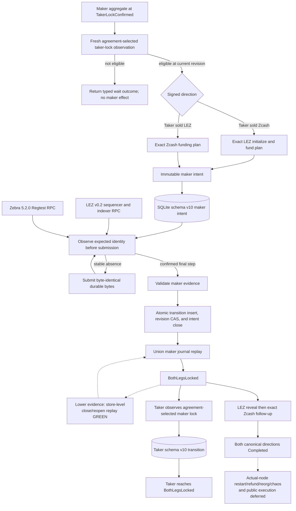

# ADR 0020: Fresh-gated durable maker second lock

Status: Accepted; both direction-derived maker second locks, schema-v10 replay, production-shaped LEZ/Zebra ports, and independent actor processes crossed both canonical actual-node happy directions; actual-node restart/refund/reorg/chaos and public execution deferred -- reconciled 2026-07-14

## Context

The maker may lock only after independently confirming the taker's first lock.
That permission cannot be cached: a fresh exact-head query is required in the
same operation that can create the maker effect. The maker plan must also be
durable before submission and replayable without Delivery or Chat.

The existing taker first-lock intent cannot safely store this effect. Its close
constraint assumes the intent predecessor is immediately followed by its
funding transition. A maker can stage at revision `n`, durably observe a deeper
canonical taker lock at `n + 1`, and only then confirm its own lock at `n + 2`.

## Decision

`ActiveZecSwap::drive_maker_lock` fixes the local role to Maker, invokes the
fresh eligibility boundary internally on every call, and returns a typed
non-effect outcome unless that exact poll is eligible. Signed direction selects
the opposite-chain plan: `TakerSellsForeign` requires LEZ initialize then fund;
`TakerSellsLez` requires Zcash fund. The public method accepts no participant or
chain selector.

An eligible call atomically creates one immutable maker intent containing the
agreement commitment, swap ID, Maker role, staging revision, and exact prepared
submission bytes before any submission port call. Exact retry is idempotent;
changed material conflicts. Each chain step is observed before submission, and
the LEZ initialize and fund steps remain independently recoverable.

Schema v8 introduced dedicated maker-intent and maker-transition tables; the
current schema v10 retains those tables and invariants. The intent
records `staged_revision`; the transition separately records its current
`predecessor_revision` and exact `intent_staged_revision`. The database permits
`closed_revision > staged_revision` while requiring
`committed_revision = predecessor_revision + 1` and
`intent_staged_revision <= predecessor_revision`. A composite foreign key binds
the transition to the exact retained intent.

Confirmed final-step evidence is revalidated against the retained plan and the
Maker confirmation threshold. One immediate SQLite transaction inserts the
transition, compare-and-swaps the active revision, and closes the exact intent.
Memory changes only after the commit or an exact unknown-outcome probe. Maker
restart replay unions taker-observation and maker-lock transitions, requires one
unique contiguous predecessor per active revision, and applies the maker proof
through `SwapCoordinator::observe_funding` to reconstruct `BothLegsLocked`.

## Executable evidence

The public SDK lifecycle test drives both signed directions through canonical
taker observation, fresh eligibility, durable opposite-chain submission,
confirmed maker projection, and restart at `BothLegsLocked`. The LEZ direction
proves initialize then fund ordering; the Zcash direction proves a single
funding step. A second maker instance held stale at `TakerLockConfirmed` replays
the committed maker transition to `BothLegsLocked` before any fresh query and
adds no submission. Stable absence in either direction returns a typed wait,
creates no intent, and calls no maker submission port. The full SDK suite,
strict Clippy, and strict Rustdoc pass.

The production role-fixed SQLite test repeats both directions, inspects the
staged, predecessor, committed, and closed revisions, closes the database, and
reopens without chain or negotiation evidence at `BothLegsLocked`. The complete
swap-store suite repeats stale-instance zero-resubmission in both directions and
passes schema-v8 migration, existing rollback/corruption/replay cases, and the
new union-journal path.

The same SQLite case stages the maker intent at revision 1, then commits a
same-inclusion Zcash depth update or LEZ finality update at revision 2 without
another maker submission. Confirmed maker funding closes that retained intent
at revision 3 against transition predecessor 2, and close/reopen replays the
mixed journal exactly.

Projection fault injection proves a store failure leaves phase and revision at
`TakerLockConfirmed` with the intent still open. An unknown successful commit is
accepted only after an exact transition probe. A real SQLite close-trigger
failure rolls back the transition insert, agreement revision CAS, and intent
closure; removing the trigger permits an exact retry.

Accept-then-transport-failure tests cover both LEZ steps and Zcash funding. Each
restart uses the same retained intent, introduced in schema v8 and preserved
in current schema v10, observes the accepted identity, and
never rebroadcasts. If the taker Zcash lock is removed after LEZ initialization,
fresh eligibility returns to `Offered` and LEZ fund is withheld through stable
absence; only a validated canonical replacement permits the exact fund step.
Malformed retained maker intent JSON and a future transition schema both fail
closed during reopen.

The distinct taker-local observation transition introduced in schema v8 is
retained in current schema v10. In both directions, separate maker and taker
stores bind the remote
maker evidence, advance independently to `BothLegsLocked`, and replay there.
The deterministic adapter still asserts the remote expected-submission ID;
production adapters must derive and validate that identity from canonical node
evidence.

## 2026-07-14 canonical actual-node reconciliation

In `TakerSellsLez`, the maker observed the taker LEZ lock before funding Zcash.
In `TakerSellsForeign`, the maker observed confirmed taker Zcash funding before
initializing and funding LEZ. Each maker effect used an immutable role-local
intent, and each counterparty independently observed the agreement-selected
second lock. Both separate actor stores reached `BothLegsLocked` and later
revision 4 `Completed` against the canonical local nodes.

The composed positive path does not replace the deterministic accept-then-loss,
rollback, stale-instance, or reorg tests. Equivalent faults, restarts, refunds,
and chaos against the composed actual nodes remain later hardening.

## Consequences

Fresh eligibility is now consumed by a real durable maker effect and is no
longer merely advisory. `next_action` still does not cache permission. The same
prepared-submission and typed chain-port contracts are reused instead of adding
another RPC or serialization system.

This proves the hardened SDK/SQLite maker-lock boundary and the canonical local
PoC composes it through both complete happy directions. Official LEZ v0.2 wire
decoding, production-shaped Zebra/LEZ ports, independent maker/taker processes,
and claim effects are GREEN in those runs. Actual-node restart, refund, reorg,
concurrency faults, chaos, public-testnet execution, and recordings remain
deferred.
