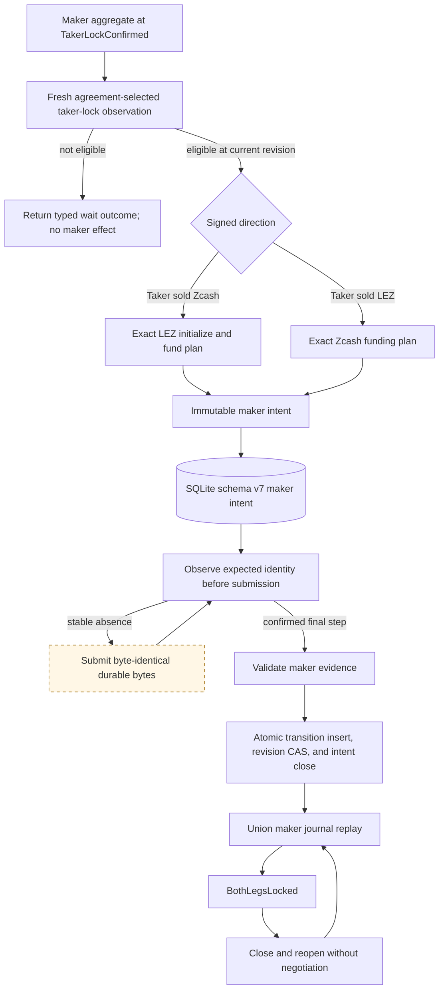

# ADR 0020: Fresh-gated durable maker second lock

Status: Accepted; both deterministic-local directions and schema-v7 restart
replay implemented, production node adapters and actor processes pending --
2026-07-12

## Context

The maker may lock only after independently confirming the taker's first lock.
That permission cannot be cached: a fresh exact-head query is required in the
same operation that can create the maker effect. The maker plan must also be
durable before submission and replayable without Delivery or Chat.

The existing taker first-lock intent cannot safely store this effect. Its close
constraint assumes the intent predecessor is immediately followed by its
funding transition. A maker can stage at revision `n`, durably observe a deeper
canonical taker lock at `n + 1`, and only then confirm its own lock at `n + 2`.

## Decision

`ActiveZecSwap::drive_maker_lock` fixes the local role to Maker, invokes the
fresh eligibility boundary internally on every call, and returns a typed
non-effect outcome unless that exact poll is eligible. Signed direction selects
the opposite-chain plan: `TakerSellsForeign` requires LEZ initialize then fund;
`TakerSellsLez` requires Zcash fund. The public method accepts no participant or
chain selector.

An eligible call atomically creates one immutable maker intent containing the
agreement commitment, swap ID, Maker role, staging revision, and exact prepared
submission bytes before any submission port call. Exact retry is idempotent;
changed material conflicts. Each chain step is observed before submission, and
the LEZ initialize and fund steps remain independently recoverable.

Schema v7 uses dedicated maker-intent and maker-transition tables. The intent
records `staged_revision`; the transition separately records its current
`predecessor_revision` and exact `intent_staged_revision`. The database permits
`closed_revision > staged_revision` while requiring
`committed_revision = predecessor_revision + 1` and
`intent_staged_revision <= predecessor_revision`. A composite foreign key binds
the transition to the exact retained intent.

Confirmed final-step evidence is revalidated against the retained plan and the
Maker confirmation threshold. One immediate SQLite transaction inserts the
transition, compare-and-swaps the active revision, and closes the exact intent.
Memory changes only after the commit or an exact unknown-outcome probe. Maker
restart replay unions taker-observation and maker-lock transitions, requires one
unique contiguous predecessor per active revision, and applies the maker proof
through `SwapCoordinator::observe_funding` to reconstruct `BothLegsLocked`.

## Executable evidence

The public SDK lifecycle test drives both signed directions through canonical
taker observation, fresh eligibility, durable opposite-chain submission,
confirmed maker projection, and restart at `BothLegsLocked`. The LEZ direction
proves initialize then fund ordering; the Zcash direction proves a single
funding step. A second maker instance held stale at `TakerLockConfirmed` replays
the committed maker transition to `BothLegsLocked` before any fresh query and
adds no submission. The full SDK suite, strict Clippy, and strict Rustdoc pass.

The production role-fixed SQLite test repeats both directions, inspects the
staged, predecessor, committed, and closed revisions, closes the database, and
reopens without chain or negotiation evidence at `BothLegsLocked`. The complete
swap-store suite repeats stale-instance zero-resubmission in both directions and
passes schema-v7 migration, existing rollback/corruption/replay cases, and the
new union-journal path.

## Consequences

Fresh eligibility is now consumed by a real durable maker effect and is no
longer merely advisory. `next_action` still does not cache permission. The same
prepared-submission and typed chain-port contracts are reused instead of adding
another RPC or serialization system.

This proves the SDK and SQLite happy-path boundary, not the complete M2
corridor. Official LEZ v0.2 wire decoding, production Zebra/LEZ ports,
independent maker/taker processes, claims, refunds, concurrency, public-testnet
evidence, and recordings remain required. Retry, reorg, unknown-submission, and
corruption hardening for the new maker effect follows the happy path.
