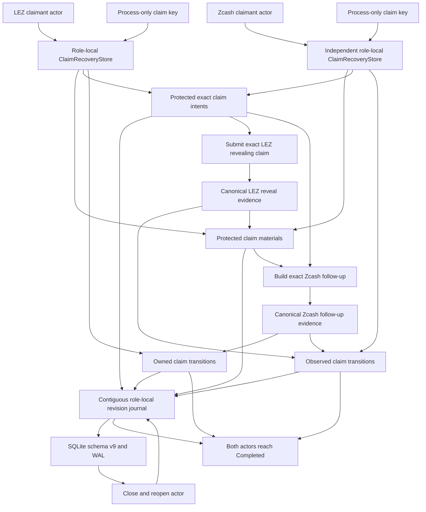

# ADR 0021: Protected role-local claim recovery

Status: Accepted; schema-v9 two-direction SQLite happy path, legacy
generic-state secret migration, and claim recovery hardening implemented;
production key rotation and chain adapters pending -- 2026-07-13

## Context

The LEZ claim reveals the agreement preimage before the other actor can claim
the Zcash BIP-199 output. Each actor runs from an independent role-local store:
the first claimant owns the LEZ effect and observes the Zcash follow-up, while
the other actor observes the LEZ reveal, protects the extracted preimage, and
owns the Zcash effect.

Plaintext preimages and exact signed claim transactions must not enter SQLite
JSON, database pages, or the WAL. At the same time, restart safety requires the
exact transaction to be recoverable before any possible rebroadcast, and the
observer must durably retain the extracted preimage before advancing to
`ClaimEvidenceAvailable`.

The general `SwapCoordinator` previously retained serializable claim evidence.
That representation conflicts with protected recovery even if the new SDK
tables are encrypted, because a second persistence path could still serialize
the preimage.

## Decision

`SqliteZecRecoveryStore::open_claim_capable` accepts a
`ProtectedClaimKey`. The key remains in zeroizing process memory behind a
redacted shared handle and is never written to SQLite. Ordinary `open`
remains available for non-claim use and fails closed if claim rows require a
key.

XChaCha20-Poly1305 protects preimages and exact claim submissions. HKDF-SHA256
derives context-specific envelope keys. Authenticated context binds the swap,
agreement commitment, pair, direction, local role, purpose, and key ID. Exact
submission context additionally binds the claim step, staging revision, and
expected transaction identity. Every encryption uses a fresh 24-byte nonce
from operating-system entropy; schema uniqueness constraints defend against
accidental nonce reuse.

Schema v9 adds four tables:

- `zec_sdk_claim_materials` stores one authenticated preimage envelope and
  its role-derived purpose.
- `zec_sdk_claim_intents` stores the secret-free intent record and encrypted
  byte-identical transaction payload. Closed intents remain retained for
  replay.
- `zec_sdk_owned_claim_transitions` stores secret-free LEZ-reveal or
  Zcash-follow-up records with a mandatory composite foreign key to the exact
  intent.
- `zec_sdk_observed_claim_transitions` stores secret-free independent
  observations. An observed LEZ reveal is linked to material created at the
  same committed revision; an observed Zcash follow-up has no material link.

These tables join the existing lock tables in one contiguous role-local
journal. Every committed revision has exactly one predecessor row across the
union. Replay starts from the accepted agreement, validates every record and
envelope, reconstructs the exact phase sequence, and rejects gaps, duplicate
slots, incorrect intent closure, orphan material, wrong material purpose,
future schemas, or failed authentication.

Owned commits atomically insert the transition, close the matching intent, and
compare-and-swap the active revision. An independently observed LEZ reveal
atomically inserts protected extracted material, inserts its observation, and
advances the revision. Memory advances only after the transaction commits or
an exact predecessor probe proves an unknown commit succeeded.

Core claim evidence is a one-way SHA-256 commitment, not a recoverable
preimage. Schema-v8 generic `swaps.state_json` rows that contain the legacy
plaintext representation must be decoded compatibly, rewritten to the
commitment-only representation during migration, and scrubbed from current
database and WAL storage. Backups made before migration remain sensitive and
require an explicit operator retention policy.

## Executable evidence

The schema-v9 SQLite actor test runs both signed directions with separate maker
and taker database files. It drives both locks, protects and submits the LEZ
claim, independently extracts and persists its preimage, protects and submits
the Zcash follow-up, and reaches revision 4 and `Completed` in both stores.
Both stores close and reopen through claim-capable replay at the same phase.

The test inspects the protected material and intent rows, proves revisions 1
through 4 are contiguous across the unified journal, and scans the SQLite
database and WAL for the preimage and both secret-bearing transaction
payloads. The full SDK recovery suite and strict production-library Clippy
also pass.

Commit `5ed04ec` proves the failing-first legacy-state migration gate. A schema-v8
fixture begins with the exact plaintext preimage in `state_json`; schema-v9 open
rewrites it to the tagged SHA-256 commitment in one migration transaction,
enables secure deletion, checkpoints the WAL with truncation, and verifies that
neither the distinctive JSON tuple nor the raw preimage remains in the database,
WAL, or shared-memory files. Pre-migration backups remain explicitly sensitive.

Commit `340bf10` completes the repository-controlled claim recovery hardening
matrix. Claim-capable reopen rejects a wrong key identifier or key material,
corrupt ciphertext or nonce, a changed authenticated fingerprint, and a future
protected-payload version without mutating state. Unified replay rejects orphan
closed intents, orphan observed material, duplicate revisions, and active-head
drift. Forced SQLite aborts roll back every coupled owned-claim or observed-reveal
effect. Unknown LEZ submission outcomes and stale instances observe the exact
durable bytes before any possible rebroadcast. The committed swap-store suite
contains 35 passing tests for the complete schema-v9 surface.

## Consequences

Crash recovery no longer requires plaintext claim material in the coordinator
or secret-bearing JSON. The same role-local revision discipline used for locks
now covers both claim effects and both independent observations.

The current constructor owns one active key only. It can reopen rows encrypted
with that same key ID and material, but it is not yet a rotation-aware keyring.
Production hardening must add active-key selection plus lookup of retained old
keys, migration or rewrapping policy, missing-key operator diagnostics, and
tests proving old rows remain readable after rotation.

Remaining production gates are rotation-aware key provisioning, canonical
LEZ/Zcash claim adapters, independent actor processes, and repetition against
actual nodes. Broader operating-system process-kill coverage remains an M5
coordinator gate; it does not replace the transaction-level rollback and
unknown-outcome evidence completed here.
