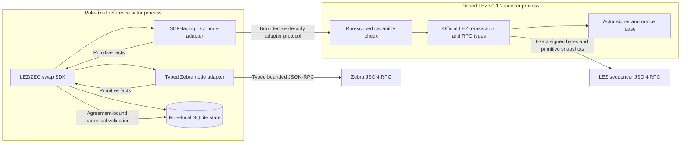

# ADR 0022: Isolate pinned LEZ official-wire code behind a sidecar

Status: Accepted for the M2 actual-node corridor; implementation in progress --
2026-07-13

## Context

The M2 composed corridor must use the official pinned LEZ transaction/RPC types
and the canonical `librustzcash`/Zebra stack. The existing LEZ standalone actor
suite and actual Zebra suites prove each node independently, but they have not
yet been composed through production chain ports.

An executable dependency-resolution RED proved that the two pinned stacks
cannot inhabit one Cargo graph. The Zcash graph pins
`crypto-common = 0.2.0-rc.1`, while the LEZ v0.1.2 graph reaches
`chacha20 0.10` and `cipher 0.5.1`, which require stable
`crypto-common ^0.2`. Cargo cannot select one package version satisfying both
requirements. Relaxing a consensus dependency pin, patching a cryptographic
crate, or duplicating an official wire format merely to make the integration
compile would weaken the evidenced stacks.

## Decision

Keep the main swap workspace and Zcash adapter in one process. Place official
LEZ transaction construction, serialization, signing, nonce handling, RPC
decoding, and raw snapshot collection in a separately built, exactly pinned
sidecar. Connect them with a small serde-only protocol that contains primitive
requests, exact bytes, identifiers, inclusion facts, account facts, and
structured errors. The protocol makes no consensus or agreement-validity
judgments.

The SDK-facing LEZ adapter converts those primitive facts into SDK snapshot
types and invokes the SDK's agreement-bound validators. The sidecar cannot
declare a lock or claim canonical by assertion. The Zebra adapter similarly
uses typed and bounded RPC DTOs, assembles stable snapshots from bracketing tip
reads, and delegates transaction/output/spend validation to the existing SDK.

For the deterministic M2 runner, the sidecar listener is ephemeral loopback,
requires a high-entropy run-scoped capability, rejects a different `RUN_ID`,
and is owned by the one runner that starts it. A production deployment should
prefer an owner-restricted Unix socket. Neither endpoint nor authentication
material is protocol authority; actor signatures, exact transaction identity,
canonical node observations, and the accepted agreement remain authoritative.

LEZ initialize and fund must be prepared and durably recorded before the first
submission. The sidecar obtains one account nonce under an exclusive signer
lease, reserves the required consecutive nonces, signs exact transactions, and
returns their identities and bytes without logging secrets. Restart
reconciliation observes exact identities before any byte-identical rebroadcast.

The sidecar retains its own lockfile, source allowlist, license/advisory policy,
and exact LEZ/SPEL pins. It does not depend on the swap SDK. The main workspace
does not import the LEZ standalone/sequencer/Risc0 server graph.

## Rejected alternatives

- Relax or patch either cryptographic dependency pin: this invalidates the
  already evidenced LEZ or Zcash stack and introduces an unaudited combination.
- Copy LEZ wire structures into the main runtime: this can silently drift from
  upstream signing and hashing semantics.
- Treat the current in-memory claim ports as node evidence: they prove SDK and
  recovery ordering, not actual consensus execution.
- Let the sidecar return already trusted SDK evidence: this moves agreement and
  consensus policy outside the SDK and makes adapter assertions authoritative.

## Consequences and verification

The process boundary adds one local component, lifecycle, capability, and
failure mode to the actor corridor. Transport loss, malformed or oversized
responses, wrong run identity, unstable tips, unavailable signers, unknown
submission outcomes, exact-hash mismatches, and node rejections must remain
distinct errors and be exercised across restart.

The initial failing composed test lives in the main workspace. It requires
distinct loopback LEZ-sidecar and Zebra endpoints, distinct role funding,
separate maker/taker databases and claim keys, both signed directions, the
fixed `locks -> LEZ reveal -> Zcash follow-up` order, and restart after every
effect. It remains RED until concrete adapters and the single-owner isolated
runner satisfy that contract. No broken commit is published while this slice
is being driven GREEN.

Before the claim ports can be certified, the SDK must validate canonical LEZ
revealing-claim snapshots rather than constructing evidence from primitive
assertions, and the Zcash observation port must receive its previous canonical
head so removal/replacement can be assembled after process restart. Those are
repository-controlled prerequisites, not Logos-owned production exceptions.
