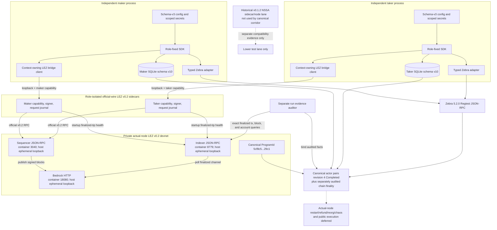

# ADR 0022: Isolate pinned LEZ official-wire code behind a sidecar

Status: Accepted for the M2 actual-node corridor; official-wire v0.2 sidecars, authenticated eight-method bridges, schema-v3 activation/drive/status, typed LEZ and Zebra ports, separate schema-v10 actors, and both canonical actual-node happy directions are GREEN. Actual-node restart/refund/reorg/chaos and live public execution remain deferred -- reconciled 2026-07-14

ADR 0023 retains this process-boundary decision but supersedes the final M2
runtime target. The implemented v0.1.2 `/NSSA/` sidecar and standalone node are
lower compatibility evidence; certification requires an equivalently isolated
official-wire v0.2 `/LEE/` sidecar against the full local Bedrock, indexer, and
non-standalone sequencer stack. The same v0.2 actor/sidecar binaries now select explicit local or exact dormant
public routes through signed configuration and provisioning only. Public client
construction is locally tested; live public execution remains deferred.

The separately locked v0.2 implementation is GREEN for exact upstream LEE
account, transaction, Vault, and escrow types; canonical signed-transaction
decoding; literal-loopback sequencer/indexer identity; authenticated role-bound
servers; durable reservations and effect journals; observation; one-attempt
submission; executable maker/taker processes; and exact dormant public HTTPS
configuration. Both canonical local actor directions completed. Public network
I/O and actual-node fault/recovery composition remain deferred.

## Context

The M2 composed corridor must use the official pinned LEZ transaction/RPC types
and the canonical `librustzcash`/Zebra stack. At the time of this decision, the LEZ standalone and Zebra suites proved each
node independently but had not been composed. The canonical v0.2 forward and
reverse runs now cross the production-shaped role bridges and chain ports; the
historical dependency-resolution rationale below remains unchanged.

An executable dependency-resolution RED proved that the two pinned stacks
cannot inhabit one Cargo graph. The Zcash graph pins
`crypto-common = 0.2.0-rc.1`, while the LEZ v0.1.2 graph reaches
`chacha20 0.10` and `cipher 0.5.1`, which require stable
`crypto-common ^0.2`. Cargo cannot select one package version satisfying both
requirements. Relaxing a consensus dependency pin, patching a cryptographic
crate, or duplicating an official wire format merely to make the integration
compile would weaken the evidenced stacks.

## Decision

Keep the main swap workspace and Zcash adapter in one process. Place official
LEZ transaction construction, serialization, signing, nonce handling, RPC
decoding, and raw snapshot collection in a separately built, exactly pinned
sidecar. Connect them with a small serde-only protocol that contains primitive
requests, exact bytes, identifiers, inclusion facts, account facts, and
structured errors. The protocol makes no consensus or agreement-validity
judgments.

The SDK-facing LEZ adapter converts those primitive facts into SDK snapshot
types and invokes the SDK's agreement-bound validators. The sidecar cannot
declare a lock or claim canonical by assertion. The Zebra adapter similarly
uses typed and bounded RPC DTOs, assembles stable snapshots from bracketing tip
reads, and delegates transaction/output/spend validation to the existing SDK.

The signed agreement names the runtime family exactly. The lower deterministic v0.1.2 compatibility lane uses `DeterministicLocalV0_1_2Compatibility` and the official
`/NSSA/v0.2/AccountId/PDA/` domain; it must never emit or be recorded as
`DeterministicLocalV0_2`, whose deployed family uses the incompatible `/LEE/`
domain. The SDK derives all metadata, native-custody, and token accounts from
that signed selector, and a separate compatibility test compares the local
derivation source to the pinned official v0.1.2 types. Public v0.2 activation
remains fail-closed and is tracked as upstream production work.

The signed runtime selector also fixes the escrow metadata generation. The
historical NSSA v0.1.2 compatibility lane emits escrow metadata schema 1,
whereas the LEE v0.2 local and dormant-public lanes emit schema 2. Protocol
constructors name those generations explicitly; the sidecars, adapter, and SDK
must select the same constructor from the signed environment. A shared
generation-ambiguous constructor is forbidden because it can relabel genuine
v0.1.2 node evidence as v0.2 evidence before agreement validation.

The historical v0.1.2 actor file used schema 2. The current v0.2 actor file uses
schema 3 and binds the runtime selector, typed local or dormant-public routes,
and the complete described sidecar/Zebra identities to a nonzero exact SHA-256 of the
accepted signed-agreement bytes. Activation rehashes the agreement file before
use. Paired maker/taker configs must carry the same agreement digest, runtime,
Zebra chain identity, and discovery policy, while fixing distinct roles,
signers, endpoints, stores, journals, and keys. The public
`validate_runtime_binding` helper compares accepted signed terms with the
sidecar environment, channel, genesis, escrow program, and local participant
signer. The sidecar's process role is intentionally checked separately by
`LezBridgeAdapter::new`, so a locally mislabelled role cannot create a port even
when signed runtime terms otherwise match.

For the deterministic M2 runner, the sidecar listener is ephemeral loopback,
requires a high-entropy run-scoped capability, rejects a different `RUN_ID`,
and is owned by the one runner that starts it. A production deployment should
prefer an owner-restricted Unix socket. Neither endpoint nor authentication
material is protocol authority; actor signatures, exact transaction identity,
canonical node observations, and the accepted agreement remain authoritative.

The lower compatibility sequencer is provisioned by a separate reusable
process in the exact v0.1.2 graph. It is retained historical/lower evidence and
is not the canonical v0.2 M2 node topology. Before creating state, that process
requires the supplied artifact manifest to equal the repository-embedded
tracked manifest and recomputes both the ELF SHA-256 and Risc0 ImageID. It
refuses an existing node home or readiness path, creates a mode-0700 home, asks
upstream for a dynamic port, and publishes a literal-loopback client URL only
after official RPC confirms health, genesis, mandatory chain progress, checked
deployment transaction and containing block, ProgramId derived from the
transaction ELF, the advertised authenticated-transfer built-in, and two
key-derived funded genesis accounts owned by that built-in. The pinned
`getProgramIds` RPC is a static built-in map and is never treated as a custom
deployment registry. Its mode-0600 no-clobber schema-v2 readiness manifest
includes the exact deployment hash/block identity and deterministic actor
private keys, so it is a run-local secret handoff rather than public liveness
metadata. The upstream server's wildcard bind remains an explicit local-fixture
limitation; a network namespace or container is required where host-wildcard
exposure is unacceptable.

LEZ initialize and fund must be prepared and durably recorded before the first
submission. The sidecar obtains one account nonce under an exclusive signer
lease, reserves the required consecutive nonces, signs exact transactions, and
returns their identities and bytes without logging secrets. Restart
reconciliation observes exact identities before any byte-identical rebroadcast.

The sidecar retains its own lockfile, source allowlist, license/advisory policy,
and exact LEZ/SPEL pins. It does not depend on the swap SDK. The main workspace
does not import the LEZ standalone/sequencer/Risc0 server graph.

The first implementation slice now provides the separately locked official
transaction planner. It constructs native initialize/fund instructions with
the official NSSA/SPEL APIs, reserves one checked consecutive nonce pair under
an exclusive mutex, preserves the first randomized BIP340 signatures for exact
retry, and accepts only its cached pair for submission. Construction binds the
complete configured runtime descriptor; decoding checks canonical bytes,
official hash, witness validity, signer, role, and escrow program. The local
official node adapter now implements nonce reads, exact cached-byte submission,
and bounded exact-owner block-window scans through upstream generated RPC
types. It brackets scans with validated tips, recomputes block hashes and links,
checks genesis when covered, and never treats a bounded miss as global absence.
Only the proven stateless invalid-params error is definitive; returned-hash,
server, parse, timeout, and transport ambiguity remain unknown outcomes. The
local server library now authenticates capability, run, and role before parsing;
uses an ephemeral literal-loopback listener; restores exact randomized prepare
results through the official decoder; and persists a submission-in-flight
marker before the node call so a crash cannot cause blind resubmission. All
eight executable methods are registered.
Revealing-claim preparation validates the exact
claimant role, runtime, signer, signed terms, preimage, and request-bound funding
transaction before nonce use; restart restores the exact randomized official
bytes, and submission requires cache membership. The pinned guest ABI carries
only swap ID and preimage, so the funding transaction identity is enforced by
the request/cache boundary but cannot be embedded in the on-chain instruction
without an upstream ABI change. Native escrow observation now decodes official
transactions, signatures, instructions, block links, metadata, and custody,
brackets account reads with an identical tip, rejects ambiguity, and reports
absence only after a complete stable discovery window. Exact-owner lookup is
limited to the latest 4,096 canonical blocks because the upstream transaction
lookup has no chain position; an older miss is `UnknownOrPending`, never
absence. The main adapter independently validates the primitive pair against
the signed agreement and conservative local-depth policy. Revealing-claim
observation now decodes the official Risc0 instruction ABI and canonical
message, witness, ordered accounts, transaction bytes, inclusion position,
terminal metadata, and zero custody. The exact claimant path is cache-bound;
the depositor discovers the counterparty claim by signed terms in a caller-owned
window. Ambiguity and moving tips fail closed, incomplete scans remain
`UnknownOrPending`, and only complete stable windows produce absence. Native
and claim reservations coexist across restart while rejecting nonce reuse.
Native refunds use the official permissionless `RefundNative` ABI with the
generated metadata/custody/depositor account order, no nonces, and no witnesses.
Preparation and restoration are byte-identical and cache-bound without reading
a signer nonce. Exact owner lookup never turns a miss into absence; bounded
claimant discovery returns absence only for a complete stable window. Found
evidence requires canonical unsigned bytes, terminal `Refunded` metadata, zero
custody, exact chain placement, and identical bracketing consensus clocks.
Native, claim, and refund reservations coexist across restart, and the generic
submit crash marker prevents blind replay of any cached transaction kind.

The executable starts one sidecar with private capability/signer files, an
exact runtime descriptor, a 0600 durable idempotency store, and a
`127.0.0.1:0` listener. Its process contract runs maker and taker
concurrently with distinct identities and proves wrong capability, run, and
role rejection plus graceful cleanup. That process contract is now composed through distinct maker and taker actors in
both canonical local happy directions. Process-kill, refund, reorg, and chaos
composition remain deferred.

The exact standalone lane now also starts that upstream sequencer as an
external child suitable for later reference actors. Process tests reject a
tampered guest before readiness, preserve a pre-existing home without mutation,
verify the published endpoint/genesis, exact deployment transaction and
containing block, ELF-derived ProgramId, static built-in owner, and both actor
key/account/balance bindings through official RPC, keep keys out of bounded
diagnostics, and prove graceful stdin shutdown. The first exact run retained the
false static-program-map assumption as RED; the corrected full runner then
passed the process suite, actual native/two-definition lifecycle, strict
Clippy, and byte-identical recursive costs. A later actor-contract RED proved
that the previous all-zero local channel could not satisfy signed agreement
validation. The sequencer configuration and readiness handoff now bind one
nonempty deterministic channel; the focused locked-graph readiness suite is
GREEN and the exact full runner must be rechecked before corridor evidence. No current actor consumes this lower v0.1.2 handoff in the canonical
cross-chain corridor; the composed proof uses the separately locked v0.2
sidecars and full three-service LEZ stack.

## Atomicity preservation

No implementation can make LEZ and Zcash commit in one shared database or
consensus transaction. This corridor therefore preserves atomic-swap safety by
making every externally visible transition satisfy the same hashlock and a
strictly ordered timeout protocol:

1. Both signatures bind the same secret digest, amounts, actor destinations,
   chain identities, programs, transaction policy, and asymmetric deadlines.
2. The taker submits the first lock. The maker cannot prepare or submit the
   second lock until fresh canonical evidence satisfies the signed identity,
   role, output/account state, depth, and environment-specific finality policy.
3. Neither claim path starts before both locks are durably projected. As the
   final awaited check before releasing the preimage, the LEZ claimant must
   freshly prove that the exact agreement-bound Zcash output is still
   canonical, unspent, sufficiently deep, and claimable before its CLTV. The
   LEZ claim is always the revealing action in both trade directions. The later
   Zcash claimant learns the preimage only from canonical LEZ transaction
   evidence and spends that exact coordinator-pinned outpoint at vout zero.
4. The LEZ refund deadline is earlier than the Zcash refund deadline by the
   signed safety margin. This gives an honest actor time to use a revealed
   preimage on Zcash before the later refund becomes valid. Local timing proves
   protocol ordering; public-testnet latency calibration is deferred to
   production readiness under ADR 0023.
5. Exact prepared bytes and their expected identities are persisted before any
   broadcast. After timeout, crash, or unknown submission outcome, a restarted
   actor observes that identity before any byte-identical rebroadcast. It never
   substitutes a newly signed transaction or advances from RPC success alone.
6. Maker and taker use separate stores, claim keys, sidecar processes,
   capabilities, and signers. A sidecar returns primitive facts only; the SDK
   independently validates them against the dual-signed agreement before an
   atomic local state-and-journal commit.

The implemented claim lifecycle is designed to remain peer-independent after
both locks: it uses protected local state plus chain observations, not a peer
message. The exact follow-up Zcash outpoint is restart-safe. Commit `166d3e5`
also makes a fresh observation of that exact canonical, unspent, sufficiently
deep, pre-CLTV Zcash output the final awaited port call before a retained LEZ
reveal is submitted. Its two-direction restart matrix proves that absent,
spent, unstable, replaced, under-depth, expired, and field-mutated observations
release nothing, while restoration submits the same retained bytes once.
The canonical composed actual-node happy paths now prove this ordering in both
directions. Durable post-lock removal/replacement ingestion, refunds, process
restart, reorg, and chaos inside that composed environment remain later
hardening, so no broader recovery claim is made.

This ordering minimizes but cannot eliminate the cross-chain time-of-check to
time-of-use window: Zcash state can change after the final observation while
the LEZ transaction is in flight. Eliminating that interval would require a
native atomic primitive spanning both chains. The implementation therefore
combines the narrowest available check-to-submit interval with conservative
confirmation depth, ordered refunds, continued chain observation, and durable
recovery rather than claiming impossible absolute atomicity.

Refund ordering, exact owner intents, observe-before-rebroadcast, and
owner/observer transition contracts are implemented in the SDK. The Zebra
refund port now revalidates canonical funding, maturity, exact signed policy,
prepared bytes, and counterparty spends with conservative unknown outcomes.
The schema-v10 SQLite refund journal is implemented with atomic owner/observer
replay. The main LEZ refund adapter now binds both signed directions and exposes
caller-owned request IDs/windows for state, preparation, exact owner lookup,
counterparty discovery, and one-attempt submit. It independently validates
stable clock, accounts, exact transaction/instruction facts, deadline, depth,
and durable identity; uncertain submit results are `Unknown`, never rejection.
The official sidecar refund handlers and crash-safe context-owning SDK-port
wrapper are GREEN. Every clone for one role shares the same locked SQLite
operation journal, so SDK activation cannot accidentally create a second
in-memory owner for request reuse decisions. Each new logical operation gets a
128-bit OS-random request ID; only the four protocol operations that perform
bounded discovery receive a window from the injected chain authority. The
durable journal remains the collision and exact-reuse authority. Independent actor composition is GREEN for the positive claim path. Equivalent
composition through peer-independent timeout/refund recovery remains required
before making that stronger implementation claim. Neither path
can guarantee liveness during indefinite node outage, censorship, or a
reorganization deeper than the signed policy.
The deterministic v0.1.2 lane also has only depth-qualified `Pending` blocks;
that weaker upstream finality model is isolated to its explicitly named local
compatibility environment and is not production-v0.2 evidence.

## Rejected alternatives

- Relax or patch either cryptographic dependency pin: this invalidates the
  already evidenced LEZ or Zcash stack and introduces an unaudited combination.
- Copy LEZ wire structures into the main runtime: this can silently drift from
  upstream signing and hashing semantics.
- Treat deterministic in-memory claim ports as node evidence: they prove SDK and
  recovery ordering, not actual consensus execution. Canonical node claims come
  only from the composed v0.2 sidecars and selected chain RPCs.
- Let the sidecar return already trusted SDK evidence: this moves agreement and
  consensus policy outside the SDK and makes adapter assertions authoritative.

## Consequences and verification

The process boundary adds one local component, lifecycle, capability, and
failure mode to the actor corridor. Transport loss, malformed or oversized
responses, wrong run identity, unstable tips, unavailable signers, unknown
submission outcomes, exact-hash mismatches, and node rejections must remain
distinct errors and be exercised across restart.

The reference-actor file boundary is intentionally Unix-only. Existing config,
agreement, capability, signer, claim, preimage, cookie, state, and journal paths
reject symlinks and non-regular objects; command secrets require exact mode
`0600`, one link, bounded contents, and stable device/inode/length/mtime/ctime
observations around open. Exact agreement hashing and cross-binding alias checks
fail closed, and diagnostics omit paths and payloads. `status` loads only
claim-recovery material plus the state location, so it neither requires
sidecar/Zebra credentials nor opens chain ports. These guarantees now extend through schema-v3 `activate`, `drive`, and offline
`status`: activation and drive compose the role-local lifecycle ports, while
status remains chain-impossible by type. Both canonical happy runs exercised
independent schema-v10 stores. Descriptor-bound mutable-open hardening beyond
the existing no-symlink/identity checks remains a production filesystem item.

The implemented main-workspace bridge client exercises all eight typed protocol
methods, accepts only literal loopback HTTP, sends a sensitive capability plus
exact run and role headers, validates the echoed run/role/runtime context, and
permits each request ID once per client instance. It makes one attempt with no
redirect, proxy, or automatic retry. The production factory reopens the
role-local capability for every fresh client, accepts only a bounded regular
non-symlink file with exact Unix mode `0600`, detects path replacement, and
redacts its path and contents. Invalid input is zeroized before rejection. The
sidecar serves all eight methods. The
first main-process
adapter accepts a
caller-owned durable request ID, verifies the signed compatibility environment,
channel, genesis, escrow program, role, and signer, and converts one official
native prepare response into the exact two-step SDK first-lock plan. Its
observation path accepts caller-owned exact IDs or a bounded discovery window,
validates full initialization/funding facts, and invokes the SDK canonical
agreement validator without importing official wire types. Durable
replay protection and idempotent responses across client or sidecar restart are
server-owned. The implemented Zebra claim/refund ports independently derive
signed terms, delegate only transaction signing, validate exact retained V5
bytes and durable identity, sample stable chain facts, observe before
byte-identical rebroadcast, and treat every post-send identity or chain drift as
an unknown outcome. Bounded canonical block/mempool counterparty discovery
returns `Unstable` for unresolved or exhausted searches rather than false
absence.

The executable sidecar process and composed canonical happy corridor are GREEN
with distinct loopback sidecars and Zebra access, role funding, databases,
claim keys, both signed directions, schema-v3 actor configuration, and the fixed
`locks -> LEZ reveal -> Zcash follow-up` order. Restart-after-every-effect,
actual-node refund, removal/replacement, reorg, and chaos remain deferred; the
happy-path evidence does not imply those fault journeys.

The official claim/refund observation boundaries and the main revealing-claim/
refund adapters are source-correct and independently validated. The Zebra
adapter also discovers agreement-bound unknown-ID funding for both role
directions from a full signed anchor with stable block/mempool scans.
Context-owning SDK-port composition and positive post-lock actor evidence are
GREEN in both canonical directions. The Zcash taker-first observation
path must still receive its previous canonical head so removal/replacement can
be assembled after process restart; the maker-lock SDK boundary needs a later
durable post-lock history extension rather than an invented adapter assertion.

## 2026-07-14 implementation status addendum

This dated reconciliation records the later implementation state. Canonical runs
`m2cert-canonical-forward-bb53daf-20260714a` and
`m2cert-canonical-reverse-bb53daf-20260714a` used deployed ProgramId
`5cf8c5...29c1`; both actor stores reached revision 4 `Completed`. Exact public
chain/effect facts are retained in the
[canonical certification packet](../evidence/m2-canonical-local-certification-20260714.json).
The sidecars now bind startup to an unchanged finalized indexer tip whose
genesis equals the runtime descriptor, with exact block-by-ID/hash rereads and
a final tip-ID equality check. This is chain identity/time evidence, not
finality evidence for a submitted effect; a separate run evidence auditor
still binds exact finalized transaction, block, and account facts.
The v0.2 official-wire sidecars, authenticated
role-isolated loopback bridges, independent schema-v3 actors, and both private
local happy-path directions are GREEN. ADR 0028 records the added dormant
public-portability contract: the actor-facing sidecar transport remains
literal-loopback and capability-protected; sidecar outbound LEZ access is typed
as explicit local loopback HTTP or the exact official Testnet HTTPS origin; and
the actor's Zebra access is typed as deterministic local, self-hosted loopback
with an owner-only cookie, or the exact Tatum Testnet HTTPS origin with an
owner-only `x-api-key` file.

Activation validates the dual-signed agreement, runtime identity, role, signer,
chain identity, route, credential files, and path isolation before persistence
or effects. The dormant route constructors are locally contract-tested without
public network I/O. Public execution and provider behavior remain deferred, and
availability of the required official LEZ indexer
`getLastFinalizedBlockId` method remains an explicit upstream
production-release risk rather than an M2 local blocker.
