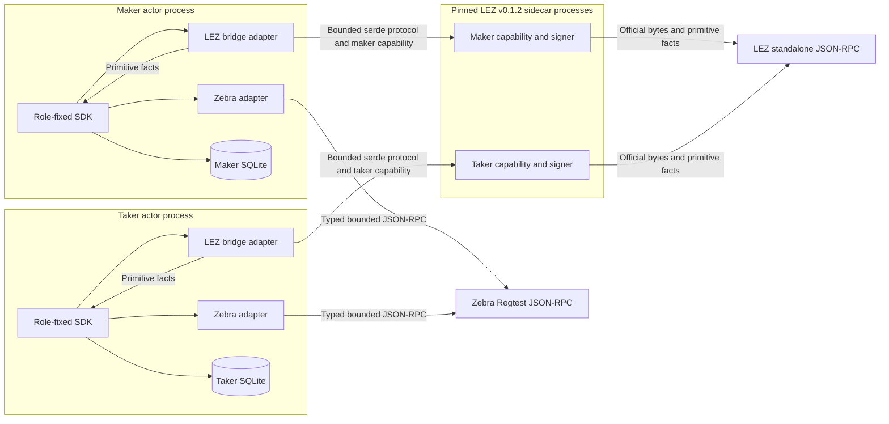

# ADR 0022: Isolate pinned LEZ official-wire code behind a sidecar

Status: Accepted for the M2 actual-node corridor; implementation in progress --
2026-07-13

## Context

The M2 composed corridor must use the official pinned LEZ transaction/RPC types
and the canonical `librustzcash`/Zebra stack. The existing LEZ standalone actor
suite and actual Zebra suites prove each node independently, but they have not
yet been composed through production chain ports.

An executable dependency-resolution RED proved that the two pinned stacks
cannot inhabit one Cargo graph. The Zcash graph pins
`crypto-common = 0.2.0-rc.1`, while the LEZ v0.1.2 graph reaches
`chacha20 0.10` and `cipher 0.5.1`, which require stable
`crypto-common ^0.2`. Cargo cannot select one package version satisfying both
requirements. Relaxing a consensus dependency pin, patching a cryptographic
crate, or duplicating an official wire format merely to make the integration
compile would weaken the evidenced stacks.

## Decision

Keep the main swap workspace and Zcash adapter in one process. Place official
LEZ transaction construction, serialization, signing, nonce handling, RPC
decoding, and raw snapshot collection in a separately built, exactly pinned
sidecar. Connect them with a small serde-only protocol that contains primitive
requests, exact bytes, identifiers, inclusion facts, account facts, and
structured errors. The protocol makes no consensus or agreement-validity
judgments.

The SDK-facing LEZ adapter converts those primitive facts into SDK snapshot
types and invokes the SDK's agreement-bound validators. The sidecar cannot
declare a lock or claim canonical by assertion. The Zebra adapter similarly
uses typed and bounded RPC DTOs, assembles stable snapshots from bracketing tip
reads, and delegates transaction/output/spend validation to the existing SDK.

The signed agreement names the runtime family exactly. The deterministic
v0.1.2 corridor uses `DeterministicLocalV0_1_2Compatibility` and the official
`/NSSA/v0.2/AccountId/PDA/` domain; it must never emit or be recorded as
`DeterministicLocalV0_2`, whose deployed family uses the incompatible `/LEE/`
domain. The SDK derives all metadata, native-custody, and token accounts from
that signed selector, and a separate compatibility test compares the local
derivation source to the pinned official v0.1.2 types. Public v0.2 activation
remains fail-closed and is tracked as upstream production work.

For the deterministic M2 runner, the sidecar listener is ephemeral loopback,
requires a high-entropy run-scoped capability, rejects a different `RUN_ID`,
and is owned by the one runner that starts it. A production deployment should
prefer an owner-restricted Unix socket. Neither endpoint nor authentication
material is protocol authority; actor signatures, exact transaction identity,
canonical node observations, and the accepted agreement remain authoritative.

LEZ initialize and fund must be prepared and durably recorded before the first
submission. The sidecar obtains one account nonce under an exclusive signer
lease, reserves the required consecutive nonces, signs exact transactions, and
returns their identities and bytes without logging secrets. Restart
reconciliation observes exact identities before any byte-identical rebroadcast.

The sidecar retains its own lockfile, source allowlist, license/advisory policy,
and exact LEZ/SPEL pins. It does not depend on the swap SDK. The main workspace
does not import the LEZ standalone/sequencer/Risc0 server graph.

The first implementation slice now provides the separately locked official
transaction planner. It constructs native initialize/fund instructions with
the official NSSA/SPEL APIs, reserves one checked consecutive nonce pair under
an exclusive mutex, preserves the first randomized BIP340 signatures for exact
retry, and accepts only its cached pair for submission. Construction binds the
complete configured runtime descriptor; decoding checks canonical bytes,
official hash, witness validity, signer, role, and escrow program. The local
official node adapter now implements nonce reads, exact cached-byte submission,
and bounded exact-owner block-window scans through upstream generated RPC
types. It brackets scans with validated tips, recomputes block hashes and links,
checks genesis when covered, and never treats a bounded miss as global absence.
Only the proven stateless invalid-params error is definitive; returned-hash,
server, parse, timeout, and transport ambiguity remain unknown outcomes. The
local server, capability middleware, revealing-claim planner, counterparty
discovery, and actor composition remain pending, so this is not yet a running
sidecar or composed-chain proof.

## Atomicity preservation

No implementation can make LEZ and Zcash commit in one shared database or
consensus transaction. This corridor therefore preserves atomic-swap safety by
making every externally visible transition satisfy the same hashlock and a
strictly ordered timeout protocol:

1. Both signatures bind the same secret digest, amounts, actor destinations,
   chain identities, programs, transaction policy, and asymmetric deadlines.
2. The taker submits the first lock. The maker cannot prepare or submit the
   second lock until fresh canonical evidence satisfies the signed identity,
   role, output/account state, depth, and environment-specific finality policy.
3. Neither claim path starts before both locks are durably projected. As the
   final awaited check before releasing the preimage, the LEZ claimant must
   freshly prove that the exact agreement-bound Zcash output is still
   canonical, unspent, sufficiently deep, and claimable before its CLTV. The
   LEZ claim is always the revealing action in both trade directions. The later
   Zcash claimant learns the preimage only from canonical LEZ transaction
   evidence and spends that exact coordinator-pinned outpoint at vout zero.
4. The LEZ refund deadline is earlier than the Zcash refund deadline by the
   signed safety margin. This gives an honest actor time to use a revealed
   preimage on Zcash before the later refund becomes valid. Local timing proves
   protocol ordering; public-testnet latency calibration remains an explicit M2
   evidence gate.
5. Exact prepared bytes and their expected identities are persisted before any
   broadcast. After timeout, crash, or unknown submission outcome, a restarted
   actor observes that identity before any byte-identical rebroadcast. It never
   substitutes a newly signed transaction or advances from RPC success alone.
6. Maker and taker use separate stores, claim keys, sidecar processes,
   capabilities, and signers. A sidecar returns primitive facts only; the SDK
   independently validates them against the dual-signed agreement before an
   atomic local state-and-journal commit.

The implemented claim lifecycle is designed to remain peer-independent after
both locks: it uses protected local state plus chain observations, not a peer
message. The exact follow-up Zcash outpoint is restart-safe. Commit `166d3e5`
also makes a fresh observation of that exact canonical, unspent, sufficiently
deep, pre-CLTV Zcash output the final awaited port call before a retained LEZ
reveal is submitted. Its two-direction restart matrix proves that absent,
spent, unstable, replaced, under-depth, expired, and field-mutated observations
release nothing, while restoration submits the same retained bytes once.
Durable post-lock reorg ingestion and the composed actual-node proof remain M2
gates, so this safety claim is not yet certified for the complete corridor.

This ordering minimizes but cannot eliminate the cross-chain time-of-check to
time-of-use window: Zcash state can change after the final observation while
the LEZ transaction is in flight. Eliminating that interval would require a
native atomic primitive spanning both chains. The implementation therefore
combines the narrowest available check-to-submit interval with conservative
confirmation depth, ordered refunds, continued chain observation, and durable
recovery rather than claiming impossible absolute atomicity.

Refund ordering is proven in the core state machine and signed parameter math,
but executable SDK refund ports, exact durable refund intents,
observe-before-rebroadcast, and SQLite refund transitions are not implemented
yet. Therefore peer-independent timeout recovery is an M2 target, not a current
implementation claim. Neither path can guarantee liveness during indefinite
node outage, censorship, or a reorganization deeper than the signed policy.
The deterministic v0.1.2 lane also has only depth-qualified `Pending` blocks;
that weaker upstream finality model is isolated to its explicitly named local
compatibility environment and is not production-v0.2 evidence.

## Rejected alternatives

- Relax or patch either cryptographic dependency pin: this invalidates the
  already evidenced LEZ or Zcash stack and introduces an unaudited combination.
- Copy LEZ wire structures into the main runtime: this can silently drift from
  upstream signing and hashing semantics.
- Treat the current in-memory claim ports as node evidence: they prove SDK and
  recovery ordering, not actual consensus execution.
- Let the sidecar return already trusted SDK evidence: this moves agreement and
  consensus policy outside the SDK and makes adapter assertions authoritative.

## Consequences and verification

The process boundary adds one local component, lifecycle, capability, and
failure mode to the actor corridor. Transport loss, malformed or oversized
responses, wrong run identity, unstable tips, unavailable signers, unknown
submission outcomes, exact-hash mismatches, and node rejections must remain
distinct errors and be exercised across restart.

The initial failing composed test lives in the main workspace. It requires
distinct loopback LEZ-sidecar and Zebra endpoints, distinct role funding,
separate maker/taker databases and claim keys, both signed directions, the
fixed `locks -> LEZ reveal -> Zcash follow-up` order, and restart after every
effect. It remains RED until concrete adapters and the single-owner isolated
runner satisfy that contract. No broken commit is published while this slice
is being driven GREEN.

Before the claim ports can be certified, the SDK must validate canonical LEZ
revealing-claim snapshots rather than constructing evidence from primitive
assertions, and the Zcash observation port must receive its previous canonical
head so removal/replacement can be assembled after process restart. Those are
repository-controlled prerequisites, not Logos-owned production exceptions.
