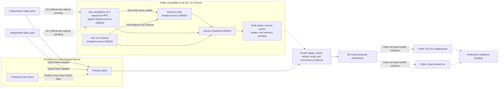

# ADR 0023: Certify M2 with a private actual-node corridor

Status: Accepted by the repository owner on 2026-07-13

## Context

Gateway proposal #112 includes public LEZ v0.2 deployment and Zcash-testnet
evidence in its M2 outputs. The repository owner has selected an unpublished
private-evidence delivery mode ("stealth" here is a disclosure policy, not a
shielded or stealth-address transaction claim): finish and certify a fully
functional corridor without publishing a
deployment, transaction identifier, address, externally hosted recording, or
public actor activity.

Local contract doubles are insufficient for that decision. The private
certification must still execute the actual pinned LEZ and Zebra node
implementations, use independent role-fixed maker and taker processes, submit
real locally signed on-chain transactions, and preserve the protocol's durable
atomicity and recovery boundaries.

## Decision

M2 certification will require private actual-node evidence for both supported
ZEC directions: taker-first ordering, both locks before reveal, canonical LEZ
reveal before the exact Zcash spend, restart recovery, ordered refund, reorg
handling, and concurrent isolation. All endpoints, funds, keys, databases,
Compose projects, ports, and retained evidence remain run-local. Manual
instructions must reproduce this corridor without a public RPC or faucet.

The normal corridor contains exactly two isolated local chain environments: one
pinned public-compatible LEZ v0.2 local devnet and one pinned Zcash Regtest
devnet using the same canonical builders and validators as the future public
route; the signed configuration selects the exact network and active consensus
branch for each environment. The LEZ devnet runs the full source-verified
Bedrock node,
indexer, and non-standalone sequencer; the `standalone` feature's mock block
publisher may be fast lower coverage but cannot be the sole certification
proof. The existing LEZ v0.1.2 standalone lane likewise remains useful
lower-level compatibility evidence but cannot certify this portability gate. A
second
Zebra process is a temporary member of the same Zcash test environment only for
fork/reorg cases; it is not a third swap leg or a shared actor. Maker and taker
remain independent operating-system processes with different configs, keys,
funds, stores, journals, sidecars, and restart lifecycles.

ADR 0024 now attests the clean v0.2 source contract, Bedrock OCI source mapping,
correct sequencer-to-Bedrock publication and indexer-to-Bedrock polling flows,
and exact sequencer/indexer output hashes. Run `v02-actors-finalized-20260713b` proves
isolated ordered service startup, signed channel onboarding, finalized
non-genesis block identity across both RPCs, channel advancement, dynamic
loopback publication, distinct maker/taker owner/Vault pre-Claim state at that
exact finalized block, and exact fail-closed cleanup. Independent clean rebuild
reproducibility, restart-state preservation, Vault Claim submission/finality, checked
escrow deployment, independent actor use, swap effects, and recovery remain
pending. This ADR makes a running-service and pre-Claim state claim, not a
corridor claim.

The M2 implementation must produce local and future public routes in the same
actor binaries, SDK state machine, chain-port traits, transaction builders, and
validation adapters. A
public move may change only provisioning and signed configuration: RPC
endpoints/authentication, chain/genesis/channel/branch identities, confirmation
profiles, signer and funding material, and the deployed LEZ escrow program ID.
Deploying that program on the selected public LEZ network is an expected
on-chain provisioning action. A devnet-only protocol branch, fake evidence
adapter, alternate transaction format, or code rebuild selected by environment
does not satisfy M2 portability. This is an open implementation gate today:
public LEZ activation still fails closed, the actor endpoint schema is
loopback-only, and the public Zebra HTTPS/signing route is incomplete. Public
execution evidence is deferred, but the dormant public-capable configuration
and adapters must exist and be locally contract-tested before M2 is tagged.

Public LEZ v0.2 deployment, public Zcash-testnet execution, public transaction
identifiers, and public recordings are deferred to the production-readiness
backlog. They remain visibly incomplete in RFP traceability. The M2 tag and
release notes must say that they certify the owner-approved local-functional
scope and do not assert those public outputs.

Logos-owned public-runtime limitations continue under ADR 0018. This ADR does
not relax repository-controlled correctness, security, dependency, lint,
vulnerability, license, documentation, or actual-node gates.

## Consequences

- Public endpoint, provider, rate-limit, faucet, and public-fund availability
  cannot make the private M2 corridor flaky.
- Regtest and local v0.2 execution prove the pinned consensus/state-transition
  implementations and real signed effects, but not public propagation, fee
  markets, organic reorgs, public service behavior, or provider behavior.
- The evidence packet and annotated tag must retain this deviation so local M2
  completion cannot be mistaken for full public-testnet compliance with
  proposal #112.
- Once the open portability gate is implemented, public activation is a
  configuration plus funding/deployment operation, subject to the signed
  compatibility checks; it is not a later rewrite of the corridor.
- Production readiness still requires an explicit decision to run and disclose
  the deferred public evidence or to obtain an accepted scope amendment.

## 2026-07-14 certification status addendum

This append-only note records that both private local actual-node happy-path
directions and the locally tested dormant public-portability contracts are now
GREEN. The M2 PoC still certifies only the owner-approved local-functional
scope: no public LEZ or Zcash service was called, no public deployment or
transaction evidence is asserted, and restart, refund, reorg, chaos, and
production hardening remain later phases under ADR 0027.

ADR 0028 is the authoritative portability decision. The same schema-v3 actors,
agreement validators, SDK state machine, official-wire LEZ sidecars, and Zebra
adapter select local or future-public node routes through signed configuration
and provisioning. Actor-to-sidecar traffic remains role-isolated loopback with
a capability. Agreement/runtime/chain/route identity is validated before
persistence or effects. The exact public LEZ and Tatum routes are dormant
configuration-and-client contracts only. Official LEZ finalized-tip method
availability is an upstream production risk and does not block local M2
certification under ADR 0018.
