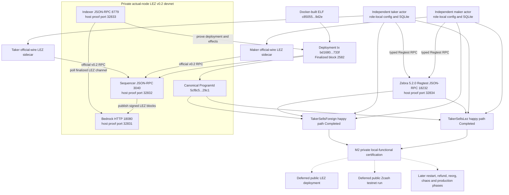

# ADR 0023: Certify M2 with a private actual-node corridor

Status: Accepted by the repository owner on 2026-07-13; canonical deployment reconciled 2026-07-14

## Context

Gateway proposal #112 includes public LEZ v0.2 deployment and Zcash-testnet
evidence in its M2 outputs. The repository owner has selected an unpublished
private-evidence delivery mode ("stealth" here is a disclosure policy, not a
shielded or stealth-address transaction claim): finish and certify a fully
functional corridor without publishing a
deployment, transaction identifier, address, externally hosted recording, or
public actor activity.

Local contract doubles are insufficient for that decision. The private
certification must still execute the actual pinned LEZ and Zebra node
implementations, use independent role-fixed maker and taker processes, submit
real locally signed on-chain transactions, and preserve the protocol's durable
atomicity and recovery boundaries.

## Decision

The private evidence program covers both supported ZEC directions: taker-first
ordering, both locks before reveal, canonical LEZ reveal before the exact Zcash
spend, restart recovery, ordered refund, reorg handling, and concurrent
isolation. ADR 0027 subsequently split delivery into progressive phases. The
owner-selected M2 PoC/tag gate requires the reproducible two-direction happy
path on actual local nodes; composed restart, refund, reorg, concurrency, chaos,
and production hardening remain explicit later phases rather than being
silently claimed or allowed to block the PoC tag. All endpoints, funds, keys,
databases, Compose projects, ports, and retained evidence remain run-local.
Manual instructions reproduce the current corridor without a public RPC or
faucet.

The normal corridor contains exactly two isolated local chain environments: one
pinned public-compatible LEZ v0.2 local devnet and one pinned Zcash Regtest
devnet using the same canonical builders and validators as the future public
route; the signed configuration selects the exact network and active consensus
branch for each environment. The LEZ devnet runs the full source-verified
Bedrock node,
indexer, and non-standalone sequencer; the `standalone` feature's mock block
publisher may be fast lower coverage but cannot be the sole certification
proof. The existing LEZ v0.1.2 standalone lane likewise remains useful
lower-level compatibility evidence but cannot certify this portability gate. A
second
Zebra process is a temporary member of the same Zcash test environment only for
fork/reorg cases; it is not a third swap leg or a shared actor. Maker and taker
remain independent operating-system processes with different configs, keys,
funds, stores, journals, sidecars, and restart lifecycles.

ADR 0024 attests the clean v0.2 source contract, Bedrock OCI source mapping,
correct sequencer-to-Bedrock publication and indexer-to-Bedrock polling flows,
and exact sequencer/indexer output hashes. Run `v02-actors-finalized-20260713b`
remains the historical service-readiness checkpoint: it proved ordered startup,
signed channel onboarding, cross-RPC finality, dynamic loopback publication,
distinct owner/Vault pre-Claim state, and fail-closed cleanup. Later evidence
added actual generated-RPC Vault Claims, the checked canonical deployment,
independent actor effects, and both swap directions. Independent second clean
service rebuild reproducibility and composed restart/refund/reorg recovery
remain later hardening; they do not invalidate the current PoC claim.

The M2 implementation must produce local and future public routes in the same
actor binaries, SDK state machine, chain-port traits, transaction builders, and
validation adapters. A
public move may change only provisioning and signed configuration: RPC
endpoints/authentication, chain/genesis/channel/branch identities, confirmation
profiles, signer and funding material, and the deployed LEZ escrow program ID.
Deploying that program on the selected public LEZ network is an expected
on-chain provisioning action. A devnet-only protocol branch, fake evidence
adapter, alternate transaction format, or code rebuild selected by environment
does not satisfy M2 portability. ADR 0028 records the now-GREEN local contract
tests for exact dormant public LEZ and Zebra routes. Live public activation
continues to fail closed until authorized provisioning, credentials, funds,
deployment, and runtime evidence exist. Public execution evidence is deferred;
the locally tested dormant route does not assert endpoint availability or a
public transaction.

Public LEZ v0.2 deployment, public Zcash-testnet execution, public transaction
identifiers, and public recordings are deferred to the production-readiness
backlog. They remain visibly incomplete in RFP traceability. The M2 tag and
release notes must say that they certify the owner-approved local-functional
scope and do not assert those public outputs.

Logos-owned public-runtime limitations continue under ADR 0018. This ADR does
not relax repository-controlled correctness, security, dependency, lint,
vulnerability, license, documentation, or actual-node gates.

## Consequences

- Public endpoint, provider, rate-limit, faucet, and public-fund availability
  cannot make the private M2 corridor flaky.
- Regtest and local v0.2 execution prove the pinned consensus/state-transition
  implementations and real signed effects, but not public propagation, fee
  markets, organic reorgs, public service behavior, or provider behavior.
- The evidence packet and annotated tag must retain this deviation so local M2
  completion cannot be mistaken for full public-testnet compliance with
  proposal #112.
- Once the open portability gate is implemented, public activation is a
  configuration plus funding/deployment operation, subject to the signed
  compatibility checks; it is not a later rewrite of the corridor.
- Production readiness still requires an explicit decision to run and disclose
  the deferred public evidence or to obtain an accepted scope amendment.

## 2026-07-14 certification status addendum

This append-only note records that both private local actual-node happy-path
directions and the locally tested dormant public-portability contracts are now
GREEN. The canonical guest was built through the pinned Risc0 Docker builder as
ELF `c85055f6fe85b71535a322ba84ffc612f5d093954a721ba3b529428814dc9d2e`,
ImageID and ProgramId
`5cf8c5a4eedb3c2873956cb7898eb33a495407c9746fb1a065c99638159329c1`.
Local deployment transaction
`bd16808ee91c9860e860830e7437148b3f4f81c632fc1b6d40350e20cc47733f`
was proved Finalized in block `2582`, hash
`d2c4944a936347207be7030bb39f6b8f21dfc3dc75e95afedb58e22ed1f96860`,
before both canonical corridor reruns completed.

Earlier host-built ELF `40c9d37c...8021`, ProgramId `f8385049...0fbe`, and
their immutable evidence are historical pre-canonical records. They are not a
trusted deployment target and are not used by current actor admission. The M2
PoC still certifies only the owner-approved local-functional scope: no public
LEZ or Zcash service was called, no public deployment or transaction evidence
is asserted, and restart, refund, reorg, chaos, and production hardening remain
later phases under ADR 0027.

ADR 0028 is the authoritative portability decision. The same schema-v3 actors,
agreement validators, SDK state machine, official-wire LEZ sidecars, and Zebra
adapter select local or future-public node routes through signed configuration
and provisioning. Actor-to-sidecar traffic remains role-isolated loopback with
a capability. Agreement/runtime/chain/route identity is validated before
persistence or effects. The exact public LEZ and Tatum routes are dormant
configuration-and-client contracts only. Official LEZ finalized-tip method
availability is an upstream production risk and does not block local M2
certification under ADR 0018.
