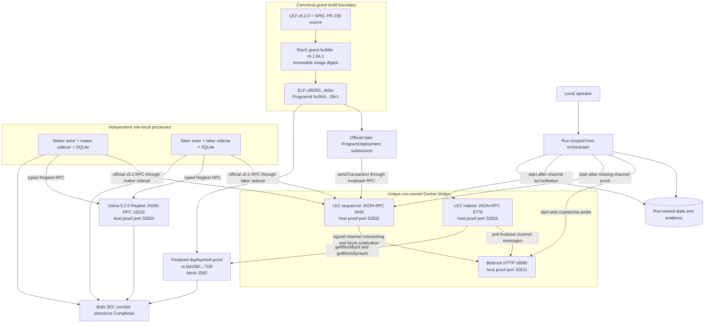

# ADR 0024: Package and isolate the source-audited LEZ v0.2 local stack

Status: Accepted architecture; service, canonical deployment, and both happy-path runtime tuples GREEN; recovery hardening pending -- 2026-07-14

## Context

ADR 0023 requires M2 to cross a private, public-compatible local LEZ v0.2
environment rather than certify against the `standalone` mock publisher. Direct
inspection of the exact upstream `v0.2.0` sources corrected the earlier
candidate topology: actors call the sequencer, the non-standalone sequencer
publishes LEZ blocks to Bedrock through the Logos Zone SDK, and the indexer
polls finalized messages from Bedrock. The indexer does not settle anything
back to the sequencer.

The upstream sequencer and indexer bind wildcard addresses and the upstream
Dockerfiles use mutable build/runtime inputs. Running those host processes or
trusting those Dockerfiles would not provide the required no-clash or
reproducibility boundary.

## Decision

The local stack is built from the clean LEZ tag `v0.2.0`, exact commit
`a58fbce2ff48c58b7bb5001b1a27e64b9596ee3a`, with upstream Rust `1.94.0` and
`cargo build --locked`. The non-standalone sequencer and indexer binaries are
packaged in
`gcr.io/distroless/cc-debian13:nonroot@sha256:aded2458d026e046cb68199db0e5793e1028ffa143f7258f3c4278253e20add7`
with exact `r0vm 3.0.5` bytes, SHA-256
`36c016a5bb2ded5bd1f8f92cc487e6ffaeb1e95ec05850c983081a0f716b515b`.
The locked Rapisnark input is revision
`e91187f8ccb5bbfc7bb00dac88169112428da78f`, release `0.0.8`, archive SHA-256
`59bdd709eed96235de061f352893f4650c923b54b591052118593012bb1cd831`;
the four static-library hashes remain mandatory contract inputs. One
clean-source locked offline release build into a fresh target produced
sequencer SHA-256
`3727e9aa10600d04d0cdfda6eb39df146ef4cc14f5b09ad33bcf076a8f2c412f`
and indexer SHA-256
`6ed54f04ae018f3554898a9f0aef6decd6930c4e8609326d146ca164e48d7442`.
A warm locked offline rerun performed no rebuild and the hashes remained
unchanged. This attests the selected outputs but does not yet prove bit-for-bit
reproducibility through an independent second clean rebuild. A binary's
reported Cargo version `0.1.0` is a diagnostic, not provenance and not a
substitute for the commit, source hashes, build inputs, and output hashes.
Both exact binaries and r0vm first passed an artifact compatibility smoke in the selected distroless image as uid 65532 with no network. The repository runner then executed both services with Bedrock as a numeric non-root host UID/GID, read-only root filesystems, all capabilities dropped, `no-new-privileges`, and CPU, memory, PID, and tmpfs limits.

Bedrock uses
`ghcr.io/logos-blockchain/logos-blockchain@sha256:91d6c5bf07e07fcfba5e7cf07d21ee686a6bc4b9f6210f2d28bffbcad9a3729f`.
Its immutable OCI labels map the image to
`https://github.com/logos-blockchain/logos-blockchain` revision
`d8711bbc3d43d3ef9755ef9b73af32fd0f703160`, version `master`, license
`Apache-2.0`; the verifier must bind that label tuple. Whether that artifact is
identical to the current public-testnet runtime remains unknown and is a
disclosed upstream production-readiness gap, not a local M2 execution claim.

The upstream sequencer/indexer Dockerfiles remain hashed source observations
only. They are not trusted packaging recipes because they include mutable base
tags and installers. The repository-owned recipe uses the immutable inputs above and records the exact output binary digests. Its run-scoped image is deleted after each normal test run.

Every execution owns the group `lez-atomic-swaps-lez-v02-{run_id}`, private state root `.e2e/{run_id}/lez-v02`, fresh service state, exact run-scoped container names, and one unique bridge with IP masquerade disabled. Docker Compose validates the generated configuration only because the installed Compose/Engine pair does not reliably materialize ephemeral loopback ports. The runner therefore creates containers directly, publishes only dynamically assigned literal `127.0.0.1` ports, captures every container ID, and deletes exactly those IDs, its exact network, and its exact image. Fixed or global names and fixed host ports remain forbidden.

Startup is ordered Bedrock, then sequencer, then indexer. The sequencer starts only after Bedrock proves the runtime channel is absent with the exact audited response. The indexer starts only after the sequencer has submitted the signed onboarding inscription and Bedrock reports the accredited runtime channel. A future restart test must preserve one state tuple: Bedrock state, the sequencer home containing the signing key plus RocksDB and publication checkpoint, and indexer RocksDB plus finalized-channel cursor. A
fresh signing key against an existing channel is not equivalent: it is not
accredited and can leave block publication stalled.

Bedrock genesis retains the source-required all-zero system channel. The upstream LEZ example all-`01` channel is a hashed observation, not a live identity. The local runtime channel is `b6adb2d238911395adde0b2f40b880ec03ffd1a3a8d97e7df8cacadf08873748`, the Ed25519 public key derived from a deterministic local-only raw signing seed. Its key file SHA-256 is `8fd0d8a6423536c14b5d3979e5135bf37253f5dfbc8485b52202bbf963b8f02e`. The runner never rewrites the protected genesis channel; the real sequencer creates and accredits its own signed channel through the supported Bedrock inscription path. The immutable infrastructure and program identity tuple is:

`(LEZ source commit, SPEL source commit, Bedrock image revision and digest,
system channel, LEZ channel, sequencer binary digest, indexer binary digest,
r0vm digest, runtime-image digest, guest-builder digest, guest ELF SHA-256,
ImageID and ProgramId)`.

For the canonical private certification, that tuple includes LEZ genesis
`e24c5a4a2d08a747b96cebefa1304cbe80e42dac9ced3a52c2330b22797e10d9`,
ELF `c85055f6fe85b71535a322ba84ffc612f5d093954a721ba3b529428814dc9d2e`,
and ImageID and ProgramId
`5cf8c5a4eedb3c2873956cb7898eb33a495407c9746fb1a065c99638159329c1`.
The deployment extension is transaction
`bd16808ee91c9860e860830e7437148b3f4f81c632fc1b6d40350e20cc47733f`
in Finalized block `2582`, hash
`d2c4944a936347207be7030bb39f6b8f21dfc3dc75e95afedb58e22ed1f96860`.
Neither an endpoint nor an environment variable can replace these consensus
and artifact identities.

The certified service-readiness tuple is:

`(Bedrock cryptarchia advancement, exact missing-channel response, signed
channel accreditation and advancement, sequencer health, channel, built-ins
and genesis, finalized non-genesis block ID, indexer lookup by ID and hash,
cross-RPC block-header identity)`.

The M2 PoC happy-path runtime tuple additionally binds finalized actor Vault
Claims and account state, the checked canonical deployment, distinct maker and
taker processes and stores, a dual-signed agreement, both direction-derived
swap effect sequences, and terminal revision-4 `Completed` state. That tuple is
GREEN in both directions. Restart, refund, reorg, chaos, and production
hardening are separate progressive phases under ADR 0027 and are not implied by
the PoC claim.

Readiness is conjunctive and is evaluated by the host orchestrator against all
three services:

1. Bedrock `GET /cryptarchia/info` returns a present tip and last immutable block and advances. Before sequencer startup, `GET /channel/{channel_id}` must return only HTTP 404 or 500 with the exact 17-byte body `channel not found`; an arbitrary HTTP 500 fails. After startup, Bedrock must report exactly the runtime public key as its accredited key and the expected threshold schema. Its tip slot or tip message must advance after finality.
2. Sequencer `checkHealth`, `getChannelId`, `getProgramIds`, genesis, and tip queries must succeed. `getBlock(1)` proves genesis availability, and `getBlock(finalized_id)` must return canonical Borsh bytes for a finalized ID of at least 2.
3. Indexer health remains diagnostic only. `getLastFinalizedBlockId` must return an ID of at least 2. `getBlockById` and `getBlockByHash` must return the same decoded block, whose ID, previous hash, hash, and signature match the sequencer Borsh header at offsets 0, 8, 40, and 80. Continuously moving service tips need not be equal.

Genesis `supply_account` entries credit actor-specific Vault PDAs through
`GenesisTransferVault`; they do not directly initialize spendable actor
accounts. Each independent actor must submit the official owner-authorized
`vault::Instruction::Claim` into its own account before escrow deployment or
swap funding. Readiness records the Vault Claim transaction and the resulting
actor account state without publishing private keys.

The same `lee_v0_2_0` actor and sidecar binaries, official wire types, SDK state
machine, builders, and validators serve local and future public routes. Moving
public changes signed configuration/provisioning and performs the checked
on-chain escrow deployment; it does not select a devnet-only build or adapter.
Public activation stays fail-closed until a reviewed public deployment and
runtime binding exist.

## Consequences

- Run `v02-actors-finalized-20260713b` remains historical service-readiness evidence. Current evidence additionally proves actual generated-RPC Vault Claims, the canonical Docker artifact deployment in finalized block 2582, and both role-real happy-path corridor directions. Restart, refund, reorg, chaos, and production hardening remain later progressive phases.
- Wildcard upstream binds no longer expose fixed host ports or collide with
  unrelated Docker activity.
- A healthy indexer cannot be mistaken for finality, and a transiently moving
  pair of tips cannot create a false readiness failure.
- Bedrock image provenance is verifier-bound from immutable OCI labels; public
  runtime parity remains an upstream production question.
- Logos-owned Hickory/SPEL/public-runtime issues stay in the production-blocker
  register under ADR 0018 and do not weaken repository-controlled M2 checks.
