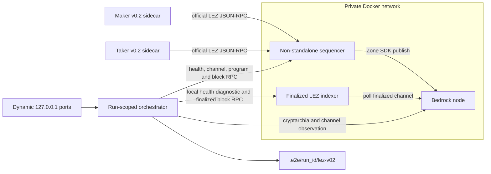

# ADR 0024: Package and isolate the source-audited LEZ v0.2 local stack

Status: Accepted architecture; source and binary attestation verified, container execution RED

## Context

ADR 0023 requires M2 to cross a private, public-compatible local LEZ v0.2
environment rather than certify against the `standalone` mock publisher. Direct
inspection of the exact upstream `v0.2.0` sources corrected the earlier
candidate topology: actors call the sequencer, the non-standalone sequencer
publishes LEZ blocks to Bedrock through the Logos Zone SDK, and the indexer
polls finalized messages from Bedrock. The indexer does not settle anything
back to the sequencer.

The upstream sequencer and indexer bind wildcard addresses and the upstream
Dockerfiles use mutable build/runtime inputs. Running those host processes or
trusting those Dockerfiles would not provide the required no-clash or
reproducibility boundary.

## Decision

The local stack is built from the clean LEZ tag `v0.2.0`, exact commit
`a58fbce2ff48c58b7bb5001b1a27e64b9596ee3a`, with upstream Rust `1.94.0` and
`cargo build --locked`. The non-standalone sequencer and indexer binaries are
packaged in
`gcr.io/distroless/cc-debian13:nonroot@sha256:aded2458d026e046cb68199db0e5793e1028ffa143f7258f3c4278253e20add7`
with exact `r0vm 3.0.5` bytes, SHA-256
`36c016a5bb2ded5bd1f8f92cc487e6ffaeb1e95ec05850c983081a0f716b515b`.
The locked Rapisnark input is revision
`e91187f8ccb5bbfc7bb00dac88169112428da78f`, release `0.0.8`, archive SHA-256
`59bdd709eed96235de061f352893f4650c923b54b591052118593012bb1cd831`;
the four static-library hashes remain mandatory contract inputs. One
clean-source locked offline release build into a fresh target produced
sequencer SHA-256
`3727e9aa10600d04d0cdfda6eb39df146ef4cc14f5b09ad33bcf076a8f2c412f`
and indexer SHA-256
`6ed54f04ae018f3554898a9f0aef6decd6930c4e8609326d146ca164e48d7442`.
A warm locked offline rerun performed no rebuild and the hashes remained
unchanged. This attests the selected outputs but does not yet prove bit-for-bit
reproducibility through an independent second clean rebuild. A binary's
reported Cargo version `0.1.0` is a diagnostic, not provenance and not a
substitute for the commit, source hashes, build inputs, and output hashes.
Both exact binaries and r0vm pass an artifact/runtime-compatibility smoke in the
selected distroless image as uid 65532 with no network, a read-only filesystem,
all capabilities dropped, and `no-new-privileges`. That smoke is not service
startup or full-stack execution.

Bedrock uses
`ghcr.io/logos-blockchain/logos-blockchain@sha256:91d6c5bf07e07fcfba5e7cf07d21ee686a6bc4b9f6210f2d28bffbcad9a3729f`.
Its immutable OCI labels map the image to
`https://github.com/logos-blockchain/logos-blockchain` revision
`d8711bbc3d43d3ef9755ef9b73af32fd0f703160`, version `master`, license
`Apache-2.0`; the verifier must bind that label tuple. Whether that artifact is
identical to the current public-testnet runtime remains unknown and is a
disclosed upstream production-readiness gap, not a local M2 execution claim.

The upstream sequencer/indexer Dockerfiles remain hashed source observations
only. They are not trusted packaging recipes because they include mutable base
tags and installers. The repository-owned recipe uses the immutable inputs
above and later records the exact output binary and image digests.

Every execution owns Compose project
`lez-atomic-swaps-lez-v02-{run_id}`, private state root
`.e2e/{run_id}/lez-v02`, fresh service state, and one private Docker network.
No `container_name` or fixed host port is allowed. Internal wildcard listeners
are reachable only inside that network; the orchestrator publishes required
operator probes on dynamically assigned literal `127.0.0.1` ports and cleans
only resources bearing its exact run identity.

Startup is ordered Bedrock, then indexer, then sequencer. Restart preserves one
state tuple: Bedrock state, `/data/bedrock_signing_key`, sequencer RocksDB and
publication checkpoint, and indexer RocksDB and finalized-channel cursor. A
fresh signing key against an existing channel is not equivalent: it is not
accredited and can leave block publication stalled.

Bedrock's all-zero channel is its system/cryptarchia channel. The local LEZ
rollup uses the distinct all-`01` channel configured identically in sequencer
and indexer. These values are not interchangeable. The immutable runtime
identity tuple is:

`(LEZ source commit, Bedrock image revision and digest, system channel,
LEZ channel, sequencer binary digest, indexer binary digest, r0vm digest,
runtime-image digest)`.

The run-time readiness tuple is:

`(Bedrock cryptarchia checkpoint, observed LEZ channel checkpoint, sequencer
channel and genesis, fixed sequencer checkpoint block, indexer finalized copy
of that checkpoint, built-in program IDs, checked escrow deployment,
maker account state, taker account state)`.

Readiness is conjunctive and is evaluated by the host orchestrator against all
three services:

1. Bedrock `GET /cryptarchia/info` must return a present tip and last immutable
   block, and its tip/slot must advance. The exact
   `GET /channel/{channel_id}` path for the configured all-`01` LEZ channel must
   return HTTP 200; the gate does not assume a response-body echo.
2. Sequencer `checkHealth`, `getChannelId`, genesis/block queries, and
   `getProgramIds` must match the Bedrock channel and required built-ins.
   `getBlock(1)` must return genesis; `getLastBlockId` must be at least genesis
   and advance after a probe transaction. The checked escrow deployment and its
   exact containing block must be observed through official sequencer RPC.
3. Indexer `checkHealth` reads only local database state and is excluded from
   the finality gate; the orchestrator may retain it only as a liveness
   diagnostic. `getLastFinalizedBlockId` must return `Some(id)`,
   `getBlockById(id)` must return that same ID, and the immutable block must
   match the sequencer block queried at the identical ID. The continuously
   moving sequencer and indexer tips are not required to be equal.

Genesis `supply_account` entries credit actor-specific Vault PDAs through
`GenesisTransferVault`; they do not directly initialize spendable actor
accounts. Each independent actor must submit the official owner-authorized
`vault::Instruction::Claim` into its own account before escrow deployment or
swap funding. Readiness records the Vault Claim transaction and the resulting
actor account state without publishing private keys.

The same `lee_v0_2_0` actor and sidecar binaries, official wire types, SDK state
machine, builders, and validators serve local and future public routes. Moving
public changes signed configuration/provisioning and performs the checked
on-chain escrow deployment; it does not select a devnet-only build or adapter.
Public activation stays fail-closed until a reviewed public deployment and
runtime binding exist.

## Consequences

- Source, binary, and artifact/runtime compatibility verification are GREEN
  before the stack runs, but the full stack, readiness tuple, Vault Claim onboarding, escrow
  deployment, and actor corridor remain RED until executed and evidenced.
- Wildcard upstream binds no longer expose fixed host ports or collide with
  unrelated Docker activity.
- A healthy indexer cannot be mistaken for finality, and a transiently moving
  pair of tips cannot create a false readiness failure.
- Bedrock image provenance is verifier-bound from immutable OCI labels; public
  runtime parity remains an upstream production question.
- Logos-owned Hickory/SPEL/public-runtime issues stay in the production-blocker
  register under ADR 0018 and do not weaken repository-controlled M2 checks.
