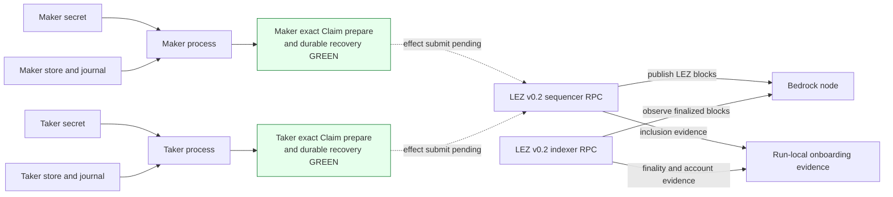
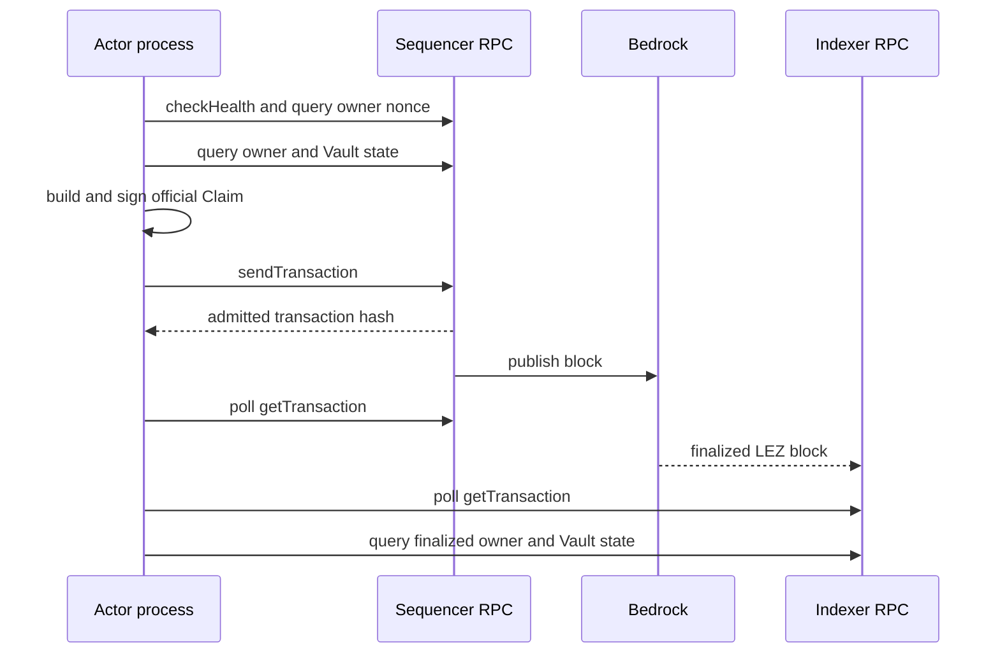
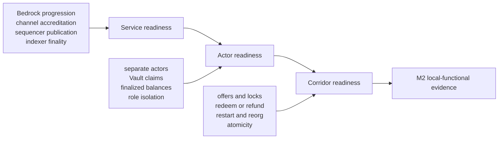

# ADR 0025: Onboard independent LEZ v0.2 actors through Vault claims

Status: Accepted architecture; exact Claim preparation and durable exact-byte recovery GREEN, submission and actor-readiness evidence pending



## Context

ADR 0024 establishes the source-audited three-service LEZ v0.2 local stack.
The exact upstream implementation shows that a sequencer
`GenesisAction::SupplyAccount` does not directly create a spendable actor
balance. It transfers the configured amount from the system faucet into a
public Vault PDA derived from the intended owner. The owner must later submit a
signed `vault_core::Instruction::Claim` to move that balance into its account.

This decision is based on upstream tag `v0.2.0`, exact commit
`a58fbce2ff48c58b7bb5001b1a27e64b9596ee3a`. All upstream paths in this ADR are
relative to that commit. The relevant authoritative types and implementations
are:

- `GenesisAction` in `lez/sequencer/core/src/config.rs:17-28`;
- genesis state and `GenesisTransferVault` construction in
  `lez/sequencer/core/src/lib.rs:581-637`;
- Vault seed and PDA derivation in `lez/programs/vault/core/src/lib.rs:5-52`;
- actual claim account handling in `lez/programs/vault/src/main.rs:59-81`;
- official wallet claim construction in
  `lez/wallet/src/program_facades/vault.rs:77-99`;
- public message and witness types in
  `lee/state_machine/src/public_transaction/message.rs:13-83` and
  `lee/state_machine/src/public_transaction/witness_set.rs:10-37`;
- nonce and signature checks in
  `lee/state_machine/src/validated_state_diff.rs:52-98`; and
- sequencer and indexer RPC traits in
  `lez/sequencer/service/rpc/src/lib.rs:39-92` and
  `lez/indexer/service/rpc/src/lib.rs:26-55`.

The source also demonstrates why prose alone is insufficient. For example,
the Vault Transfer comment says three accounts while its implementation expects
two. For Claim, the executable implementation and wallet facade agree on the
two-account order recorded below and are authoritative.

## Decision

M2 uses two deterministic, public, test-only LEZ actors. The sequencer genesis
configuration contains only their public account IDs and distinct allocations.
Each actor's private key exists only in that actor's owner-readable secret and
runtime. Maker and taker have separate operating-system processes, sidecars,
configuration, dynamic loopback ports, state stores, journals, authentication
tokens, restart lifecycles, and evidence namespaces. Neither process may load,
mount, derive, or request signatures from the other actor's key material.

The deterministic local fixture is:

| Role | Private key | Public key | Account ID | Vault PDA | Allocation |
|---|---|---|---|---|---:|
| Maker | byte `01` repeated 32 times | `1b84c5567b126440995d3ed5aaba0565d71e1834604819ff9c17f5e9d5dd078f` | `B1UN3hPgxacgHKBRoThcAmsPajGcUf6YXUhgB36x4DAd` | `7Mzr43PK9VxpcvwdjgL8PeE4nb2aG9FqBKLfkoH8RBmQ` | `100000` |
| Taker | byte `02` repeated 32 times | `4d4b6cd1361032ca9bd2aeb9d900aa4d45d9ead80ac9423374c451a7254d0766` | `34Kqgek6R7N1zU5FSJz8ziXwSPEPCuWGcn1T7GCVrfib` | `AXLjVw4tKTgieQoGRgXMVLVVaB4c5YnL1YTogZdX1cpH` | `200000` |

The different allocations make a maker/taker transposition observable. These
keys and balances are fixtures, not production defaults. Private keys must not
appear in sequencer configuration, retained evidence, logs, source-controlled
runtime configuration, or RPC responses.

The exact built-in v0.2 Vault program ID used for the PDA snapshots is words
`[1168813120, 241877831, 3407559972, 2131462206, 1965161891, 2000235008,
2574408698, 1333126597]`, little-endian bytes
`40acaa4547c36a0e243d1bcb3e880b7fa3fd2175002a3977fa5b7299c5e5754f`,
displayed as `5MToKNPNxLQKqvrVXKJYngV36Yk1TNi4B2KbUCZBvTLr`. Runtime code must call
`programs::vault().id()` and `vault_core::compute_vault_account_id`; the exact
values above are compatibility snapshots, not a locally reimplemented PDA
algorithm.

For the pinned implementation, the Vault seed is SHA-256 over the exact
32-byte domain `"/LEZ/v0.3/VaultSeed/00000000000/"` followed by the owner
account bytes. `AccountId::for_public_pda` then derives the Vault account from
the Vault program ID and that seed. The mixed internal `v0.3` Vault domain and
`v0.2` public-PDA domain are the behavior of the v0.2 tag and must not be
renamed or normalized locally.

The genesis fragment is equivalent to:

```json
{
  "genesis": [
    {
      "supply_account": {
        "account_id": "B1UN3hPgxacgHKBRoThcAmsPajGcUf6YXUhgB36x4DAd",
        "balance": 100000
      }
    },
    {
      "supply_account": {
        "account_id": "34Kqgek6R7N1zU5FSJz8ziXwSPEPCuWGcn1T7GCVrfib",
        "balance": 200000
      }
    }
  ]
}
```

Genesis configuration is effective only against a fresh sequencer database.
If RocksDB already exists, `start_from_config` loads stored state instead of
reapplying genesis at `lez/sequencer/core/src/lib.rs:81-123`. The isolated M2
runner therefore creates fresh state for a fresh run and preserves the exact
state tuple only for explicit restart tests.

### Claim contract

A public actor claim has this exact shape:

1. program ID: `programs::vault().id()`;
2. account IDs, in order: `[owner, owner_vault]`;
3. nonces: one current owner nonce;
4. instruction: `vault_core::Instruction::Claim { amount }`; and
5. witness: one signature and public key for the owner.

The Vault PDA is present but does not sign. The nonce count equals the
signature count, not the account count. The account IDs must be distinct, the
owner signature must validate over the complete message hash, and the nonce
must equal the owner's current public-state nonce. The public v0.2 message type
has no transaction-level block or timestamp validity-window fields. The Vault
program emits unbounded output windows through `ProgramOutput::new` at
`lee/state_machine/core/src/program.rs:443-460`; nonce validation is therefore
the claim's replay boundary.

`LeeTransaction` is Borsh encoded and represented as base64 by the JSON-RPC
protocol at `lez/common/src/transaction.rs:9-25`. The implementation uses the
official transaction types and generated RPC clients. It must not hand-roll
the base64, Borsh, message hash, signature, program ID, or PDA encoding.

### RPC and evidence sequence



For each actor, the run performs and records:

1. sequencer `checkHealth` and the already-proven service identity checks;
2. `getAccount(owner)`, `getAccountBalance(owner_vault)`, and
   `getAccountsNonces([owner])`;
3. local construction and signing of the exact Claim;
4. sequencer `sendTransaction`;
5. bounded polling of sequencer `getTransaction(hash)` for inclusion;
6. bounded polling of indexer `getTransaction(hash)` for finalized visibility;
7. indexer `getLastFinalizedBlockId` and the finalized block containing the
   transaction; and
8. finalized `getAccount` results for both owner and Vault.

`sendTransaction` returning a hash proves only stateless admission to the
mempool. The service performs size and signature checks before enqueueing at
`lez/sequencer/service/src/service.rs:46-82`. A stale nonce, wrong owner,
reversed account order, or insufficient Vault balance can still be admitted
and later skipped during stateful block construction at
`lez/sequencer/core/src/lib.rs:392-435`. A claim is successful only when its
hash is included by the sequencer and observed through the finalized indexer
view with the expected state.

The expected state transition for each actor is:

| State | Owner balance | Owner nonce | Owner program | Vault balance | Vault nonce |
|---|---:|---:|---|---:|---:|
| Before Claim | `0` | `0` | default | role allocation | `0` |
| After finalized Claim | role allocation | `1` | authenticated transfer | `0` | `0` |

The authenticated-transfer chained call claims the previously default owner
account under the authenticated-transfer program, making the resulting native
balance spendable. The first real corridor escrow or lock transaction is the
effect-level spendability proof; actor onboarding does not perform a synthetic
transfer that would perturb the deterministic corridor balances.

### Readiness boundaries



Service readiness contains no user-funding claim. It proves Bedrock
progression, matching and accredited channel identity, sequencer publication,
and indexer finality as defined by ADR 0024.

Actor readiness begins only after service readiness is GREEN. It proves the
two genesis Vault allocations, independent actor secrets and stores, exact
signed claims, sequencer inclusion, indexer finality, expected post-state, and
cross-role signing denial.

The separately locked sidecar now completes the durable preparation portion of
this boundary: 25 integration tests include exact maker/taker public-key, owner,
Vault, program, allocation, nonce, account-order, amount, canonical-byte, hash,
signature, restart, stored-state mutation, filesystem-isolation, and redaction
checks. Each planner confirms the request nonce through an injected
official-node source before signing and installs its reservation only after
complete construction. On Linux it opens the actor directory with
`openat2(NO_SYMLINKS)`, persists an fsynced create-exclusive owner-only file,
and returns the exact stored bytes after restart without a nonce lookup or
re-sign. This is durable preparation evidence, not actor readiness: there is
still no RPC submission, inclusion/finality observation, or post-state proof.

Corridor readiness begins only after actor readiness is GREEN. It proves offer
exchange, funding reservation, escrow or HTLC locks, counter-chain
observations, canonical reveal, redeem and refund effects, restart recovery,
reorg handling, concurrency isolation, and the full cross-chain atomicity
invariants. A healthy service or an admitted Claim hash cannot satisfy actor or
corridor readiness.

## TDD evidence plan

The implementation follows RED, GREEN, refactor without advancing the ADR
status from pending evidence until the corresponding gates pass.

### RED

1. Contract tests fail until the generated sequencer config contains exactly
   the two distinct public IDs and allocations above and contains no private
   keys.
2. Compatibility tests fail until official derivation returns the exact actor
   and Vault snapshots and the two Vaults are distinct.
3. Transaction-shape tests fail until a decoded message has the exact Vault
   program, `[owner, owner_vault]` order, one current owner nonce, exact Claim
   amount, and exactly the matching owner witness.
4. Process-boundary tests fail if maker can load or request taker signing, if
   taker can load or request maker signing, or if any home, store, journal,
   token, PID, or port is shared.
5. E2E tests retain the pre-claim state and fail actor readiness while either
   claim is absent from the finalized indexer view.

### GREEN

1. Start the source-audited stack with fresh run-owned state and prove service
   readiness first.
2. Start maker and taker as separate processes with only their role-specific
   public config, owner-readable secret, store, journal, and token.
3. Prove both pre-claim states, submit the claims independently, and retain the
   two distinct hashes without secrets.
4. Prove sequencer inclusion, indexer finality, and every post-state invariant
   in the table above.
5. Restart each actor process with its own preserved state and reconcile the
   recorded hash and finalized account state without blind resubmission.
6. Prove wrong-signer, reversed-order, stale-nonce, duplicate-claim, and
   overclaim attempts do not become finalized and do not change either actor or
   Vault balance.

Refactoring may share stateless code and official clients, but it may not merge
actor runtimes, stores, secrets, authentication, or lifecycle ownership.

## Failure and atomicity properties

- Genesis funding and each Claim are individual LEZ state transitions. A
  failed Claim produces no partial owner credit or partial Vault debit.
- A successful Claim conserves the role allocation: the full amount leaves the
  role's Vault and enters only that role's owner account.
- Maker and taker claims use distinct signers, nonces, accounts, and Vaults, so
  neither claim authorizes or consumes the other's state.
- Mempool admission is not committed state. The actor journals the returned
  hash before waiting and reconciles inclusion and finality after timeout or
  restart instead of assuming failure or signing a blind duplicate.
- A stale or duplicate nonce, wrong signer, reversed account order, or
  overclaim must remain absent from finalized indexer evidence and leave the
  last finalized balances unchanged.
- Corridor commands remain unavailable until both actor claims are finalized.
  No escrow lock, secret reveal, redeem, or refund may depend on a pending
  onboarding transaction.
- Finality evidence comes from the indexer view of Bedrock-finalized LEZ
  blocks, not only from the sequencer's local pending store.

## Existing upstream helpers

The implementation reuses upstream protocol crates rather than reproducing
their algorithms. Useful exact examples include deterministic public key
construction and direct claims at `integration_tests/tests/tps.rs:40-53` and
`:69-121`, genesis construction at `test_fixtures/src/config.rs:125-152`, and
balance invariants at `integration_tests/tests/vault.rs:12-100`.

The upstream `TestContext` is not the M2 actor topology. Its default identities
are OS-random, it holds all keys in one `WalletCore`, runs sequencer and indexer
in-process, and owns Docker Compose directly. The M2 runner may reuse its
official types, builders, and assertions, but not its shared-wallet or
shared-lifecycle boundary. If the official wallet CLI is used, separate
`LEE_WALLET_HOME_DIR` values provide distinct `wallet_config.json` and
`storage.json` paths as defined at `lez/wallet/src/helperfunctions.rs:36-67`.

## Logos-owned production gaps

These findings remain production-readiness items governed by ADR 0018. They do
not relax repository-controlled actor isolation, transaction construction,
finality, failure, security, or evidence gates.

1. The checked-in channel fixtures disagree. `test_fixtures/src/config.rs:192-197`
   uses alternating `00` and `01` bytes, shipped sequencer examples use all
   `01`, and `bedrock/deployment-settings.yaml:65-72` creates only the all-zero
   system channel. Supported nonzero channel creation and accreditation must be
   used and proven.
2. The sequencer creates a distinct Bedrock signing key at
   `lez/sequencer/core/src/lib.rs:77-79`. Production provisioning must preserve
   and accredit that exact key for the configured channel.
3. `testnet_initial_state::initial_state()` contains directly funded accounts
   whose private keys are present in source, even outside the `testnet`
   feature. The keys and balances are visible at
   `lez/testnet_initial_state/src/lib.rs:12-20`, `:74-75`, `:117-130`, and
   `:229-257`. A production genesis must remove or explicitly replace them.
4. `SupplyAccount` is fresh-genesis provisioning, not a public faucet. Public
   activation needs the supported Bedrock deposit, funding, or reviewed
   provisioning route and cannot change balances by editing a running
   sequencer config.
5. The v0.2 indexer replay path temporarily bypasses system-account origin
   checks because the block does not preserve `TransactionOrigin`, documented
   at `lez/common/src/transaction.rs:132-150`. This must be removed or accepted
   upstream before production readiness.
6. Public Vault claims have no transaction-level expiry window in this v0.2
   message type. The current nonce prevents replay, while bounded polling and
   state reconciliation constrain local operation. Production pending-claim
   expiry or replacement policy remains an upstream protocol and operations
   decision.
7. The upstream wallet poller is timeout-based despite block-oriented naming
   and performs tight inner retries at `lez/wallet/src/poller.rs:32-63`. The M2
   adapter uses bounded polling with delay and explicit deadlines; upstream
   behavior remains a production hardening item.

## Consequences

- Local actor funds are deterministic, role-distinct, fully local, and do not
  depend on a public RPC, faucet, or external provider.
- Real user roles are represented by independently authenticated processes and
  stores rather than two labels inside one wallet or test process.
- Actor readiness cannot falsely pass on health checks, mempool admission, or
  sequencer-only pending state.
- Moving to a public LEZ route changes signed provisioning, endpoints,
  authentication, funding, and deployed program identities. It does not change
  the actor roles, official transaction types, claim builder, state machine, or
  finality validation boundary.
- The deterministic local private keys and source-visible upstream test keys
  are never production credentials.
